<!--
 * @Author: guanjiajun www.guanjiajun@ewake.com
 * @Date: 2023-06-12 18:10:13
 * @LastEditors: guanjiajun www.guanjiajun@ewake.com
 * @LastEditTime: 2023-06-16 17:13:55
 * @FilePath: \studys\programming\c++相关\编译\cmake.md
 * @Description: 这是默认设置,请设置`customMade`, 打开koroFileHeader查看配置 进行设置: https://github.com/OBKoro1/koro1FileHeader/wiki/%E9%85%8D%E7%BD%AE
-->
<https://github.com/parallel101/course>\
<https://blog.csdn.net/u011436427/article/details/125838619>\

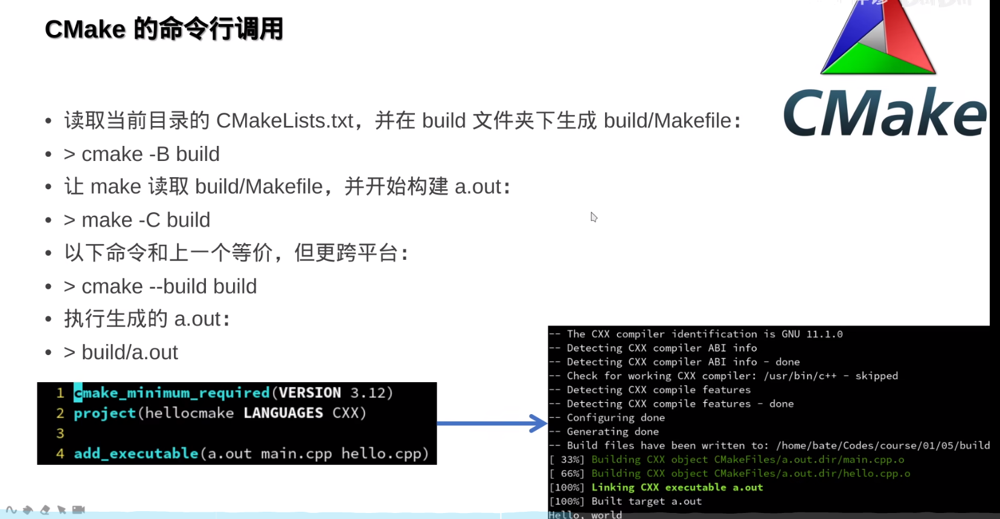
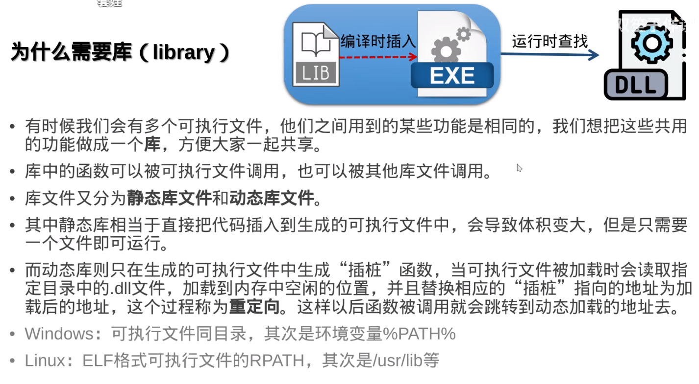
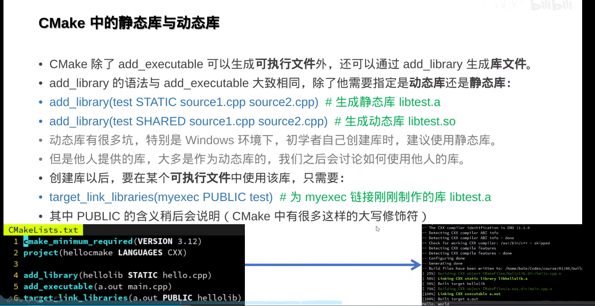
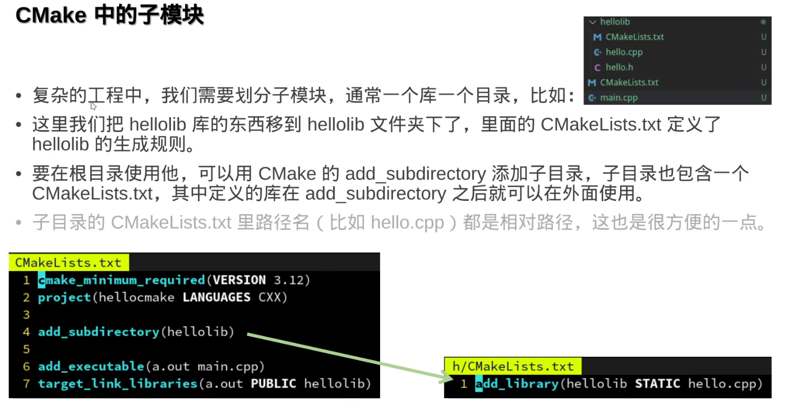
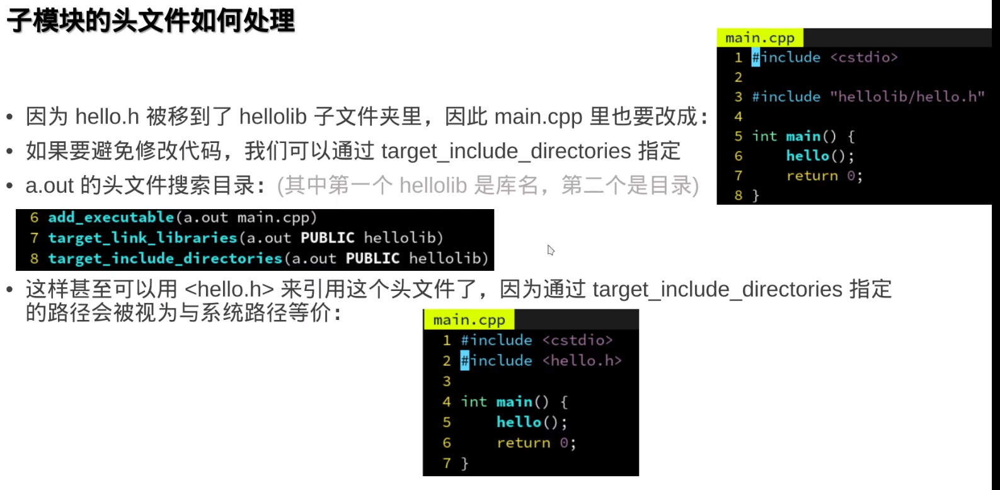
### 设置private，可防止引用该目录为头文件搜索路径

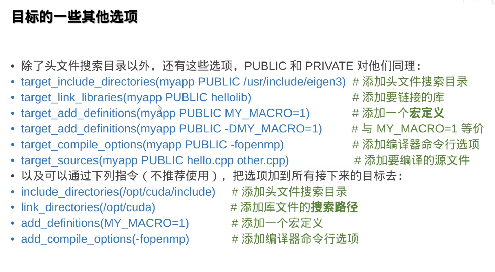
### 这类库适合作为子模块引用，sqlite
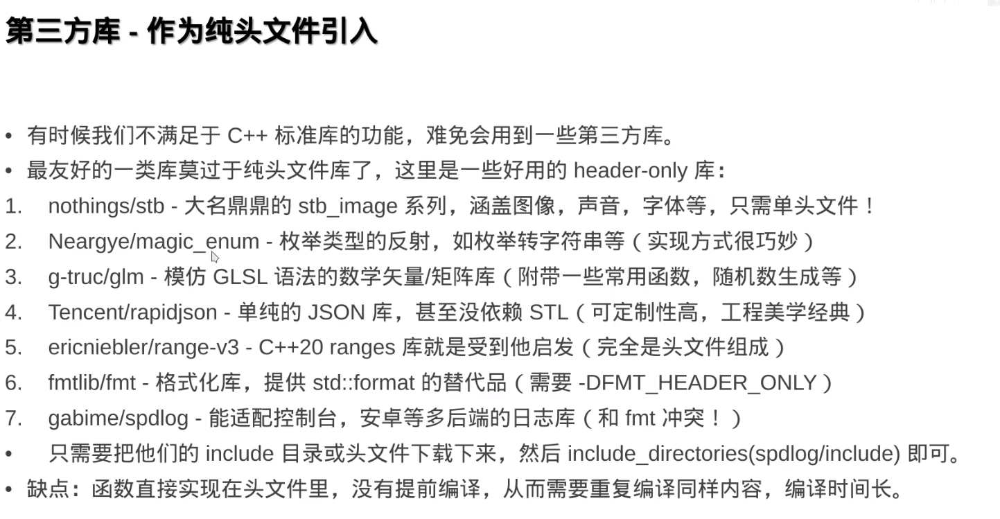
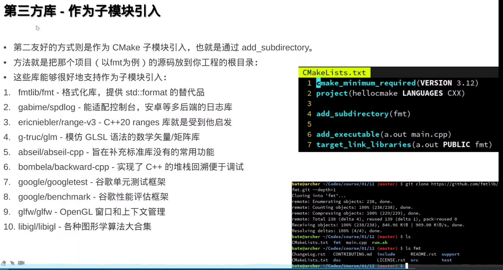
### 作为子模块引入，可能有菱形依赖问题
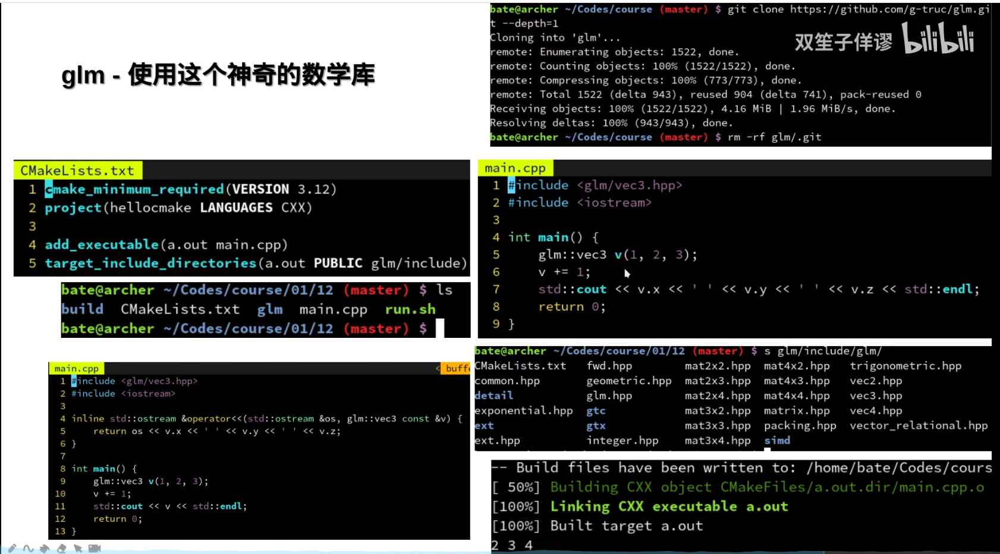
### 类似numpy
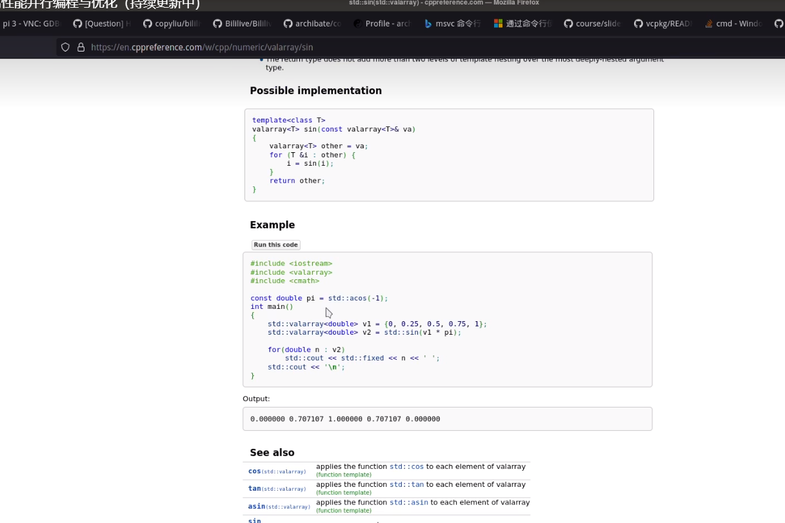

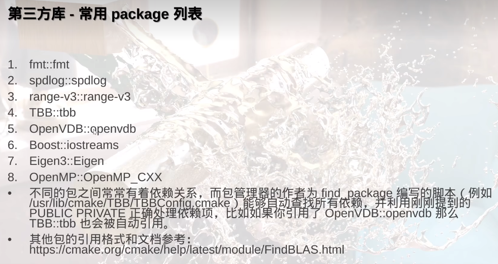
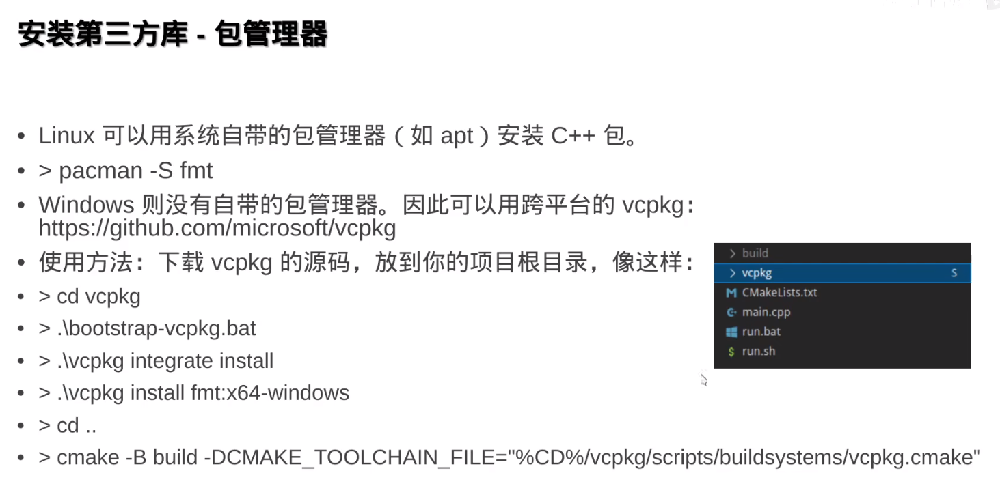