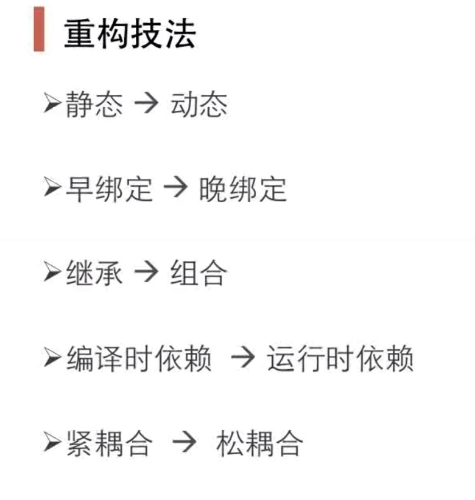
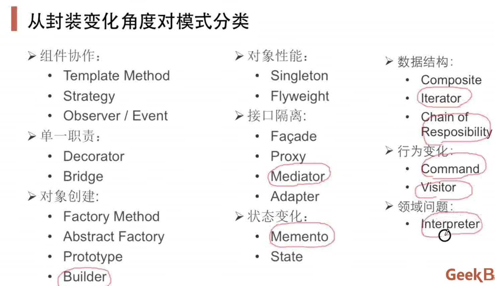
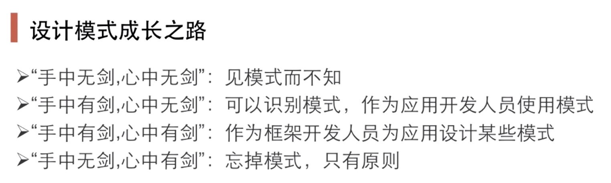

<!--
 * @Author: guanjiajun www.guanjiajun@ewake.com
 * @Date: 2023-06-12 19:13:19
 * @LastEditors: guanjiajun www.guanjiajun@ewake.com
 * @LastEditTime: 2023-06-15 18:03:10
 * @FilePath: \studys\programming\c++相关\设计模式\23种设计模式概述.md
 * @Description: 这是默认设置,请设置`customMade`, 打开koroFileHeader查看配置 进行设置: https://github.com/OBKoro1/koro1FileHeader/wiki/%E9%85%8D%E7%BD%AE
-->
## 简述
<https://blog.csdn.net/weixin_45712636/article/details/124328504>\
<https://subingwen.cn/design-patterns/>、
<https://blog.csdn.net/qq_32378713/article/details/126207309>
###### 总体思想
抽象，继承，组合，隔离，复用
### 1. 创建型模式
#### 单例模式【singleton】
##### 概述
<https://blog.csdn.net/QDNBD/article/details/119334441>\
对象（类）只创建一次
##### 适用场景
* 任务队列
* Windows的Task Manager（任务管理器）就是很典型的单例模式（这个很* 熟悉吧），想想看，是不是呢，你能打开两个windows task manager* 吗？ 不信你自己试试看哦~
* windows的Recycle Bin（回收站）也是典型的单例应用。在整个系统运行* 过程中，回收站一直维护着仅有的一个实例。
* 网站的计数器，一般也是采用单例模式实现，否则难以同步。
* 应用程序的日志应用，一般都何用单例模式实现，这一般是由于共享的日志* 文件一直处于打开状态，因为只能有一个实例去操作，否则内容不好追加。
* Web应用的配置对象的读取，一般也应用单例模式，这个是由于配置文件是* 共享的资源。

#### 简单工厂模式 【人造恶魔果实工厂 1】
##### 概述
基于抽象产品（功能）类创建子类功能，注意虚析构（本质析构子类，继承多态要使用，单纯继承不需要），此模式下工厂类只有一个，
##### 实现
通过添加功能子类，枚举类型进行扩展
##### 适用场景
行为类似，生产对象类型不多（不符合闭合原则）

#### 工厂模式 【人造恶魔果实工厂 2】
##### 概述
需要多个工厂类，由抽象父工厂类产生，符合开闭原则，使用率较高
,将依赖赶到一个局部的地方，new（紧耦合关系）会导致关系脆弱，
通过抽象延迟创建对象到子类
##### 实现
通过添加功能子类，工厂子类进行扩展
##### 适用场景
行为类似，生产对象类型多

#### 抽象工厂模式【弗兰奇一家】
##### 概述
对比工厂模式，产品（功能）抽象类，需要抽象成多个抽象功能模块子类
##### 适用场景
功能相当复杂（常常伴随组合或聚合关系），系列对象，对象间相互依赖，切可能有多个对象，类数据库切换

#### 生成器 / 建造者模式【builder】
##### 概述
<https://www.jianshu.com/p/fb463ec41507>\
建造者模式可以将复杂对象的建造过程抽象出来(抽象类别)，使这个抽象过程的不同实现方法可以构造出不同表现(属性)的对象。
建造者模式是一步一步创建一个复杂的对象，它允许用户只通过指定复杂对象的类型和内容就可以构建它们，用户不需要知道内部的具体构建细节。
与策略区别：步骤算法确定，策略步骤不确定
##### 适用场景
顾客去餐馆点餐，利用工厂模式，根据顾客不同的选择制作不同的食物，比如：披萨、汉堡、沙拉。
比方说顾客选择了披萨，而披萨又可以定制各种配料，比如奶酪、番茄、肉。
利用建造者模式，根据顾客选择不同的配料制作披萨。


#### 原型模式【prototype】
##### 概述
<https://blog.csdn.net/qq_16116881/article/details/121942001>\
深克隆原型进行使用，在软件系统中，创建某一类型的对象，为了简化创建的过程，可以只创建一个对象，然后通过克隆的方式复制出多个相同的对象。克隆对象比new对象快
##### 适用场景
* 对象之间相同或相似，即只是个别的几个属性不同的时候。
* 创建对象成本较大，例如初始化时间长，占用CPU太多，或者占用网络资源* 太多等，需要优化资源。
* 创建一个对象需要繁琐的数据准备或访问权限等，需要提高性能或者提高安* 全性。
* 系统中大量使用该类对象，且各个调用者都需要给它的属性重新赋值。

### 2. 结构型模式
#### 适配器模式【adapter】
##### 概述
适配器模式主要应用于希望复用一些现存的类，但是接口又与复用环境要求不一致的情况
##### 适用场景
1.封装有缺陷的接口设计

假设我们依赖的外部系统在接口设计方面有缺陷（比如包含大量静态方法），引入之后会影响到我们自身代码的可测试性。为了隔离设计上的缺陷，我们希望对外部系统提供的接口进行二次封装，抽象出更好的接口设计，这个时候就可以使用适配器模式了。

2.统一多个类的接口设计

某个功能的实现依赖多个外部系统（或者说类）。通过适配器模式，将它们的接口适配为统一的接口定义，然后我们就可以使用多态的特性来复用代码逻辑。

3.替换依赖的外部系统

当我们把项目中依赖的一个外部系统替换为另一个外部系统的时候，利用适配器模式，可以减少对代码的改动。

4.兼容老版本接口

在做版本升级的时候，对于一些要废弃的接口，我们不直接将其删除，而是暂时保留，并且标注为 deprecated，并将内部实现逻辑委托为新的接口实现。这样做的好处是，让使用它的项目有个过渡期，而不是强制进行代码修改。这也可以粗略地看作适配器模式的一个应用场景。

5.适配不同格式的数据

适配器模式主要用于接口的适配，实际上，它还可以用在不同格式的数据之间的适配。比如，把从不同征信系统拉取的不同格式的征信数据，统一为相同的格式，以方便存储和使用。再比如，Java 中的 Arrays.asList() 也可以看作一种数据适配器，将数组类型的数据转化为集合容器类型。

#### 桥接模式【bridge】
##### 概述
<https://blog.csdn.net/hzf0701/article/details/124392322>\
平台与业务的拆分，通过桥接将单个平台及其对应的业务进行组合，进而简化平台的整体区分，与装饰的区别，装饰针对同一个类，桥接针对两个类
##### 适用场景
多端相同功能的适配

#### 组合模式【composite】
##### 概述
<https://blog.csdn.net/shulianghan/article/details/119822802>\
将 对象 组合成 树形结构 , 表示 " 部分-整体 " 层次结构 ;
组合模式 使 客户端 对 单个对象 和 组合对象 保持一致的 方式处理 ;
##### 适用场景
文件系统 , 根目录下有若干文件和目录 , 在二级目录下还有目录和文件 , 这种情况下 , 适合使用组合模式

#### 装饰模式【decorator】
##### 概述
通过继承拓展功能，代码指数增长。
原始功能上的拓展（对应多种具有相同行为的对象），同时拓展多种对象的功能，主要思想为通过组合的手法在运行时动态拓展，主体操作与拓展操作最好通过组合进行拓展
##### 适用场景
各种流数据的加密

#### 外观模式【facade】
##### 概述
<https://blog.csdn.net/shulianghan/article/details/105339213/>\
外观模式提供一个统一接口，用来访问子系统的一系列接口，从而让子系统更容易使用。这个子系统可以有多种理解方式，它既可以是一个完整的系统，也可以是更细粒度的类或者模块
它其实就是前面提到过的设计模式原则中“迪米特原则”的典型应用：两个有交互的系统，只暴露有限且必要的接口
##### 适用场景
* ① 子系统复杂 : 子系统复杂 , 通过使用外观模式可以简化调用接口 ;
* ② 层次复杂 : 系统结构层次复杂 , 每个层级都一个使用外观对象作为该层入口 , 可以简化层次间的调用接口 ;


#### 享元模式【flyweight】
##### 概述
<https://mikechen.cc/20757.html>\
享元模式有点类似于单例模式，都是只生成一个对象来被共享使用。
享元模式的作用：主要用于减少创建对象的数量，以减少内存占用和提高性能。创建的对象最好只读
* 其实现方式不一样，单例是一个类只有一个唯一的实例，而享元可以有多个实例，只是通过一个共享容器来存储不同的对象。
* 其使用场景不一样，单例是强调减少实例化提升性能，因此一般用于一些需要频繁创建和销毁实例化对象或创建和销毁实例化对象非常消耗资源的类中，如连接池、线程池。而享元则是强调共享相同对象或对象属性，节约内存使用空间。
* 享元模式主要是为了节约内存空间，提高系统性能，而单例模式主要为了可以共享数据
##### 适用场景
* 一类就是：系统中存在大量的相似对象；
* 另外一类就是：就是池技术,比如：String常量池、数据库连接池、缓冲池等等，都是享元模式的应用，享元模式是池技术的重要实现方式。
#### 代理模式【proxy】
##### 概述
经典：网络服务
由于某些原因需要给某对象提供一个代理以控制对该对象的访问。这时，访问对象不适合或者不能直接引用目标对象，代理对象作为访问对象和目标对象之间的中介
##### 适用场景
* 1.日志的采集
* 2.权限控制
* 3.实现aop
* 4.Mybatis mapper
* 5.Spring的事务
* 6.全局捕获异常
* 7.Rpc远程调用接口
* 8.分布式事务原理代理数据源

### 3. 行为模式
#### 责任链模式【chain of resposibility】
##### 概述
<https://blog.csdn.net/u011897062/article/details/89457070>\
如果这种结构用在编程领域，则每个节点可以看做一个对象，每个对象有不同的处理逻辑，将一个请求从链的首端发出，沿着链的路径依次传递每个节点对象，直到有对象处理这个请求为止，我们将这样一种模式称为责任链模式
链表
##### 适用场景
事件冒泡
* 1.多个对象可以处理同一个请求，但具体由哪个对象处理则在运行时动态决定。
* 2. 在请求处理者不明确的情况下向对个对象中的一个提交一个请求。
* 3. 需要动态处理一组对象处理请求。

#### 命令模式【command】
##### 概述
<https://blog.csdn.net/guorui_java/article/details/106718457>
* 1、在软件设计中，我们经常需要向某些对象发送请求，但是并不知道请求的接收者是谁，也不知道被请求的操作时哪个，我们只需在程序运行时指定具体的请求接收者即可，此时，可以使用命令模式来进行设计。
* 2、命令模式使请求发送者与请求接收者消除彼此之间的耦合，让对象之间的调用关系更加灵活，实现解耦。
* 3、在命令模式中，会将一个请求封装为一个对象，以便使用不同参数来表示不同的请求，同时命令模式也支持撤销操作。

泛型编程加函数对象可能比command更好

##### 适用场景
* 1、命令的发送者和命令执行者有不同的生命周期，命令发送了并不是立即执行。换言之，原先的请求发出者可能已经不在了，而命令对象本身仍然是活动的。这时命令的接收者可以在本地，也可以在网络的另一个地址。命令对象可以在序列化之后传送到另一台机器上去。
* 2、命令需要进行各种管理逻辑，比如对多个命令的统一管理。
* 3、需要支持撤销、重试等操作。
命令模式可以把状态存储起来，等到客户端需要撤销命令所产生的的效果时，调用undo()方法，把命令产生的效果撤销掉；
命令模式还提供了redo()方法，以供客户端在需要的时候再重新发送命令。
* 4、使用命令模式作为 "回调(callBack)" 在面向对象系统中的替代。"callBack" 讲的便是先将一个函数登记上，然后在以后调用此函数。
* 5、如果将系统中所有的数据更新到日志里，以便在系统崩溃时，可以根据日志读回所有的数据更新命令，重新调用execute()方法一条一条执行这些命令，从而恢复系统在崩溃前所做的数据更新。


#### 迭代器模式【iterator】
##### 概述
<https://blog.csdn.net/daidaineteasy/article/details/108043688>\
提供一种方法顺序访问一个容器对象中各个元素，而又不需暴露该对象的内部细节
##### 适用场景
* 当集合内部为复杂的数据结构， 且你希望对客户端隐藏其复杂性时，可以使用迭代器模式。
* 如果希望有多种遍历方式可以访问聚合对象，可以使用迭代器模式。
* 如果希望不同的聚合对象有一个统一的遍历接口，可以使用迭代器模式

#### 中介者模式【mediator】
##### 概述
中介者（Mediator）模式指定义了一个单独的中介对象，来封装一组对象之间的交互。即将这组对象之间的交互委派给中介对象，从而来避免对象之间的直接交互。比如我们各种设备之间的通信，就是通过服务器作为中介对象来进行交互，与代理区别，中介多对多，代理一对一
##### 适用场景
微服务
系统结构可能会日益变得复杂，对象之间存在大量的相互关联和调用，系统的整体结构容易变为网状结构。在这种情况下，如果需要修改某一个对象，则可能会要跟踪和该对象关联的其他所有对象，并进行处理。耦合越多，修改的地方就会越多。
如果我们使用中介者对象，则可以将系统的网状结构变成以中介者为中心的星型结构。中介者承担了中转作用和协调作用，简化了对象之间的交互，而且还可以给对象间的交互进行进一步的控制。

#### 备忘录模式【memento】
##### 概述
<https://blog.csdn.net/qq_60735796/article/details/129175254>\
备忘录模式（Memento Pattern）是一种行为型设计模式，它允许在不破坏封装性的前提下捕获和保存一个对象的内部状态，并在需要时恢复该状态。这个模式的核心思想是将对象状态的存储和恢复分离开来，从而使得对象在不暴露其实现细节的前提下能够恢复之前的状态
##### 适用场景
* 需要保存和恢复对象的状态。当需要保存和恢复对象状态时，备忘录模式是一种非常有用的设计模式。例如，在文本编辑器中，用户可以执行撤销和重做操作，这需要保存和恢复编辑器的状态。
* 需要支持撤销和重做操作。备忘录模式可以支持撤销和重做操作，因为它可以保存对象的历史状态。例如，在绘图应用程序中，用户可以撤销和重做他们的绘图操作。
* 需要实现快照功能。备忘录模式可以帮助我们实现快照功能，即保存对象的状态快照，以便在需要时恢复对象状态。例如，在游戏中，我们可以使用备忘录模式保存游戏进度，并在需要时恢复进度。
* 需要保护敏感数据。备忘录模式可以通过加密和压缩等手段，保护备忘录中的敏感数据。例如，在电子商务系统中，我们可以使用备忘录模式保存用户的订单信息，并使用加密算法保护用户的个人信息。


总的来说，备忘录模式适用于需要保存和恢复对象状态的场景，尤其是在需要支持撤销和重做操作时非常有用。如果您的应用程序需要实现这些功能，备忘录模式可能是一种很好的选择


#### 观察者模式【observer】
##### 概述
<https://blog.csdn.net/zhizhengguan/article/details/122325700>\
类似qt event监听等
##### 适用场景
进度条的不同表现形式，监听

#### 策略模式【strategy】
##### 概述
方法封装，多态，互相替换
与工厂区别，更注重实现方式的不同，工厂更注重对象的不同
<https://blog.csdn.net/qq78442761/article/details/84371361>\
<https://blog.csdn.net/m4330187/article/details/121292879>
##### 实现
```c++
#pragma once
 
#include <iostream>
using namespace std;
 
class Strategy{
 
public:
	virtual void algorithmInterface() = 0;
	virtual ~Strategy(){
		cout << "~Strategy() called!" << endl;
	}
 
};
 
class ConcreteStrategyA: public Strategy{
 
public:
	void algorithmInterface(){
 
		cout << "arithmetic A is called!" << endl;
	}
 
	~ConcreteStrategyA(){
 
		cout << "~ConcreteStrategyA() called!" << endl;
	}
};
 
class ConcreteStrategyB: public Strategy{
 
public:
	void algorithmInterface(){
 
		cout << "arithmetic A is called!" << endl;
	}
 
	~ConcreteStrategyB(){
	
		cout << "~ConcreteStrategyB() called!" << endl;
	}
};
 
class ConcreteStrategyC: public Strategy{
 
public:
	void algorithmInterface(){
 
		cout << "arithmetic C is called!" << endl;
	}
 
	~ConcreteStrategyC(){
 
		cout << "~ConcreteStrategyC() called!" << endl;
	}
};
 
class Context{
	
public:
	Context(Strategy *strategy){
		m_strategy = strategy;
	}
 
	~Context(){
		delete m_strategy;
	}
 
	void contextInterface(){
		m_strategy->algorithmInterface();
	}
 
 
private:
	Strategy *m_strategy;
};
```
```c++
#include "strategy.h"
 
int main(){
 
	Context *contextA, *contextB, *contextC;
	//由于实例化不同的策略，所以最终在调用context->contextInterface()时，所获得的结果就不尽相同
	contextA = new Context(new ConcreteStrategyA);
	contextA->contextInterface();
	delete contextA;
 
	cout << endl << "----------**********----------" << endl;
	
	contextB = new Context(new ConcreteStrategyB);
	contextB->contextInterface();
	delete contextB;
 
	cout << endl << "----------**********----------" << endl;
 
	contextC = new Context(new ConcreteStrategyC);
	contextC->contextInterface();
	delete contextC;
 
	getchar();
	return 0;
}
```
##### 适用场景
* 导入，导出多种格式，各国税计算
* 1、业务代码需要根据场景不同，切换不同的实现逻辑
* 2、代码中存在大量 if else 逻辑判断

#### 状态模式【state】
##### 概述
<https://blog.csdn.net/shulianghan/article/details/119684989>\
一个对象 , 如果其 内部状态改变 , 其 行为也需要进行改变 ; 如果其行为不需要改变 , 也可以只 控制 该对象的状态 的 互相转换 ;

当控制一个对象 , 其状态转换过程比较复杂时 , 将 状态判断逻辑 , 转到代表不同状态的一系列类中
<https://blog.csdn.net/qq_40124555/article/details/126474930>\
策略模式封装的是行为，而状态模式封装的是变化。尽管这么说，但事实上策略模式与状态模式在很多情况下都是可以互相转化的
往往伴随上下文分享，context
##### 适用场景
 一个对象 , 存在多个状态 , 状态可以相互转换 ; 不同状态下 , 行为不同

#### 模板方法模式【template method】
##### 概述
流程框架总体稳定，其中变化通过虚函数进行重写定制，主要特征为晚绑定
##### 适用场景
<https://blog.csdn.net/xiaofeng10330111/article/details/123619576>\
流程稳定

#### 访问者模式【visitor】
##### 概述
<https://www.syrr.cn/news/32015.html?action=onClick>\
表示一个作用于某对象结构中的各元素的操作，使得可以在不改变（稳定）各元素的类的前提下定义（扩展）作用于这些元素的新操作（变化）
##### 适用场景
* 数据结构稳定，但是作用于数据结构的操作经常变化
* 需要数据结构与数据操作分离
* 需要对不同数据类型(元素)进行操作，但是有不使用if.. else ..判断具体类型

#### 解析器模式【interpreter】
##### 概述
<https://blog.csdn.net/lonely_baby/article/details/129220871>
它主要用于处理自然语言或符号语言等语法问题。它的基本原理是将一个表达式解析成一个抽象语法树，然后使用该树来执行特定的操作
##### 适用场景
* 当您需要处理自然语言或符号语言等语法问题时，可以使用解释器模式。
* 当您需要对一些基本语法构造进行扩展或修改时，可以使用解释器模式。
* 当您需要将复杂表达式分解成独立的部分时，可以使用解释器模式。

## 总结
常用：单例，工厂，策略，状态,备忘录,组合模式,命令，访问者（元素层次不稳定不适用，一般不用）



## 补充知识点
### context
这个很多人很多人觉得难以理解，其实context就是一个系统定义的结构体类型，可以存储key-value等，目的是能够将本协程的变量传给下一个协程（kv)，或者控制下一个协程什么时候退出,流程间共享信息传递