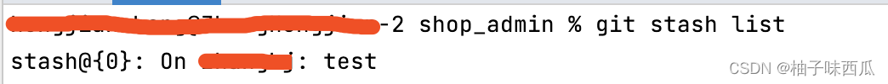

### git拉取远程代码，但不要覆盖本地新修改的代码
参考连接\
<https://blog.csdn.net/qq_42956653/article/details/121613703>\
<https://blog.csdn.net/Joye_7y/article/details/125769826>\
<https://blog.csdn.net/Guzarish/article/details/127576587>\
<https://blog.csdn.net/lonely_fool/article/details/125681803>\
<https://geek-docs.com/git/git-cmds/git-squash.html>\
#### 方式一
1.创建，切换到功能分支
```bash
(master) git checkout -b feature
```
2.功能迭代
```bash
(feature) git add .
(feature) git commit -m beizhu
```
3.合并最新主干代码
```bash
(feature) git checkout master 
(master) git pull 
(master) git checkout feature 
(feature) git merge master
 
解冲突 
(feature) git commit #
```
4.review 修改代码
```bash
(feature) git commit
```
5.提交测试通过后，合并到主分支，先执行一遍第3步
```bash
把提交合并成一个 
(feature) git checkout master 
(master) git merge feature --squash 
(master) git commit #
推送到远端，正常结束 
(master) git push origin #
```
6.被拒绝\
如果上一步被拒绝，是因为master有更新的代码入库了，\
为了防止master上出现分线，需要重新执行第5步


#### 方式二（推荐）

1.先切换到自己的分支（切换分支后进行代码编写）
```bash
git checkout 自己的分支名
```
2.在自己分支上，先提交
```bash
git add .
git commit -m beizhu#修改到一半不想提交，可以不commit，先stash一边
```
3.然后，将提交的代码放到暂存区[stash详解](#stash)
```bash
git stash
```
4.切换到主分支 , 拉取远程master
```bash
git checkout master
git pull orign master
# 创建一个新分支
git checkout -b 新分支名
# 现在，将刚刚暂存区的代码放回本地
git stash pop

git add .
git commit -m zhushi
# push可选
git push

#主分支合并到分支
git merge master
# 解冲突 
git commit
# review 修改代码
git commit
```

5.提交测试通过后，合并到主分支[squash详解](#squash)
```bash
# 提交测试通过后，合并到主分支，先执行一遍第4步
#切换回主分支，合并分支，提交
git checkout master
git merge 新分支名 --squash

git add .
git commit -m zhushi
git push origin
```
6.被拒绝\
如果上一步被拒绝，是因为master有更新的代码入库了，为了防止master上出现分线，需要重新执行第5步


#### stash详解<a id="stash"></a>
1.git stash
保存当前的工作区与暂存区的状态，把当前的修改的保存到git 栈以后需要的时候再恢复，git stash 这个命令可以多次使用，每次都会新加一个stash@{num}，num是编号

2.git stash save '注释'
作⽤等同于git stash，区别是可以加⼀些注释， 执⾏存储时，添释，⽅便查找
```bash
git stash save 'test'
```

3.git stash pop
        默认恢复git栈中最新的一个stash@{num}，建议在git栈中只有一条的时候使用，以免混乱

        注：该命令将堆栈中最新保存的内容删除

4.git stash list

        查看当前stash的所有内容

5.git stash apply
        将堆栈中的内容恢复到当前分支下。这个命令不同于 git stash pop。该命令不会将内容从对堆栈中删除，也就是该命令能够将堆栈的内容多次运用到工作目录，适合用与多个分支的场景

        使用方法：git stash apply stash@{$num}

6.git stash drop 
        从堆栈中移除指定的stash

        使用方法：git stash drop stash@{$num}

7.git stash clear
        移除全部的stash

8.git stash show
     查看堆栈中最新保存的stash和当前⽬录的差异，显⽰做了哪些改动，默认show第一个存储

#### squash详解<a id="squash"></a>
<https://www.cnblogs.com/quanzhanlaoliu/p/14433398.html>\
<https://blog.csdn.net/tilblackout/article/details/124557422>\
在git merge中，每一次merge就会产生一个额外的commit，如果在工程中有许多bug和一些微小改变的commit，那么可以使用--squash选项将feature分支中的所有commit取出，然后压缩这些commit为一个并加入到master分支中\
squash操作后你的提交信息就变成了一次提交，会记录你之前的提交的描述信息，但是已经看不到相关的提交记录了；
```bash
git checkout master
git merge --squash feature
```

