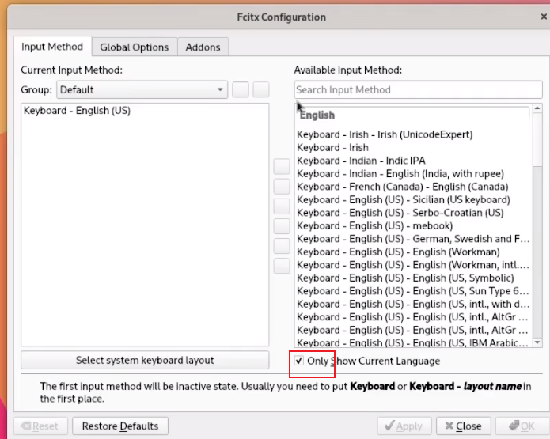

### 驱动安装
#### 声卡
```shell
pacman -Syu pipewire pipewire-pulse pipewire-jack pipewire-alsa 
```
#### 显卡
##### 显卡状况
```shell
lspci -k | grep -A 2 -E "(VGA|3D)"
```
##### 英伟达
```shell
pacman -S nvidia nvidia-prime nvidia-settings nvidia-utils opencl-nvidia lib32-nvidia-utils lib32-opencl-nvidia
```
### 中文输入配置
<https://wiki.archlinuxcn.org/wiki/Fcitx5#%E4%B8%AD%E6%96%87>\
<https://www.bilibili.com/video/BV1Wu411o7Kd/?spm_id_from=333.337.search-card.all.click&vd_source=ac44a38168194f76fada7686c12a4a37>\
安装 fcitx5包 软件包。
fcitx5-im包组 包组提供 fcitx5包 本体、#配置工具和必要的#输入法模块。
fcitx5-chewing包 是流行的繁体中文注音输入引擎，它基于 libchewing包。
fcitx5-chinese-addons包 包含与中文相关的 addon，例如拼音、双拼和五笔。
fcitx5-rime包 使用 Rime 引擎。
fcitx5-mcbopomofo-gitAUR McBopomofo 支持。


#### finally
```shell
pacman -Syu fcitx5-im fcitx5-chinese-addons fcitx5-input-support fcitx5-qt fcitx5-gtk fcitx5-material-color
```
##### 主题配置

##### 取消勾选，显示中文输入法

##### 云拼音配置，可选


##### ArchCN源
/etc/pacman.conf 文件末尾添加以下两行
```conf
[archlinuxcn]
Server = https://mirrors.tuna.tsinghua.edu.cn/archlinuxcn/$arch
```
```shell
pacman -Syu
pacman -Syu archlinuxcn-keyring
```
##### 本地字库配置（推荐）
```shell
#可先联想
pacman -Syu fcitx5-pinyin 按tab
pacman -Syu fcitx5-pinyin-zhwiki fcitx5-pinyin-moegirl fcitx5-pinyin-sougou
```
##### 中文乱码 安装中文字体
```shell
pacman -Syu wqy-zenhei wqy-microhei
```

### xfce美化

### 常用软件安装
```shell
pacman -Syu chromium
pacman -Syu firefox
pacman -Syu visual-studio-code-bin#不行用yay
pacman -Syu
pacman -Syu
pacman -Syu
pacman -Syu
```
#### 快照
<https://www.bilibili.com/read/cv16725144>\
<https://zhuanlan.zhihu.com/p/346602946>
```shell
#snapper-gui
pacman -Syu btrfs-assistant

pacman -Syu timeshif
```