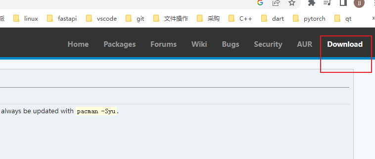
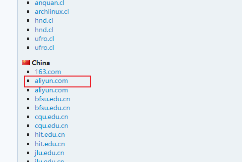
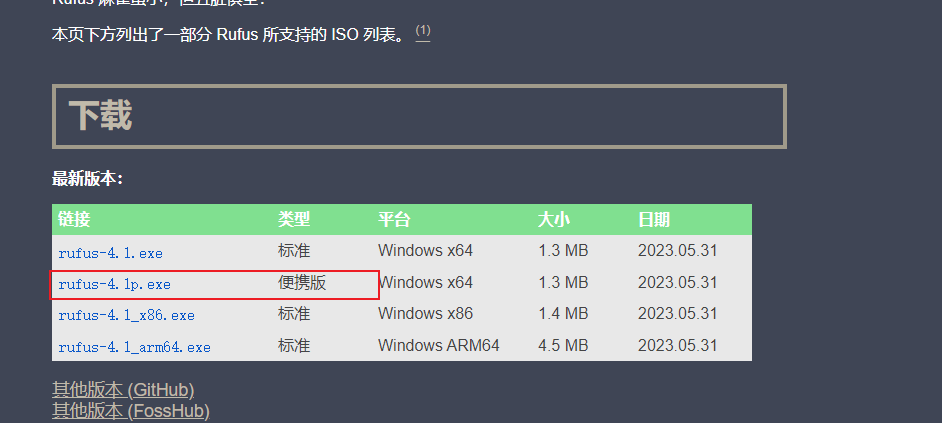
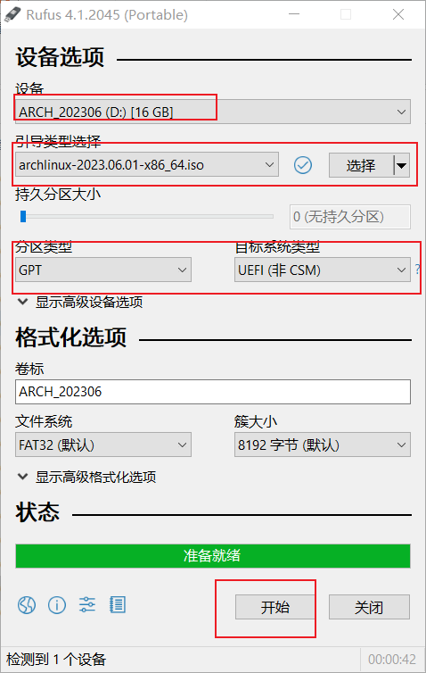
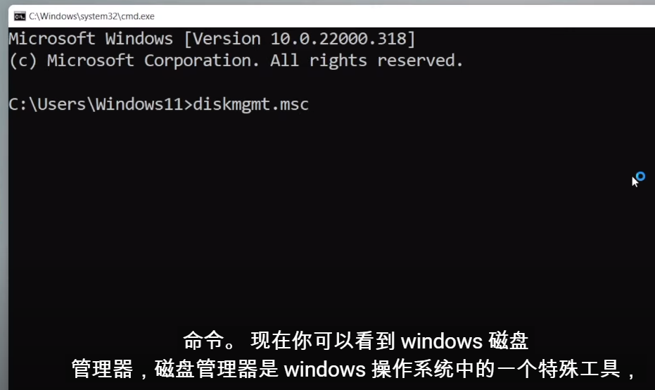
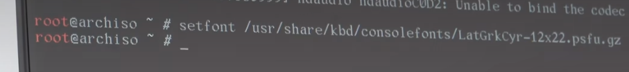
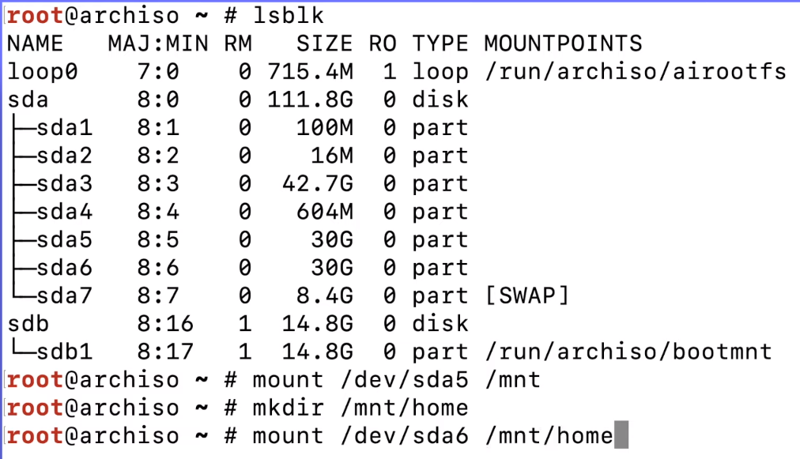

<https://zhuanlan.zhihu.com/p/568981775>\
<https://blog.csdn.net/kimux/article/details/128700223>\
<https://sspai.com/post/78916>\
<https://blog.csdn.net/qq_36390239/article/details/111296840>\
<https://blog.csdn.net/m0_56763895/article/details/130179676>\
<https://www.cnblogs.com/liam220818/p/16332754.html#btrfs-%E5%AD%90%E5%8D%B7>
### 下载arch镜像
<https://archlinux.org/>


### 制作启动盘
<https://rufus.ie/zh/>


### 为arch分配可用空间（可使用移动硬盘）
#### 移动硬盘先转为gpt
##### 用DiskGenius工具操作

操作步骤如下：

* 1) 下载、安装DiskGenius工具并运行

* 2) 找到你要转换的硬盘并进行右键点击

* 3) 在弹出的下拉菜单中选择“转换分区表类型”

* 4) 在出现的窗口中选择“MBR转GPT”选项，并按照提示完成剩余配置，最后点击“确认”

压缩卷
### 重启进入启动盘(提前进入bios禁用)
<https://github.com/archlinux/archinstall/issues/1554>\
<https://askubuntu.com/questions/1213973/how-to-repair-kernel-error-pcieport-aer-p-pcieport-device-8086a110-error-st>\
<https://blog.csdn.net/qq_41807801/article/details/99954767>\
在试图启动 Arch Linux 之前在固件设置中手动禁用 UEFI 安全启动
华硕在security，secure boot中，并将boot改为uefi启动first，启动后报错Error of this agent is reported first，尝试升级bios或:
```shell
sudo -H gedit /etc/default/grub # edit this file
找到字符串“quietsplash”并将其更改为"quiet splash pci=noaer" or"quiet splash pcie_aspm=off"。
sudo update-grub # update GRUB
reboot# 重新启动计算机
```

```shell
#设置字体大小
setfont /usr/share/kdb
setfont ter-132n
```

```shell
#确认是否在uefi模式
ls /sys/firmware/efi/efivars
#查看当前wifi设备（一般wlan0）
ip link
ip a
#打开wifi
ip link set waln0 up
#查看是否启用（有up字样）
ip link
#扫描wifi
iwctl
station wlan0 scan
station waln0 get-networks
station wlan0 connect wifi名称
输入密码
#退出
exit
#检查网络是否正常
ping baidu.com
#网络同步时间
timedatectl set-ntp true
#或者根据地点
timedatectl list-timezones
timedatectl set-timezone 地区
#查看同步结果
timedatectl status
```
### 更新mirrorlist
reflector -c China -a 6 --sort rate --protocol https --save /etc/pacman.d/mirrorlist
cat /etc/pacman.d/mirrorlist
### 分区
```shell
#查看磁盘列表
lsblk
# MBR 格式的硬盘使用fdisk(cfdisk 图形界面)
# GPT 格式的硬盘使用gdisk(cgdisk 图形界面)
# 查看磁盘
gdisk -l
#清屏
clear
ctrl+l
#进入分给linux的磁盘
cgdisk/gdisk 分区名称
#查看当前磁盘布局
p
#名称
c
#新建分区
n
#选择类型(ef00 3800 3200 最好检查下类型)
t

#传统格式化分区
# 格式化成 Ext4
mkfs.ext4 /dev/sda3
mkfs.ext4 /dev/sda5
# 格式化 swap 分区
mkswap /dev/sda6
# 格式化为 XFS
mkfs.xfs /dev/vdb2

# 新格式化分区
mkfs.fat -F32 /dev/sda1    # 格式化 boot 分区，双系统可设置可不设置512MB
mkswap /dev/sda2    # 格式化 swap 分区16GB
swapon /dev/sda2 #启用交换分区
mkfs.btrfs /dev/sda3    # 格式化主分区

```

传统Ext4挂载


挂载btrfs分区
```shell
mount /dev/sdb1 /mnt
```
创建子卷
```shell
btrfs su cr /mnt/@                    // 挂载到 root，必需
btrfs su cr /mnt/@boot                // boot 子卷, 可选
btrfs su cr /mnt/@home                // home ，可选
btrfs su cr /mnt/@distfiles           // 放置pacman -S 安装软件是下载的文件 , 可选 
btrfs su cr /mnt/@log                 // log 文件,  可选
btrfs su cr /mnt/@snapshots            // 快照文件, 可选
btrfs su cr /mnt/@swap                // swapfile ，可选

```
创建完成后查检一下
```shell
btrfs su li /mnt
```
挂载子卷
<https://www.momiji.fun/use-btrfs-in-omv/>\
<https://www.python100.com/html/83579.html>
compress=zstd
启动透明压缩，实测若是以媒体（影视大文件(以GB计)+音乐、图片、图书等小文件(以MB计)）为主，zstd的压缩比更优秀。总共1.8T | 1.0T，可压缩部分为1.8G | 5.1G，lzo压缩比50% | 56%，zstd压缩比35 | 49%。lzo\zstd均为默认压缩等级，均未使用过碎片整理。
zlib、 lzo、zstd的对比可看相关测试。

autodefrag
自动碎片整理，懒人必备，不适合大量小文件的写入（如大型数据库）。

noatime
要求系统不必在每次访问文件的时候都修改最后一次的访问时间，可以明显提升服务器性能，尤其是在读取密集型工作负载下。这是因为btrfs是写时复制文件系统，每次修改访问时间都需要先复制元数据块，如果一次性访问了很多文件，就会导致大量和分散的写入操作。
除非是安全审计和应用程序需要，否在完全没必要使用文件访问时间。

space_cache=v2
在非常大的文件系统（many TB）和某些工作负载上，v1空间缓存的性能可能会急剧下降。自4.5起，v2通过实现添加了一个称为空闲空间树的 新 b 树解决了这个问题。启用后，将始终使用v2空间缓存，除非将其清除，否则无法禁用。

commit=0
立即提交数据，即立即将数据写入硬盘，默认为30秒，适当增加时间可以提升磁盘性能，但会有断电丢数据的风险。
```shell
umount /mnt

mount -t btrfs -o defaults,compress=zstd,space_cache=v2,autodefrag,discard=async,subvol=@ /dev/sdb1 /mnt
mkdir -pv /mnt/{boot,home,var/log,var/cache/pacman/pkg,.snapshot,.swap}
mount -t btrfs -o subvol=@boot /dev/sdb1 /mnt/boot
mount -t btrfs -o subvol=@home /dev/sdb1 /mnt/home
mount -t btrfs -o subvol=@distfiles /dev/sdb1 /mnt/var/cache/pacman/pkg
mount -t btrfs -o subvol=@log /dev/sdb1 /mnt/var/log
mount -t btrfs -o subvol=@snapshots /dev/sdb1 /mnt/.snapshots
mount -t btrfs -o subvol=subvol=@swap /dev/sdb1 /mnt/.swap

#例子2
# 挂载根目录
mount /dev/sda3 /mnt -t btrfs -o subvol=@,noatime,discard=async,compress=zstd,space_cache=v2
# 挂载家目录
mkdir /mnt/home
mount /dev/sda3 /mnt/home -o subvol=@home,noatime,discard=async,compress=zstd
# 挂载 /var/log 目录
mkdir -p /mnt/var/log
mount /dev/sda3 /mnt/var/log -o subvol=@log,noatime,discard=async,compress=zstd
# 挂载 /var/cache/pacman/pkg 目录
mkdir -p /mnt/var/cache/pacman/pkg
mount /dev/sda3 /mnt/var/cache/pacman/pkg -o subvol=@pkg,noatime,discard=async,compress=zstd
检查
btrfs su li /mnt

```
别忘了挂载WIN10的EFI分区
注意别挂错分区，一定要挂载WIN10的EFI分区
```shell
mkdir /mnt/boot/wefi
mkdir /mnt/boot/efi
mount -t vfat /dev/sdc1 /mnt/boot/wefi
mount -t vfat /dev/sda1 /mnt/boot/efi
swapon /dev/sda2
```
### 更新库
```shell

pacman -Syu

```
### 安装系统
```shell
pacstrap -K /mnt base base-devel linux-lts linux-lts-headers linux-firmware neovim btrfs-progs amd-ucode
pacstrap -K /mnt base base-devel linux-zen linux-zen-headers linux-firmware intel-ucode man-db man-page man-page-zh_cn texinfo git neovim mtools dosfstools btrfs-progs pacman-contrib openssh bash-completion doas
pacstrap -K /mnt base base-devel linux linux-headers linux-firmware neovim btrfs-progs intel-ucode git networkmanager snapper dhcpcd sudo network-manager-applet  wpa_supplicant net-tools

# 安装报错
pacman -Sy archlinux-keyring
```
### 生成 fstab 文件
```shell
genfstab -U /mnt >> /mnt/etc/fstab

cat /mnt/etc/fstab
```
### 进入到安装的系统
```shell
arch-chroot /mnt
ln -s /bin/nvim /bin/vi
```
### 本地化的一些工作
```shell
ln -sf /usr/share/zoneinfo/Asia/Shanghai /etc/localtime    
hwclock --systohc

vi /etc/locale.gen
# 搜索en_US和zh_CN
# 取消下面两行的注释
# en_US.UTF-8 UTF-8
# zh_CN.UTF-8 UTF-8
# 保存退出

locale-gen
echo "LANG=en_US.UTF-8" > /etc/locale.conf

# 主机名
echo 主机名 > /etc/hostname
# 配置主机名
# archlinux 可自定义，但要注意后边的要和自定义的一致  
echo archlinux > /etc/hostname

# archlinux 为上面定义的主机名
vim /etc/hosts
127.0.0.1  localhost
::1        localhost
127.0.1.1  myhostname.localdomain myhostname
# 查看 hosts
cat /etc/hosts

```
### grub引导和一些其他工具
<https://wiki.archlinuxcn.org/wiki/Systemd-boot?rdfrom=https%3A%2F%2Fwiki.archlinux.org%2Findex.php%3Ftitle%3DSystemd-boot_%28%25E7%25AE%2580%25E4%25BD%2593%25E4%25B8%25AD%25E6%2596%2587%29%26redirect%3Dno#%E9%85%8D%E7%BD%AE>
```shell
pacman -S grub efibootmgr os-prober 
grub-install --target=x86_64-efi --efi-directory=/boot/efi --bootloader-id=Archlinux
grub-mkconfig -o /boot/grub/grub.cfg

or

bootctl --path=/mnt/boot install


```
### 驱动安装

### mkinitcpio
```shell
vi /etc/mkinitcpio.conf

# MODULES = (btrfs nvidia)
# BINARIES (/usr/bin/btrfs)
# HOOKS  (去掉fsck 添加 btrfs ）
或
# 在 MODULES=() 中添加 btrfs

mkinitcpio -P
```
### 用户
```shell
passwd
useradd -m -G wheel 用户名  # 创建用户，并为其创建家目录，将其加入 wheel 组
passwd 用户名  # 为新用户设置密码
EDITOR=vim visudo
or
vim /etc/sudoers
%wheel ALL=(ALL:ALL) ALL

```
### 安装桌面
```shell
pacman -S xorg xorg-server xorg-xinit xterm
pacman -S xfce4 xfce4-goodies lightdm-gtk-greeter lightdm-gtk-greeter-settings
```
### 服务启用
```shell
systemctl enable lightdm.service 
systemctl enable dhcpcd
systemctl enable NetworkManager
systemctl enable wpa_supplicant.service
```
### 重启
```shell
exit
swapoff /mnt/.swap/swapfile
umount -R /mnt
reboot
```
### 选择系统
<https://wiki.archlinux.org/title/GRUB#Using_the_command_shell>
```shell
#每天一边遍,防止滚挂【doge】
sudo pacman -Syyu
```