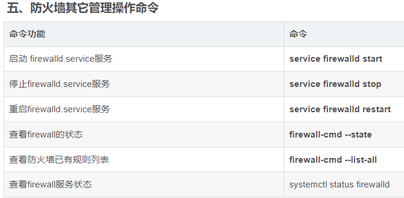

<!--
 * @Author: guanjiajun www.guanjiajun@ewake.com
 * @Date: 2023-04-03 15:37:56
 * @LastEditors: guanjiajun www.guanjiajun@ewake.com
 * @LastEditTime: 2023-07-01 14:07:13
 * @FilePath: \studys\programming\linux\centos常见命令.md
 * @Description: 这是默认设置,请设置`customMade`, 打开koroFileHeader查看配置 进行设置: https://github.com/OBKoro1/koro1FileHeader/wiki/%E9%85%8D%E7%BD%AE
-->
### 查看ip
```shell
ip addr
```
### 修改root密码
```shell
passwd
```
### 查看端口占用
```shell
netstat -anp | grep 8080

netstat -anp

# 或者
netstat -tln
lsof -i :8080
kill -9 2597932
```
### 端口开启
```shell
#查看端口是否开启
netstat -aptn
lsof -i :8080
#端口开启
iptables -A INPUT -p tcp --dport 3306 -j ACCEPT
#之间
iptables -A INPUT -p tcp --dport 49150:65522 -j ACCEPT
#在Centos linux 6及以前的版本，操控防火墙用的命令是iptables，但在Centos linux 7 及其以后的版本，操控防火墙的命令变化了，现在用firewall-cmd这个命令来操作防火墙了，现记录如下
#开放端口用 --add-port
firewall-cmd --permanent --add-port=8080/tcp
#移除端口用 --remove-port
firewall-cmd --permanent --remove-port=8080/tcp
#刷新规则用 --reload
firewall-cmd --reload
#查询端口是否开放用 --query-port
firewall-cmd --query-port=8080/tcp
#建议重启
```


```shell
#查看隐藏文件
ls -a
```