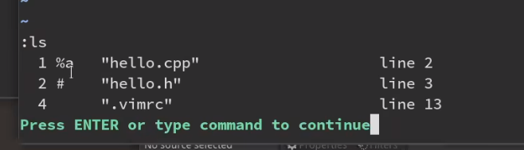
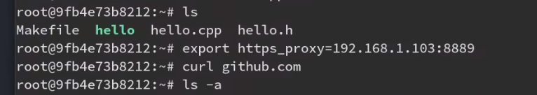

<!--
 * @Author: guanjiajun www.guanjiajun@ewake.com
 * @Date: 2023-06-25 19:35:26
 * @LastEditors: guanjiajun www.guanjiajun@ewake.com
 * @LastEditTime: 2023-07-01 19:42:34
 * @FilePath: \studys\programming\linux\vim\vim基本命令.md
 * @Description: 这是默认设置,请设置`customMade`, 打开koroFileHeader查看配置 进行设置: https://github.com/OBKoro1/koro1FileHeader/wiki/%E9%85%8D%E7%BD%AE
-->
### 基本命令
```shell
hjkl左上下右
i当前字符前插入
a当前字符后插入
I当前行开头插入
A当前行末尾插入
o在后一行插入
O在前一行插入
v选择
V选择整行
y复制
p粘贴在当前字符后
P粘贴在当前字符前
c修改
d删除
x删除一个字符
s修改当前字符
r仅修改当前字符
f跳转到下一个字符上
t跳转到下一个字符前
0开头
$结尾
^除去空格的开头
w下一个单词
b上一个单词
e下一个单词的末尾
W下一个单词（无视符号）
B上一个单词（无视符号）
E下一个单词的末尾（无视符号）
ZZ保存并退出
ZQ不保存强制退出
<<减小缩进
>>增大缩进
==自动调整缩进
#向前查找当前光标下单词
*向后查找当前光标下单词
?向前查找
/向后查找
n下一个
N上一个
{上一段落
}下一段落
q录制宏
@播放宏
```
### tips
```shell
:set mouse=a #启用鼠标
ye yw #复制一个单词 e w对单词进行操作 we的区别：对于空格换行符处理不同
#退出
q! #强制退出

set nu #开启行号
set nonu

cw #修改单词
c3w

5o #输入多行相同内容 esc后显示

vi" #选中符号内的内容
va" #选中符号内的内容 带符号

ci[ #修改 符号内
ca

:s/\s*$//g #去除行尾空格

shift+insert #粘贴外部代码

r #替换光标处字符
f+字符 #找字符

:sh #进入shell进行操作 exit或 ctrl+d退出
:!+shell命令 #立即执行shell命令
vf+字符 #进入块模式，从当前贯标选到find的字符处
```
### c++调试
%a代表当前正在编辑文件，#上一个打开文件，ctrl+o调转到上一个文件，ctrl+i跳转回当前文件，:b+缓存序，跳转指定文件缓存

```shell
:cw #查看报错 可定位到报错处
:ls #查看缓冲区
:b1 #跳转到1号缓存

```
### vim插件
<https://www.bilibili.com/video/BV16S4y1m7Dr/?spm_id_from=333.788&vd_source=ac44a38168194f76fada7686c12a4a37>\
<https://github.com/junegunn/vim-plug>
vim-plug
访问github变快

### 映射实现快捷功能（例如一键编译）
```shell
nmap ，noremap区别在于nmap可以递归 例如双向绑定按键
:noremap <绑定的按键> :wa<CR>:!g++ % -o a.out && ./a.out<CR> #%代表本文件 <CR>代表确认类似enter
:noremap <绑定的按键> :sh<CR> #%代表本文件 <CR>代表确认类似enter
```
### V模式
```shell
V #选中全行
v #从光标位置开始
c+v #列
#块选中加：进行选中区域行的相关操作
:'<,'>norm I# #norm表示对每行执行的vi命令
```
### 查找
```shell
# #向前查找当前光标下单词
* #向后查找当前光标下单词
? #向前查找
/ #向后查找
```
### 跳转
```shell
行号gg #跳转
gg #文件头
G #最后一行
0 #行首
$ #行尾
3+ #前三行的行首
3- #后三行的行首
3$ #下三行的行尾
^ #不带空格的行首
w #跳转单词头
e #跳转到单词尾
b #往前跳
{ #上一段落
} #下一段落
c+d #向下翻页
c+u #向上翻页
```
### 注释 替换
<https://blog.csdn.net/cwcmcw/article/details/44875165>
```shell
#注释 替换
#可使用v块模式替代行号操作 前提选中注释区域
:'<,'>norm 02x

:'<,'>norm I//
#//
#当前行
:s/.*/\/\/&/
:s:.*://&:
:s/^/\/\/


#指定行
:n,n s/.*/\/\/&/
:n,n s:.*://&:
:n,m s/^/\/\/
#/**/
:n,m s/^/\/*
:n,m s/$/*\/

:s//\/*&*\//
:s:.:/&*/:

:n, n s//\/*&*\//
:n, n s:.:/&*/:*/

#取消注释，替换
#//
:n,m s/^\/\///g #/g代表多次替换
#/**/
:n,m s/^\/\*//g
:n,m s/\*\/$//g

#全部替换
%替代行号

```