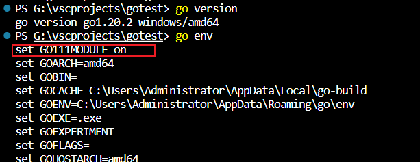

<!--
 * @Author: guanjiajun www.guanjiajun@ewake.com
 * @Date: 2023-03-09 10:43:13
 * @LastEditors: guanjiajun www.guanjiajun@ewake.com
 * @LastEditTime: 2023-03-31 08:38:06
 * @FilePath: \studys\programming\server\go\go环境搭建.md
 * @Description: 这是默认设置,请设置`customMade`, 打开koroFileHeader查看配置 进行设置: https://github.com/OBKoro1/koro1FileHeader/wiki/%E9%85%8D%E7%BD%AE
-->
## windows go环境搭建
1.golang官网下载安装，https://golang.google.cn/dl/
注意点看你是否需要更换安装路径


```bash
#安装版本校验
go version
```

2.配置go环境
```bash
#查看go env 修改为mod方式管理包,1.20以上默认打开
go env

#如果没有打开，使用以下命令打开，打开后如下图所示
go env -w GO111MOUBLE=on
#代理 1.20以上默认打开
go env -w GOPROXY=https:// goproxy.cn,direct
```

3.go mod常用如下， 其他相关知识自行搜索
```bash
go mod init + module名称  // 给就项目添加mod管理

go build ./...  // 可以一次性将目录下所有的项目的依赖

go get xxx  // 用于添加依赖
```
