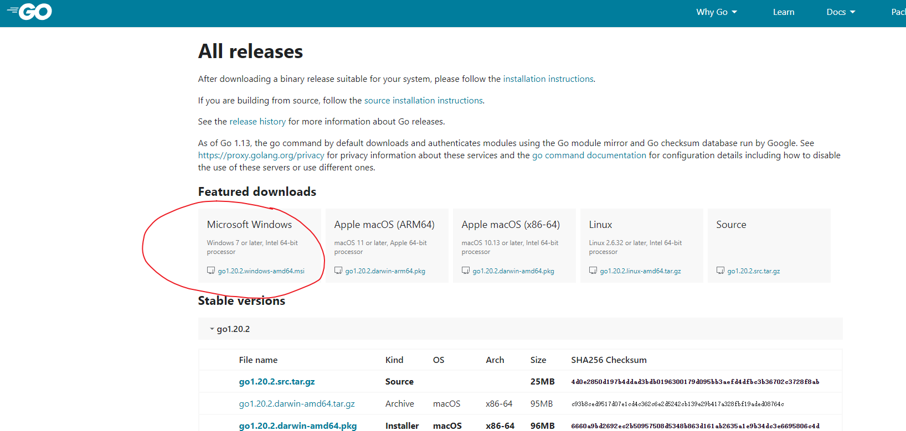

##windows go环境搭建
1.golang官网下载安装，https://golang.google.cn/dl/
注意点看你是否需要更换安装路径


```bash
#安装版本校验
go version
```

2.配置go环境
```bash
#查看go env 修改为mod方式管理包,1.20以上默认打开
go env

#如果没有打开，使用以下命令打开，打开后如下图所示
go env -w GO111MOUBLE=on
#代理 1.20以上默认打开
go env -w GOPROXY=https:// goproxy.cn,direct
```

3.go mod 管理相关知识自行搜索
