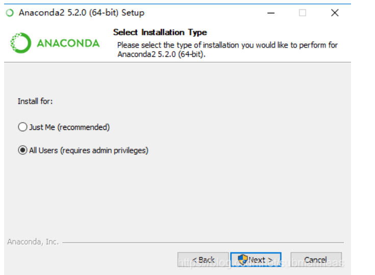

# Python开发环境搭建（4）：Anaconda+Pycharm创建/导出/复现虚拟环境

## 1.Anaconda

Anaconda指的是一个开源的Python发行版本，其包含了conda、Python等180多个科学包及其依赖项。 因为包含了大量的科学包，Anaconda 的下载文件比较大（500+ MB），如果只需要某些包，或者需要节省带宽或存储空间，也可以使用Miniconda这个较小的发行版（仅包含conda和 Python）。

**Conda是一个开源的包、环境管理器，可以用于在同一个机器上安装不同版本的软件包及其依赖，并能够在不同的环境之间切换。**

Anaconda包括Conda、Python以及一大堆安装好的工具包，比如：numpy、pandas等

Miniconda包括Conda、Python

原文链接：[Anaconda详细安装及使用教程（带图文）_代码帮-CSDN博客_anaconda安装教程](https://link.zhihu.com/?target=https%3A//blog.csdn.net/ITLearnHall/article/details/81708148)

**（1）为什么安装Anaconda**

①Anaconda通过管理工具包、开发环境、Python版本，大大简化了工作流程。不仅可以方便地**安装、更新、卸载包**，而且安装时能自动安装相应的**依赖包**，同时还能使用不同的**虚拟环境**隔离不同要求的项目。

②包含了720多个数据科学相关的开源包，在数据可视化、机器学习、深度学习等多方面都有涉及。不仅可以做**数据分析**，甚至可以用在大数据和人工智能领域。

③Anaconda还附带捆绑了两个非常好用的交互式代码编辑器：**Spyder、Jupyter notebook**。

**（2）Anaconda安装**

官网地址：[https://www.anaconda.com/download/](https://link.zhihu.com/?target=https%3A//www.anaconda.com/download/)

①如下图，点击下载即可。


②根据提示安装

自定义安装路径。

需要注意的是最后一步的配置：

- **添加环境变量（添加后可以在cmd中使用comda命令）**
- **将Anoconda中的python作为默认解释器。**
  

可以根据情况勾选。


最后，等待安装完成即可。

可以查看所有的组件，如下：

- **Anaconda Navigator**：桌面图形用户界面（GUI），允许您在不使用命令行命令的情况下启动应用程序并轻松管理conda包，环境和通道。Navigator可以在Anaconda Cloud或本地Anaconda存储库中搜索包。
- **Anaconda Powershell Prompt**：比anaconda prompt多出了一些命令。
- **Anaconda Prompt**：类似于cmd窗口，输入命令就可以控制和配置python，最常用的是conda命令，和pip的用法一样。
- **Jupyter Notebook**：基于网页的用于交互计算的应用程序。其可被应用于全过程计算：开发、文档编写、运行代码和展示结果。
- **Spyder**：使用Python编程语言进行科学计算的集成开发环境。


## **2.Anaconda使用**

**（1）Anaconda Navigator**

**①基本菜单+Home界面内容**

**基本菜单有：File/Help/Home/Environments/Learning/Community**

**Home界面：**显示了**当前环境中（可以切换）**可以使用Navigator管理的所有可用应用程序。

在每个应用程序框中，你可以：
启动应用程序—单击其"启动"按钮
安装应用程序—单击其"安装"按钮


**②Environments界面内容**

显示了envs文件中创建的所有的环境，点击可以进行环境切换，并对其进行管理（克隆、删除等），右侧显示该环境中的包。


**③Learning界面内容**

可以了解有关Navigator，Anaconda平台和开放数据科学的更多信息。

**④Community界面内容**

可以了解有关Navigator相关的活动，免费支持论坛和社交网络的更多信息。

**参考：**[自用：Anaconda Navigator功能介绍](https://link.zhihu.com/?target=https%3A//blog.csdn.net/qq_44942936/article/details/104623714)

**（2）Anaconda Prompt**

Anaconda Prompt不同于Anaconda Navigator的可视化配置，它使用conda命令的方式配置虚拟环境，类似于cmd窗口的pip。

如果conda下载不了包，可以尝试用pip命令下载，或者导入其他的下载源等。

**系列conda操作：**

**查看conda版本**

> conda --version


**创建环境**
```shell
# 添加Anaconda的TUNA镜像
conda config --add channels https://mirrors.tuna.tsinghua.edu.cn/anaconda/pkgs/free/
conda config --add channels https://mirrors.tuna.tsinghua.edu.cn/anaconda/pkgs/main/
conda config --set show_channel_urls yes
```
(CondaHTTPError: HTTP 000 CONNECTION FAILEDv参考)<https://blog.csdn.net/guotianqing/article/details/108650253>
> conda activate test

> \# 环境名为“test”，指定python版本为3.6，不指定则不会下载python
> conda create --name test python=3.6


**激活某个环境（直接写环境名就行，conda可以直接找到）**


**查看环境中的包（纯净环境连python都没有！！）**

> conda list

**查看所有环境列表**

> conda env list


**安装/卸载包（conda同时会下载其依赖包）**

> \# 为当前环境安装requests包
> conda install requests
> \# 安装特定版本
> conda install requests==2.20
> \# 为指定环境安装指定包
> conda install --name <env> requests
> \# 同时卸载多个包
> conda uninstall package1 package2 ..
> \# 当conda下载不了，用pip下载
> pip install <pack_name>
> \# 卸载环境中的无用包
> conda
> \# 卸载环境中的所有包
> conda clear --all

**查找包（在conda云上找所有可安装版本，而不是在当前环境找）**

> \# 全名查找
> conda search --full-name <pack_name>

**退出当前环境**

> conda deactivate

**删除某环境，并删除所有包**

> conda remove --name test --all

**复制一个环境**

> \# 克隆test来创建一个test_copy环境。
> conda create --name test_copy --clone test

**参考文章：**

[Anaconda详细安装及使用教程（带图文）_代码帮-CSDN博客_anaconda安装教程](https://link.zhihu.com/?target=https%3A//blog.csdn.net/ITLearnHall/article/details/81708148)

[Conda包环境管理基本操作](https://link.zhihu.com/?target=https%3A//www.jianshu.com/p/777ea4b8d4e2)

[使用Anaconda进行环境和包的管理_CommissarMa的博客-CSDN博客_anaconda environment中的包](https://link.zhihu.com/?target=https%3A//blog.csdn.net/u012343179/article/details/76146815)

[anaconda的使用教程，手把手教你（一）_薛定谔的痘痘的博客-CSDN博客](https://link.zhihu.com/?target=https%3A//blog.csdn.net/qq_44859600/article/details/115822388)

## 3.Anaconda+Pycharm创建/使用虚拟环境

Anaconda是创建和管理虚拟环境的工具之一，可创建包含任意python版本和包版本的环境。其自带的base环境包含了conda、Python等180多个科学包及其依赖。

Pycharm是python的第三方IDE，用它进行开发效率较高。

**（1）pycharm基于已存在的conda环境进行虚拟环境创建。**

**①基于conda的base环境**

直接选择Anaconda路径下的python.exe作为解释器，即可调用base环境。

选用了base中所有的包都可以使用，而且可以通过Anaconda对base环境进行管理，而不需要通过pycharm。


**②基于事先用conda创建的其他虚拟环境**

选择Anaconda下级**Envs**文件具体环境文件夹中**tools**中的**python.exe**作为解释器，就可以使用该虚拟环境。

该虚拟环境中所有的包都可以使用，而且可以通过Anaconda对其环境进行管理，而不需要通过pycharm。

通过pycharm查看所用环境中的配置信息，如下图：

- 标记1：是当前环境中的解释器版本
- 标记2：是当前环境中的包
- 标记3：点击这个按钮，可以由conda来接管包，通过Anaconda对该环境作出的处理，都可以实时更新到工程中。通过这些，也就**不需要通过pycharm来安装需要的包了**。


**（2）pycharm使用conda直接进行虚拟环境创建。**

**如下图所示：**

- 标记2：选择用conda工具为当前工程新建一个虚拟环境。**如果安装了Anaconda，那么通过标记5中选择Anaconda中的执行版本，此处的conda就会使用Anaconda中的。有关Anaconda的相关介绍，可以参考我的其他的文章：**
- 标记1：该Location是即将创建的工程想要保存的位置，可以自定义。
- 标记3：该Location是即将创建的虚拟环境要保存的位置，**环境名就是工程名**。**Anaconda在其安装目录下有专门的的目录来管理它创建的所有虚拟环境（比virtualenv方便）**。
- 标记4：Python version是所要创建的虚拟环境要用的解释器，即Python的版本，可以选择不同的版本，而不用基于已安装的，**默认使用Anaconda中自带的python版本**。（**因为conda创建的虚拟环境可以自动下载配置所需的python版本，是它特有的功能**）。
- 标记5：**Conda executable**，选择Conda执行器（一般是唯一的），选择Anoconda安装目录下的版本。
- 标记6：Make available to all projects，指该虚拟环境可以被其他的工程用作虚拟环境，如果不勾选，那么就只能被当前的工程使用。如果该环境具有一定的通用性，可以放开权限给其他工程，视情况而定。


创建以后，新环境的配置依旧通过conda进行，无需在pycharm中添加包。

## 4.Anaconda导出/复现虚拟环境

**（1）删除环境中没用到的包**

**没测试过，不知道靠不靠谱。**

**参考：**[conda常用命令:安装，更新，创建，激活，关闭，查看，卸载，删除，清理，重命名，换源，问题_zhayushui的专栏-CSDN博客](https://link.zhihu.com/?target=https%3A//blog.csdn.net/zhayushui/article/details/80433768%3Fops_request_misc%3D%257B%2522request%255Fid%2522%253A%2522162374501416780264087505%2522%252C%2522scm%2522%253A%252220140713.130102334.pc%255Fall.%2522%257D%26request_id%3D162374501416780264087505%26biz_id%3D0%26utm_medium%3Ddistribute.pc_search_result.none-task-blog-2~all~first_rank_v2~rank_v29-5-80433768.pc_search_result_cache%26utm_term%3Dconda%E6%B8%85%E7%90%86%E5%AE%89%E8%A3%85%E5%8C%85%26spm%3D1018.2226.3001.4187)

> conda clean -p //删除没有用的包
> conda clean -t //删除tar包
> conda clean -y --all //删除所有的安装包及cache

**（2）可选项：单纯导出组件清单**

pip批量导出包含环境中所有组件的requirements.txt文件

> pip freeze > requirements.txt

pip批量安装requirements.txt文件中包含的组件依赖

> pip install -r requirements.txt

conda批量导出包含环境中所有组件的requirements.txt文件

> conda list -e > requirements.txt

conda批量安装requirements.txt文件中包含的组件依赖

> conda install --yes --file requirements.txt

原文链接：[pip和conda批量导出、安装组件(requirements.txt)_智者之家-CSDN博客_conda requirements.txt](https://link.zhihu.com/?target=https%3A//blog.csdn.net/chekongfu/article/details/83187591)

**（3）导出整个环境，指定导出路径（包括所有的包信息）**

> conda env export > env_name.yaml D:\anaconda3\envs

**（4）复现虚拟环境**

使用以下命令，就可以复现一个环境。复现后的环境仍旧在envs目录中（如果已存在就会出错），复现过程会自动下载需要的包，等待完成即可。

**①复现.yaml文件中的整个环境（100%还原）**

> conda env create --file env_name.yaml D:\anaconda3\envs

**②创建新环境，并复现conda导出的包列表文本，类似于克隆**

> conda create --name <new_env> --file <requirements.txt>

**参考文章：**

[Anaconda详细安装及使用教程（带图文）_代码帮-CSDN博客_anaconda安装教程](https://link.zhihu.com/?target=https%3A//blog.csdn.net/ITLearnHall/article/details/81708148)

[anaconda 环境导出/导入](https://link.zhihu.com/?target=https%3A//blog.csdn.net/enter89/article/details/86507366)

**（5）其他更多conda命令可以参阅**

[conda常用命令:安装，更新，创建，激活，关闭，查看，卸载，删除，清理，重命名，换源，问题_zhayushui的专栏-CSDN博客](https://link.zhihu.com/?target=https%3A//blog.csdn.net/zhayushui/article/details/80433768%3Fops_request_misc%3D%257B%2522request%255Fid%2522%253A%2522162374501416780264087505%2522%252C%2522scm%2522%253A%252220140713.130102334.pc%255Fall.%2522%257D%26request_id%3D162374501416780264087505%26biz_id%3D0%26utm_medium%3Ddistribute.pc_search_result.none-task-blog-2~all~first_rank_v2~rank_v29-5-80433768.pc_search_result_cache%26utm_term%3Dconda%E6%B8%85%E7%90%86%E5%AE%89%E8%A3%85%E5%8C%85%26spm%3D1018.2226.3001.4187)

## 5.使用建议

**（1）Anaconda的base环境+conda管理环境**

Anaconda的base环境预装了很多的包，可以满足基本的需求，可以以此作为新建工程的依赖环境，同时辅以conda进行包的管理。

但是如果是要进行环境的迁移，那么这个环境无疑是比较庞大的，可以对一些没用到的包进行删减，做到环境的“净化”。

**（2）自创建环境作为模板环境**

我们可以根据自己的使用习惯和实际需求，创建合适的虚拟环境，并安装所需的包。那么这个环境就是比较“定制”的，没有太杂乱的包来占用空间。