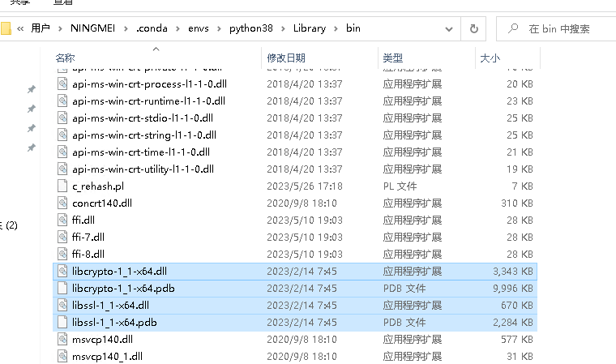

<!--
 * @Author: guanjiajun www.guanjiajun@ewake.com
 * @Date: 2023-04-30 15:35:01
 * @LastEditors: guanjiajun www.guanjiajun@ewake.com
 * @LastEditTime: 2023-05-27 14:51:55
 * @FilePath: \studys\programming\server\python\第三方库.md
 * @Description: 这是默认设置,请设置`customMade`, 打开koroFileHeader查看配置 进行设置: https://github.com/OBKoro1/koro1FileHeader/wiki/%E9%85%8D%E7%BD%AE
-->
<!--
 * @Author: guanjiajun www.guanjiajun@ewake.com
 * @Date: 2023-04-29 14:51:26
 * @LastEditors: guanjiajun www.guanjiajun@ewake.com
 * @LastEditTime: 2023-05-27 14:50:51
 * @FilePath: \studys\programming\server\python\第三方库.md
 * @Description: 这是默认设置,请设置`customMade`, 打开koroFileHeader查看配置 进行设置: https://github.com/OBKoro1/koro1FileHeader/wiki/%E9%85%8D%E7%BD%AE
-->
```shell
pip install -i https://pypi.tuna.tsinghua.edu.cn/simple xxx
# 这里注意，xxx是需要下载的包的名字，例如：
# pip install -i https://pypi.tuna.tsinghua.edu.cn/simple torch

#分别执行下列命令即可永久替换服务器为清华镜像源：
pip3 install pip -U
pip3 config set global.index-url https://mirror.baidu.com/pypi/simple
pip3 config set install.trusted-host https://mirror.baidu.com
或
pip3 config set global.index-url https://pypi.tuna.tsinghua.edu.cn/simple
pip3 config set install.trusted-host https://pypi.tuna.tsinghua.edu.cn
# ssl报错
pip install xxxxx -i http://pypi.douban.com/simple --trusted-host pypi.douban.com
pip3 config set global.index-url http://pypi.douban.com/simple
pip3 config set install.trusted-host pypi.douban.com
# 或将虚拟环境的Library/bin下的文件复制到DLLS下，如下图

# "pip install pip -U" 是用于执行升级pip的命令；

```
ssl报错将虚拟环境的Library/bin下的文件复制到DLLS下，如下图

### 项目第三方库的导入导出
<https://blog.csdn.net/chengxuyuan_110/article/details/129130272>
```shell
包含基础库
pip freeze > requirement.txt

#推荐 但少库
pip install pipreqs
pipreqs . --encoding=utf8 --force

pip install -r requirement.txt

```
