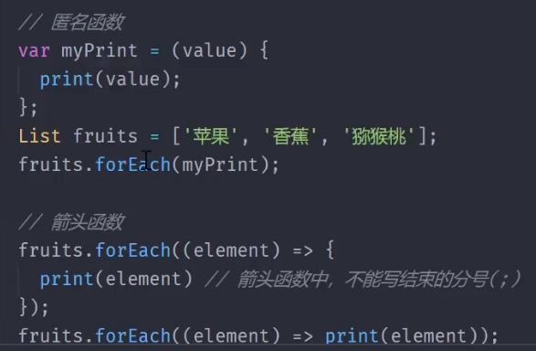
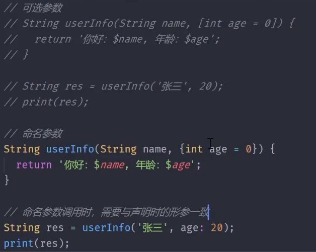
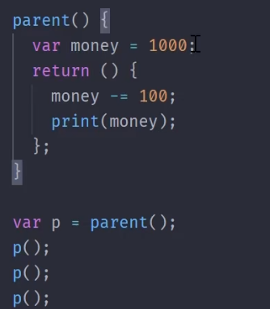
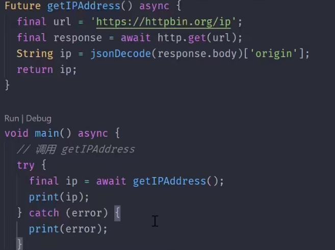

<!--
 * @Author: guanjiajun www.guanjiajun@ewake.com
 * @Date: 2023-08-26 15:02:36
 * @LastEditors: guanjiajun www.guanjiajun@ewake.com
 * @LastEditTime: 2023-08-26 15:20:46
 * @FilePath: \studys\programming\web,client\dart\dart函数.md
 * @Description: 这是默认设置,请设置`customMade`, 打开koroFileHeader查看配置 进行设置: https://github.com/OBKoro1/koro1FileHeader/wiki/%E9%85%8D%E7%BD%AE
-->
<https://www.jianshu.com/p/9f04a8c2558e>


Dart闭包
* 闭包是一个方法（对象）
* 闭包定义在其他方法内部
* 闭包能够访问外部方法内的局部变量，并持有其状态（这是闭包最大的作* 用，可以通过闭包的方式，将其暴露出去，提供给外部访问）


  ```dart


  ```

### 异步函数

