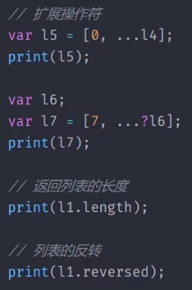
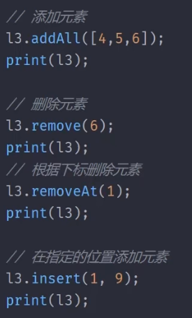
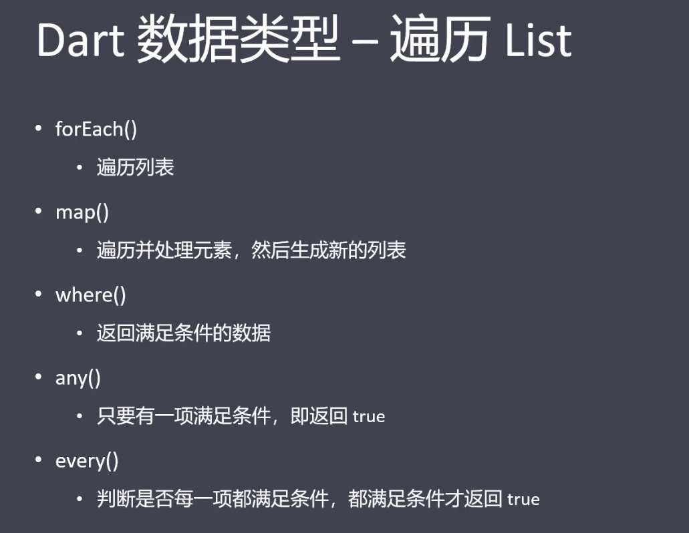
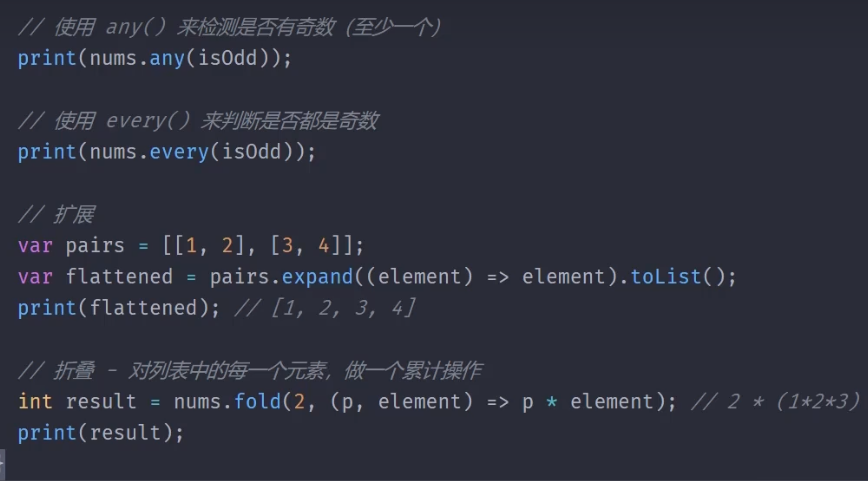
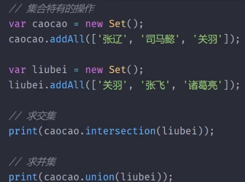
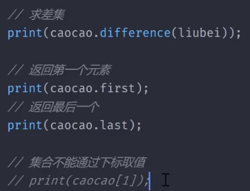
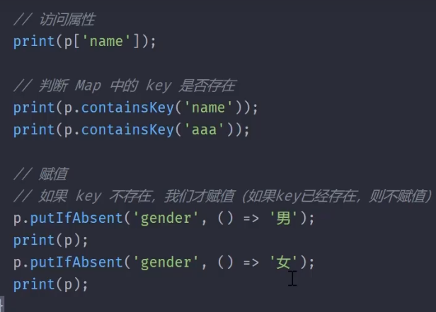
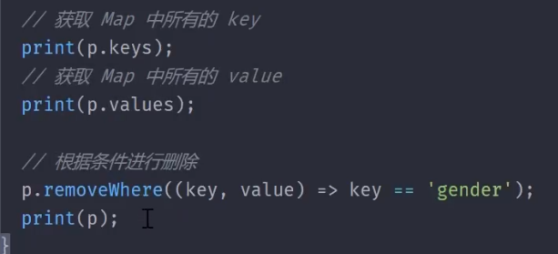
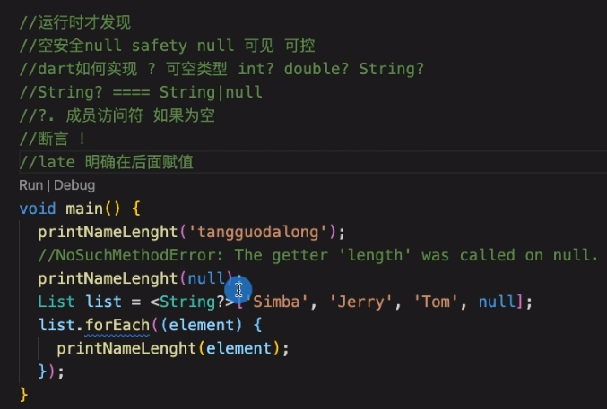

<!--
 * @Author: guanjiajun www.guanjiajun@ewake.com
 * @Date: 2023-08-26 14:00:02
 * @LastEditors: guanjiajun www.guanjiajun@ewake.com
 * @LastEditTime: 2023-08-26 14:56:28
 * @FilePath: \studys\programming\web,client\dart\dart基础.md
 * @Description: 这是默认设置,请设置`customMade`, 打开koroFileHeader查看配置 进行设置: https://github.com/OBKoro1/koro1FileHeader/wiki/%E9%85%8D%E7%BD%AE
-->
<https://www.bilibili.com/video/BV1rN411Z7JH/?p=7&spm_id_from=pageDriver&vd_source=ac44a38168194f76fada7686c12a4a37>
### 数值
```dart
//向下取整
num.toint()
//四舍五入
num.round()
//四舍五入保留几位小数
num.toStringAsFixed(4)
//返回余数
num.remainder(除数)
//比较
num.compareTo(num1)
```
### 字符串
<https://blog.csdn.net/weixin_47933729/article/details/125378099>
```dart

//'''  '''保留字符串换行


```


### list






<https://blog.csdn.net/weixin_42354735/article/details/109473003>
Dart中对List的一些方法的封装比java丰富了很多，有必要了解以下，避免再去自己实现一些操作。

    var list1 = List();// 不限定长度，不限定类型，可添加任意类型的数据
    List list2 = List();// 不限定长度，不限定类型，可添加任意类型的数据
    List list3 = List(2);//限定了长度为2  越界会报错，不限定类型，可添加任意类型的数据
 
    list1.add(1);
    list1.add('aaa');
    list1.add(true);
    print(list1);//[1, aaa, true]
 

    var list4 = [1,2,3];//初始就赋值了，限定了长度，限定了类型，只能是int
    var list5 = [2,'3',true];//初始就赋值了，限定了长度，未限定类型，任意位置可用任意类型替换
    List list6 = ['a',2,'b',false];//初始就赋值了，限定了长度，未限定类型，任意位置可用任意类型替换
    list5[1] = 2;
    list5[2] = 'aa';
    print(list5);//[2, 2, aa]
 

    var list33 = <String>["a","b"];
    List<String> list7 = ['a','b','3'];
    List<String> list8 = new List(2);
    list8[0]=('aaa');
    print(list8);//[aaa, null]
常用属性

 

    List<String> list13 = List();
    list13.add('aaa');
    list13.add('bbb');
    list13.add('ccc');
    print(list13.length);//3    长度
    print(list13.isEmpty);//false      是否为空
    print(list13.isNotEmpty);//true     是否不为空
    print(list13.reversed);//(ccc, bbb, aaa)      返回一个List的倒序排列的Iterable  不改变原List
    print(list13.first);//aaa    第一个元素
    print(list13.last);//ccc    最后一个元素
常用方法

add() 添加一个元素到List末尾

 

    List<String> list9 = List();
    list9.add('aaa');
    list9.add('bbb');
    print(list9);//[aaa, bbb]
addAll() 两个List合并

 

    List<String> list10 = List();
    list10.add('aaa');
    list10.add('bbb');
    List<String> list11 = List();
    list11.add('ccc');
    list11.add('ddd');
    list11.addAll(list10);
    print(list11);//[ccc, ddd, aaa, bbb]
insert(index,element) 在指定index处插入值

 

List<int> list21 = List();
    list21.add(0);
    list21.add(1);
    list21.add(2);
    list21.add(3);
    print(list21);//[0, 1, 2, 3]
    list21.insert(1, 5);  //指定索引位置 插入值，其余顺延
    print(list21);// [0, 5, 1, 2, 3]
insertAll(index,list) 在指定index处插入list 其余顺延

 

    List<int> list25 = List();
    list25.add(0);
    list25.add(1);
    list25.add(2);
    list25.add(3);
    print(list25);//[0, 1, 2, 3]
    list25.insertAll(1, [5,6,7]);
    print(list25);//[0, 5, 6, 7, 1, 2, 3]
followedBy(list) 将自身和参数内list合成一个List

 

    List<int> list45 = [3, 4, 1, 2, 5];
    Iterable<int> list46 = list45.followedBy([6,7]);//拼接两个list
//    print(list46);//(3, 4, 1, 2, 5, 6, 7)
//    print(list46.toList());//[3, 4, 1, 2, 5, 6, 7]
//    print(list46.toList(growable: false));//[3, 4, 1, 2, 5, 6, 7]  growable=false  表示生成的List的长度固定  不可再增加新元素
 
remove(obj) 删除具体的元素
removeAt(index) 删除索引位置元素

 

    List<String> list15 = List();
    list15.add('aaa');
    list15.add('bbb');
    list15.add('ccc');
    print(list15);//[aaa, bbb, ccc]
    list15.remove('bbb');// 直接根据元素的值删除
    print(list15);// [aaa, ccc]
    list15.removeAt(1);//根据索引位置删除
    print(list15);//[aaa]
removeLast()删除末尾元素
removeRange(start,end) 范围删除
removeWhere() 根据条件删除

 

    List<String> list16 = List();
    list16.add('aaa');
    list16.add('bbb');
    list16.add('ccc');
    list16.add('ddd');
    list16.add('eee');
    list16.add('fff');
    print(list16);//[aaa, bbb, ccc, ddd, eee, fff]
    list16.removeLast();//删除末尾元素
    print(list16);//[aaa, bbb, ccc, ddd, eee]
    list16.removeRange(0, 2);//删除索引从0-2的元素 含头不含尾
    print(list16);//[ccc, ddd, eee]
    list16.removeWhere((element){ return element=='ddd';});//根据条件 筛选，这里表示删除元素值为ddd的元素
    print(list16);//[ccc, eee]
    list16.removeWhere((element)=> element=='ccc');//条件只有一个表达式时，可以用箭头函数简化写法
    print(list16);//[eee]

clear() 清空数组

 

    List<String> list17 = List();
    list17.add('aaa');
    list17.add('bbb');
    list17.add('ccc');
    list17.add('ddd');
    print(list17);//[aaa, bbb, ccc, ddd]
    list17.clear();//清空数组
    print(list17);//[]
修改指定index位置的值

 

    var list12 = [2,'3',true];
    list12[1] = 2;
    print(list12);// [2, 2, true]
setRange(startIndex,endIndex,list) 范围修改List的值

 

 List<String> list18 = List();
    list18.add('aaa');
    list18.add('bbb');
    list18.add('ccc');
    list18.add('ddd');
//    print(list18);// [aaa, bbb, ccc, ddd]
    List<String> list19 = List();
    list19.add("111");
    list19.add("222");
    list19.add("333");
    list19.add("444");
    list19.add("555");
    list19.add("666");
    list18.setRange(0,3, list19);//范围修改，从list19取出0 1 2位置的值，修改list18对应0 1 2位置的值，0-3含头不含尾，start和end相同，则不变。start和end任何一个超出list18 list19的角标 则报错。
//    print(list18);//[111, 222, ccc, ddd]

replaceRange(start,end,list)范围替换 含头不含尾

 

List<int> list27 = List();
    list27.add(0);
    list27.add(1);
    list27.add(2);
    list27.add(3);
    print(list27);//[0, 1, 2, 3]
    list27.replaceRange(1, 3, [5,6,7,8]);//范围替换  含头不含尾
    print(list27);//[0, 5, 6, 7, 8, 3]
fillRange(start,end,value) 从start-end 每个元素用value替换

 

    List<int> list30 = List();
    list30.add(0);
    list30.add(1);
    list30.add(2);
    list30.add(3);
    list30.add(4);
//    print(list30);//[0, 1, 2, 3, 4]
    list30.fillRange(1, 4,6); //用相同的值替换指定索引范围内的值
//    print(list30);//[0, 6, 6, 6, 4]
retainWhere(()=>(bool)) 根据条件筛选元素

 

    List<int> list31 = List();
    list31.add(0);
    list31.add(1);
    list31.add(2);
    list31.add(3);
    list31.add(4);
//    print(list31);//[0, 1, 2, 3, 4]
    list31.retainWhere((element)=>(element>2)); //根据条件保留住元素
//    print(list31);//[3, 4]
setAll(index,list) 从index开始，使用list内的元素逐个替换本list中的元素

 

    List<int> list32 = List();
    list32.add(0);
    list32.add(1);
    list32.add(2);
    list32.add(3);
    list32.add(4);
//    print(list32);//[0, 1, 2, 3, 4]
    list32.setAll(2, [7,6]);//从指定index位置开始使用arr的值进行替换替换，index+arr.length必须<=list32.length   否则报错
//    print(list32);//[0, 1, 7, 6, 4]
查看index位置的值

 

    List<String> list14 = List();
    list14.add('aaa');
    list14.add('bbb');
    list14.add('ccc');
    print(list14[0]);//aaa     查看指定索引位置的值
    print(list14[2]);//ccc
    print(list14.first);//aaa     便捷操作  获取List第一个元素
    print(list14.last);//ccc     便捷操作  获取最后一个元素
indexOf(element,[start]) 查找指定元素在list中的索引

 

    List<int> list24 = List();
    list24.add(0);
    list24.add(1);
    list24.add(2);
    list24.add(3);
    int index1 = list24.indexOf(2);  //从索引0处开始查找指定元素，返回指定元素的索引
    int index2 = list24.indexOf(2,3);//从索引3处开始查找指定元素，如果存在返回元素索引，否则返回-1
    print(index1);//2
    print(index2);// -1
lastIndexOf(obj,index) 从后往前查找，返回第一个的index

 

    List<String> list34 = List();
    list34.add("aaa");
    list34.add("bbb");
    list34.add("ccc");
    list34.add("ddd");
    list34.add("eee");
//    print(list34);// [aaa, bbb, ccc, ddd, eee]
    int index = list34.lastIndexOf("ccc",1);//从指定索引位置（包含）开始往前找指定的元素所在的索引，找不到返回-1
//    print(index);//-1
    int index3 = list34.lastIndexOf("ccc",2);//从指定索引位置（包含）开始往前找指定的元素所在的索引，找不到返回-1
//    print(index3);//2
elementAt(index) 获取指定索引位置的元素

 

    List<String> list40 = List();
    list40.add("aaa");
    list40.add("bbb");
    list40.add("ccc");
    list40.add("ddd");
    list40.add("eee");
//    print(list40);// [aaa, bbb, ccc, ddd, eee]
    String result3 = list40.elementAt(4);//获取指定索引位置的元素
//    print(result3);//eee
any((element)=>(bool)) 判断List中是否有任意一个元素符合给定的参数

 

    List<String> list36 = List();
    list36.add("aaa");
    list36.add("bbb");
    list36.add("ccc");
    list36.add("ddd");
    list36.add("eee");
//    print(list36);// [aaa, bbb, ccc, ddd, eee]
    bool result = list36.any((element)=>(element=="d"));//判断list元素中是否有任何一个元素满足给定的条件，如果满足返回true 否则false
//    print(result);//false
every((element)=>(bool)) 判断List中是否每个元素都符合参数函数

 

    List<int> list41 = [1, 2, 3, 4, 5];
    bool result4 = list41.every((element)=>(element%2==0));//是否每个元素都符合条件   都符合返回true  否则返回false
    bool result5 = list41.every((element)=>(element>0));
//    print(result4);//false
//    print(result5);//true
contains(obj) List中是否存在给定的obj

 

    List<String> list39 = List();
    list39.add("aaa");
    list39.add("bbb");
    list39.add("ccc");
    list39.add("ddd");
    list39.add("eee");
//    print(list39);// [aaa, bbb, ccc, ddd, eee]
    bool result2 = list39.contains("eee");//是否包含某元素
//    print(result2);//true
firstWhere((element)=>(bool)) 返回第一个满足条件的元素（不是元素的index）

 

    List<int> list43 = [1, 2, 3, 4, 5];
    int result7 = list43.firstWhere((element)=>(element>2));//返回满足条件的第一个元素
//    int result8 = list43.firstWhere((element)=>(element>44));//返回满足条件的第一个元素，不满足 报错
    int result9 = list43.firstWhere((element)=>(element>44),orElse: ()=>(10));//返回满足条件的第一个元素，不满足 返回orElse方法的返回值
//    print(result7);//3
//    print(result8);//报错
//    print(result9);//10
indexWhere((e)=>(bool)) 返回第一个满足条件的元素的index
lastIndexWhere((e)=>(bool)) 从后向前找 返回第一个满足条件的元素的index

 

    List<int> list48 = [3, 4, 1, 2, 5];
    int result12 = list48.indexWhere((e)=>(e>3));//返回第一个满足条件的元素的index
//    print(result12);//1
    int result14 = list48.indexWhere((e)=>(e>3),2);//返回第一个满足条件的元素的index,从index为2开始寻找
//    print(result14);//4
    int result13= list48.indexWhere((e)=>(e>13));//返回第一个满足条件的元素的index  不存在则返回-1
//    print(result13);//-1
    int result15= list48.indexWhere((e)=>(e<2),3);//返回第一个满足条件的元素的index ,从index为3开始寻找 不存在则返回-1
//    print(result15);//-1
 
    int result16 = list48.lastIndexWhere((e)=>(e>3));//从后向前找，返回第一个满足条件的元素的index
//    print(result16);//4
    int result17 = list48.lastIndexWhere((e)=>(e>3),1);//从后向前找，返回第一个满足条件的元素的index,从index为1开始寻找
//    print(result17);//1
    int result18= list48.lastIndexWhere((e)=>(e>13));//从后向前找，返回第一个满足条件的元素的index  不存在则返回-1
//    print(result18);//-1
    int result19= list48.lastIndexWhere((e)=>(e<2),3);//从后向前找，返回第一个满足条件的元素的index ,从index为3开始寻找 不存在则返回-1
//    print(result19);//2

lastWhere((e)=>(bool)) 从后往前找，返回第一个满足条件的元素的值(不是index)

 

    List<int> list49 = [3, 4, 1, 2, 5];
    int result20 = list49.lastWhere((e)=>e>2);//从后往前找，返回第一个满足条件的元素的值(不是index)
    //print(result20);//5
    //int result22 = list49.lastWhere((e)=>e>22);//从后往前找，返回第一个满足条件的元素的值(不是index)，没有找到则报错
    int result21 = list49.lastWhere((e)=>e>11,orElse: ()=>(44));//从后往前找，返回第一个满足条件的元素的值(不是index),如果没有，则返回orElse的方法返回值
    //print(result21);//44
forEach() List遍历每个元素

 

    List<int> list47 = [3, 4, 1, 2, 5];
    list47.forEach((element){//遍历每个元素  此时不可add或remove  否则报错 但可以修改元素值，
      element += 1;
//      print(element);//依次输出：4   5  2  1  6
      list47[3]=0;//直接修改list对应index的值
      list47[0]=0;
    });
//    print(list47);// [0, 4, 1, 0, 5]
 
//for  List遍历每个元素
    for(var x in list47){
      print(x);//0  4  1  0   5
    }
map() 遍历现有List的每个元素，并做处理，返回一个新的Iterable

 

    List<int> list51 = [3, 4, 1, 2, 5];
    Iterable<String> result25 = list51.map((e)=>(e>2?"a":"b"));//用指定方法对每个元素做操作，将结果组成一个新的Iterable
//    print(result25);//(a, a, b, b, a)
    Iterable<bool> result26 = list51.map((e)=>(e>2));
//    print(result26);//(true, true, false, false, true)
fold(initValue,(preValue,element)=>()); 根据现有的List和给定的initValue,指定一个参数函数规则，对List每个元素做操作，并将结果返回。

 

    List<int> list44 = [1, 2, 3, 4, 5];
    int result10 = list44.fold(2, (a,element)=>(a*element));//2*(1*2*3*4*5)    2为初始值，后面的方法定义初始值和List之间的操作方式，并将结果返回。
//    print(result10);//240
    int result11 = list44.fold(2, (a,element)=>(a+element));//2+(1+2+3+4+5) = 17
//    print(result11);//17
reduce((a,b)=>(某种操作)) 用指定的方法对元素做连续操作，将结果返回

 

    List<int> list52 = [3, 4, 1, 2, 5];
    int result27 = list52.reduce((a,b)=>(a+b));//3+4+1+2+5   用指定的方法对元素做连续操作，将结果返回
//    print(result27);//15
    int result28 = list52.reduce((a,b)=>(a*b));//3*4*1*2*5   用指定的方法对元素做连续操作，将结果返回
//    print(result28);//120
skip(count)越过count个元素后，开始返回list的Iterable
skipWhile((e)=>(bool)) 根据参数函数，找到第一个不符合条件的元素，然后将其及其后的元素返回

 

    List<int> list54 = [3, 4, 1, 2, 5];
    Iterable<int> result30 = list54.skip(2);//越过count个元素后，开始返回list的Iterable
//    print(result30);//(1, 2, 5)
    Iterable<int> result31 = list54.skip(3);
//    print(result31);//(2, 5)
    Iterable<int> result32 = list54.skipWhile((e)=>(e>2));//从第一个元素开始，逐个判断是否符合参数函数，直至第一个不符合的元素，将其及其后面的元素返回
//    print(result32.toList());//[1, 2, 5]
    Iterable<int> result35 = list54.skipWhile((e)=>(e<4));//从第一个元素开始，逐个判断是否符合参数函数，直至第一个不符合的元素，将其及其后面的元素返回
//    print(result35.toList());//[4, 1, 2, 5]
    Iterable<int> result36 = list54.skipWhile((e)=>(e>0));//从第一个元素开始，逐个判断是否符合参数函数，直至第一个不符合的元素，将其及其后面的元素返回，如果都符合，返回一个空数组
//    print(result36.toList());//[]
    Iterable<int> result37 = list54.skipWhile((e)=>(e<0));//从第一个元素开始，逐个判断是否符合参数函数，直至第一个不符合的元素，将其及其后面的元素返回，如果都不符合，全部返回。都不符合其实就是第一个就不符合，因此将第一个及后面的返回。
//    print(result37.toList());//[3, 4, 1, 2, 5]
take(count) 从0开始取count个元素，并返回结果
takeWhile((e)=>(bool)) 从0开始取，直至第一个不符合函数的元素，将其前面的元素都返回。

 

    List<int> list55 = [3, 4, 1, 2, 5];
    Iterable<int> result33 = list55.take(2);//从0开始取2个元素  并返回
//    print(result33);//(3, 4, 1)
    Iterable<int> result34 = list55.takeWhile((e)=>(e>2));//从第一个元素开始，逐个判断是否符合参数函数，直至第一个不符合的元素，将其前面元素都返回
//    print(result34);//(3, 4)
where（(e)=>(bool) 根据指定参数函数筛选每个元素，符合条件的元素组成一个新的Iterable

 

    List<int> list57 = [3, 4, 1, 2, 5,2,3,6];
    Iterable<int> result39 = list56.where((e)=>(e>2));//根据参数函数筛选
    //print(result39);//(3, 4, 5, 3, 6)
singleWhere((e)=>(bool>) 找到那唯一满足条件的元素

 

    List<int> list53 = [3, 4, 1, 2, 5];
    int result29 = list53.singleWhere((e)=>(e>4),orElse: ()=>(10));//找到那唯一满足条件的元素，如果没有满足条件的元素或有多个元素满足条件，就返回orElse方法的返回值，如果没有传入orElse则报错。
//    print(result29);//5
whereType() 从无指定泛型的List中，筛选出指定类型的数据。

 

    List list58 = [3, 4, "a",true,"b",5,false];
    Iterable<int> result40 = list58.whereType();//从混合类型的List中，筛选出指定类型的数据
    print(result40);//(3, 4, 5)
    Iterable<String> result41 = list58.whereType();
    print(result41);//(a, b)
    Iterable<bool> result42 = list58.whereType();
    print(result42);//(true, false)
cast() 将List的泛型提升到其父祖类

 

    List<String> list37 = List();
    list37.add("aaa");
    list37.add("bbb");
    list37.add("ccc");
    list37.add("ddd");
    list37.add("eee");
//    print(list37);// [aaa, bbb, ccc, ddd, eee]
    List<Object> list38 = list37.cast();//类型提升，将当前List<String> 提升为泛型的父祖类  List<Object>
    list38.add("222");//必须添加同类型的元素   如果list38.add(2)  则报错
//    print(list38);//[aaa, bbb, ccc, ddd, eee, 222]
expand() 根据现有的List，指定一个规则，生成一个新的List

 

    List<int> list42 = [1, 2, 3, 4, 5];
    Iterable<int> result6 = list42.expand((element)=>([element+1,element+2]));//通过对元素操作，返回一组指定规则的新的集合
//    print(result6);//(2, 3, 3, 4, 4, 5, 5, 6, 6, 7)
//    print(result6.toList());//[2, 3, 3, 4, 4, 5, 5, 6, 6, 7]
toSet() 将List转为Set 去除后面重复的元素

 

    List<int> list56 = [3, 4, 1, 2, 5,2,3,6];
    Set<int> result38 = list56.toSet();//将list转为set,将后面重复的都去掉
    //print(result38);//{3, 4, 1, 2, 5, 6}
asMap() 将list转为map

 

    List<String> list33 = List();
    list33.add("aaa");
    list33.add("bbb");
    list33.add("ccc");
    list33.add("ddd");
    list33.add("eee");
//    print(list33);// [aaa, bbb, ccc, ddd, eee]
    Map<int,String> map = list33.asMap();//list转为map  key为index  value为list的值
//    print(map);//{0: aaa, 1: bbb, 2: ccc, 3: ddd, 4: eee}
shuffle() List内元素，重新随机排列

 

    List<String> list35 = List();
    list35.add("aaa");
    list35.add("bbb");
    list35.add("ccc");
    list35.add("ddd");
    list35.add("eee");
//    print(list35);// [aaa, bbb, ccc, ddd, eee]
    list35.shuffle();//元素重新随机排列
//    print(list35);//[ddd, eee, aaa, ccc, bbb]
sort() List自身排序

 

List<int> list20 = List();
    list20.add(2);
    list20.add(3);
    list20.add(1);
    list20.add(0);
//    print(list20);//[2, 3, 1, 0]
    list20.sort((a,b)=>(a>b?1:-1));//自身排序  修改本身的list
//    print(list20);//[0, 1, 2, 3]
sublist(start,[end]) 从指定index 截取list

 

    List<int> list21 = List();
    list21.add(0);
    list21.add(1);
    list21.add(2);
    list21.add(3);
    print(list21);//[0, 1, 2, 3]
    list21.insert(1, 5);  //指定索引位置 插入值，其余顺延
    print(list21);// [0, 5, 1, 2, 3]
    List<int> list22 = list21.sublist(1);//从指定索引截取List
    List<int> list23 = list21.sublist(1,3);//从指定索引截取List  含头不含尾
    print(list22);//[5, 1, 2, 3]
    print(list23);//[5, 1]
getRange(start,end) 从list中截取start-end范围内的数据

 

    List<int> list28 = List();
    list28.add(0);
    list28.add(1);
    list28.add(2);
    list28.add(3);
    list28.add(4);
    list28.add(5);
    list28.add(6);
    list28.add(7);
//    print(list28);//[0, 1, 2, 3, 4, 5, 6, 7]
    Iterable<int> list29 = list28.getRange(2, 5);//含头不含尾，从2开始到5（不含）结束的一个Iterable
//    print(list29);//(2, 3, 4)
join("-") 用指定的字符将List中每个元素都连接起来，返回一个字符串

 

    List<int> list50 = [3, 4, 1, 2, 5];
    String result24 = list50.join("-");//用指定的字符将每个元素都连接起来，返回一个字符串
//    print(result24);//3-4-1-2-5
 

### set



### map


### 空安全

