<!--
 * @Author: guanjiajun www.guanjiajun@ewake.com
 * @Date: 2023-08-26 15:21:54
 * @LastEditors: guanjiajun www.guanjiajun@ewake.com
 * @LastEditTime: 2023-08-26 18:28:36
 * @FilePath: \studys\programming\web,client\dart\dart类.md
 * @Description: 这是默认设置,请设置`customMade`, 打开koroFileHeader查看配置 进行设置: https://github.com/OBKoro1/koro1FileHeader/wiki/%E9%85%8D%E7%BD%AE
-->
<https://blog.csdn.net/qq_24000367/article/details/129754984>
<https://dart.cn/get-dart>
### 构造函数
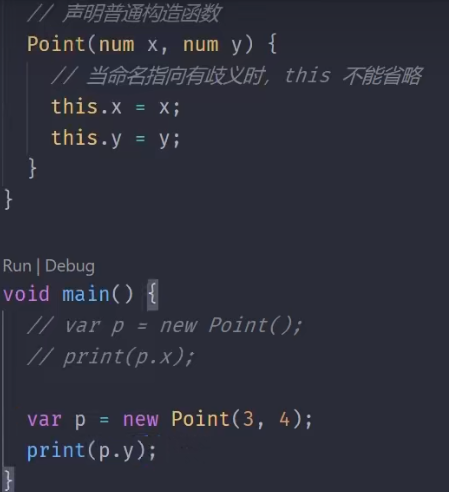
### 访问修饰
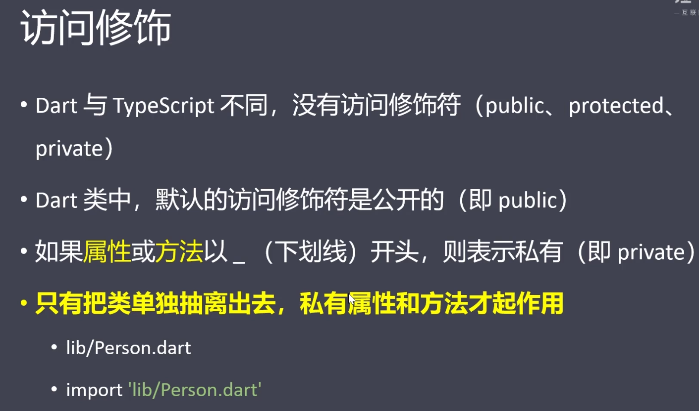

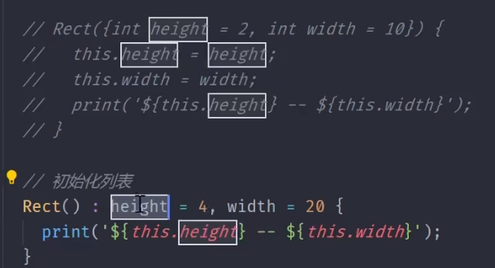
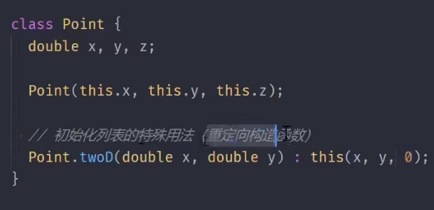
### 静态
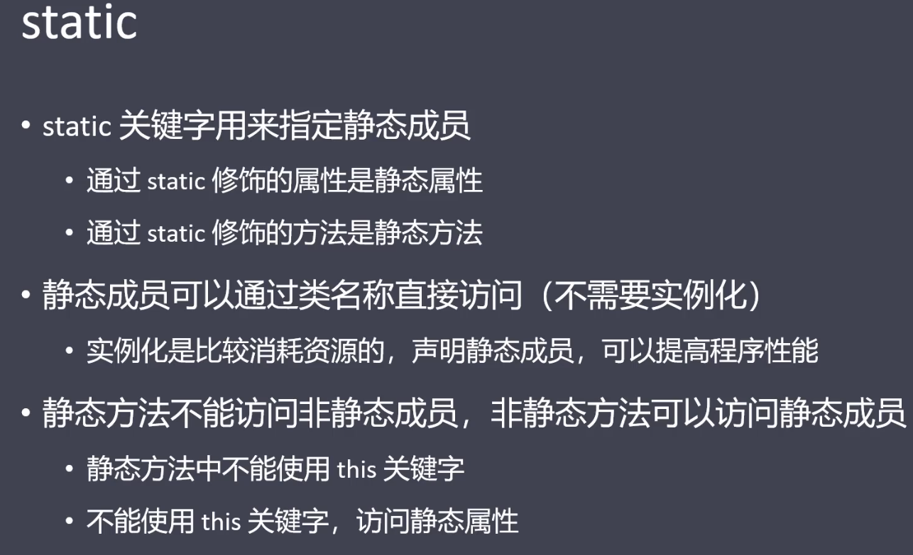
### 元数据
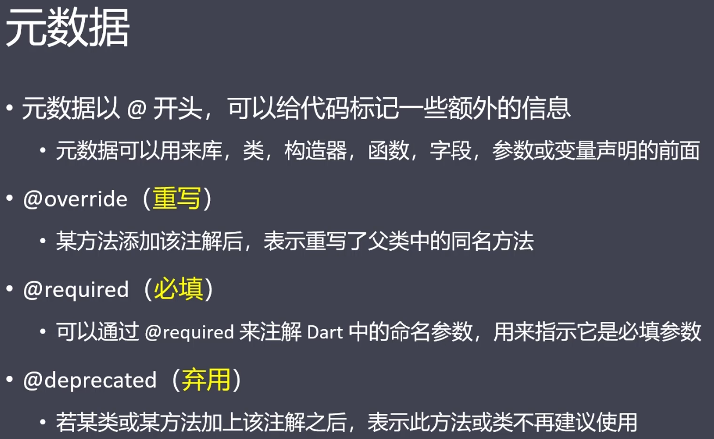
### 继承

### 抽象类
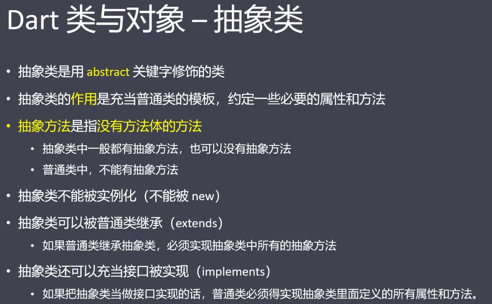

### 接口
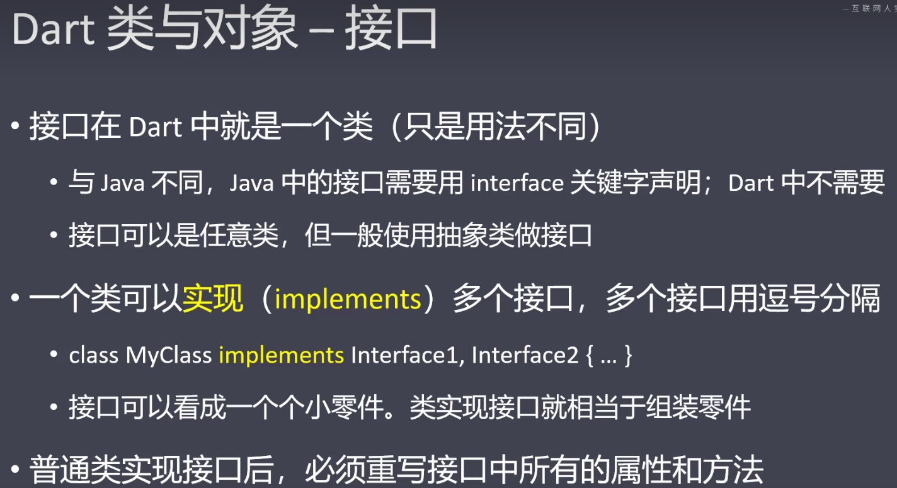
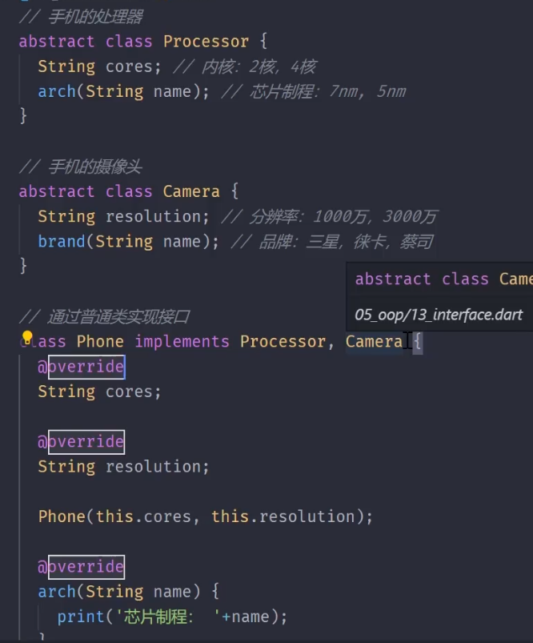

### 混入
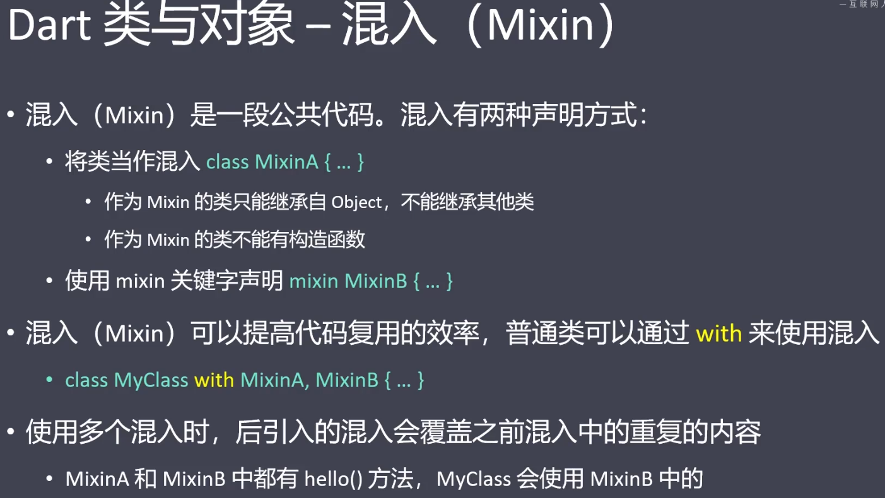
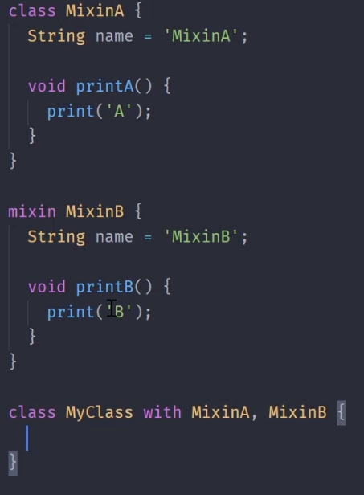
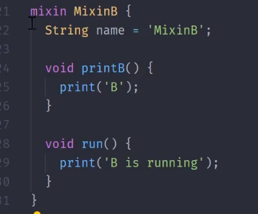

### 泛型
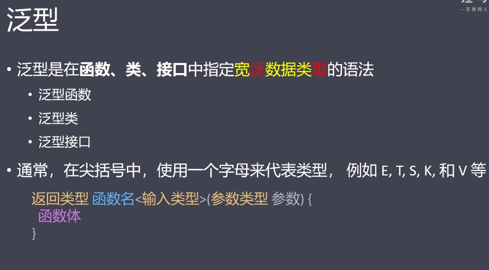
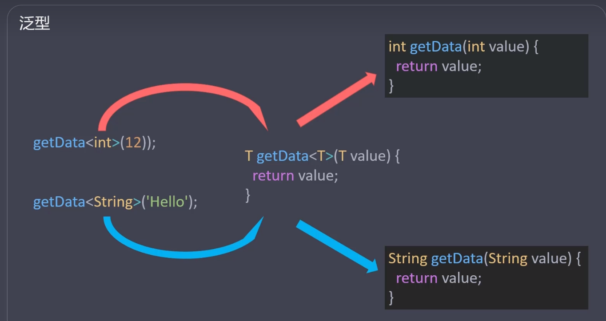

#### 泛型类
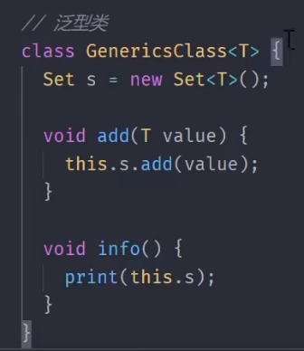
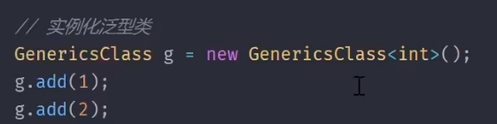

#### 泛型接口
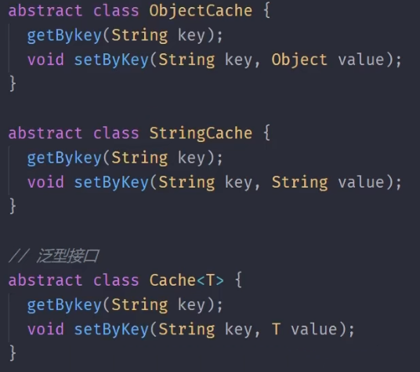
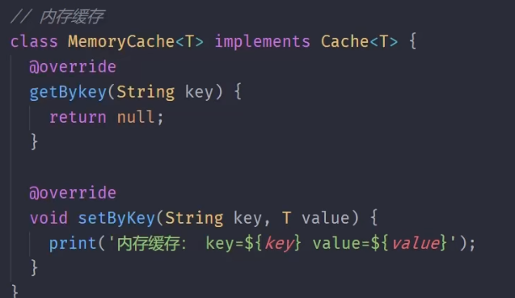

#### 类型限制

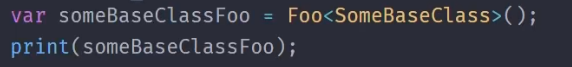

### 枚举
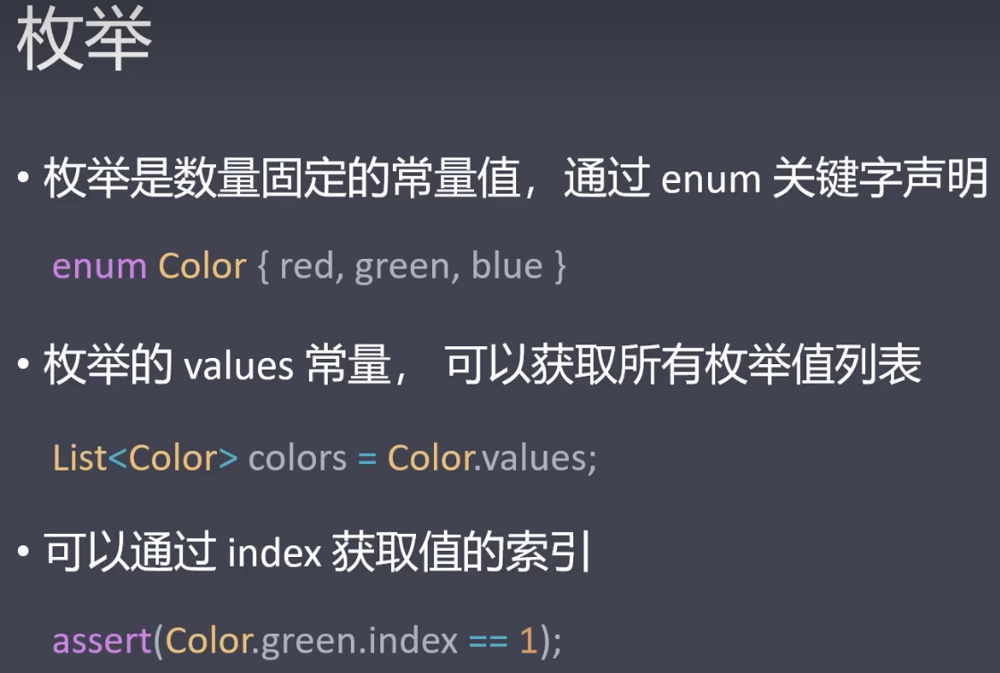