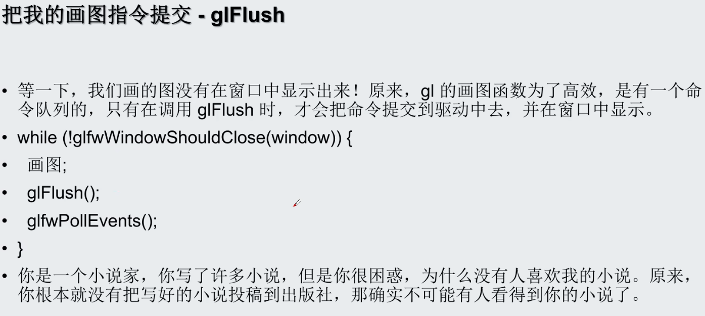

<!--
 * @Author: guanjiajun www.guanjiajun@ewake.com
 * @Date: 2023-06-30 12:04:47
 * @LastEditors: guanjiajun www.guanjiajun@ewake.com
 * @LastEditTime: 2023-06-30 19:50:03
 * @FilePath: \studys\programming\图形学\opengl\现代OpenGL保姆级课程\class1\class1.md
 * @Description: 这是默认设置,请设置`customMade`, 打开koroFileHeader查看配置 进行设置: https://github.com/OBKoro1/koro1FileHeader/wiki/%E9%85%8D%E7%BD%AE
-->
## 从配置安装到画第一个三角形
<https://www.bilibili.com/video/BV1Na4y1c7tP/?spm_id_from=333.999.0.0&vd_source=ac44a38168194f76fada7686c12a4a37!--
 * @Author: guanjiajun www.guanjiajun@ewake.com
 * @Date: 2023-06-30 12:04:47
 * @LastEditors: guanjiajun www.guanjiajun@ewake.com
 * @LastEditTime: 2023-06-30 12:05:03
 * @FilePath: \studys\programming\图形学\opengl\现代OpenGL保姆级课程\class1.md
 * @Description: 这是默认设置,请设置`customMade`, 打开koroFileHeader查看配置 进行设置: https://github.com/OBKoro1/koro1FileHeader/wiki/%E9%85%8D%E7%BD%AE
-->
<https://www.bilibili.com/video/BV1Na4y1c7tP/?spm_id_from=333.999.0.0&vd_source=ac44a38168194f76fada7686c12a4a37>\
<https://github.com/parallel101/openglslides>\
<https://github.com/parallel101/opengltutor>
### 运行环境
#### 安装opengl
##### windows
安装directx
##### linux
```shell
#archlinux
sudo pacman -Syu freeglut glu libglvnd mesa glfw glm

#查询opengl版本，显卡型号
glxinfo | grep OpenGL 
```

#### 安装显卡驱动
windows 官方软件下载

#### opengl头文件
##### 古代opengl
```cpp
//系统自带
#include <GL/gl.h> 
```
##### 现代opengl
###### 通过glad或glew库加载所有opengl函数
```cpp
//glad尽量放前面，例如glfw前，因为其要用到opengl函数
#include <glad/glad.h>
//跨平台窗口管理库
#include <GLFW/glfw3.h>
//建议上两行写在自己的glcommon.h中，然后用gl和glfw就导入glcommon.h，其他gl库也可以放到里面
#include "glcommon.h"
```
###### 生成glad库及头文件
```shell
python -m pip install glad
#compatibility兼容模式 core 3.0以后适用
python -m glad --out-path . --generator c --api gl=4.6 --profile compatibility
```
###### glm 防glsl语法的数学矢量库
glm 支持SIMD（cpu并行指令），CUDA（gpu相关）

#### opengl术语


### opengl样板代码





### 绘制
api <https://registry.khronos.org/OpenGL-Refpages/gl4/html/>、
<https://docs.gl/>


绘制前清除缓存
```cpp
//清除颜色缓存，清除深度缓存
 CHECK_GL(glClear(GL_COLOR_BUFFER_BIT | GL_DEPTH_BUFFER_BIT));
```
sinf代表浮点型sin


### 作业git
