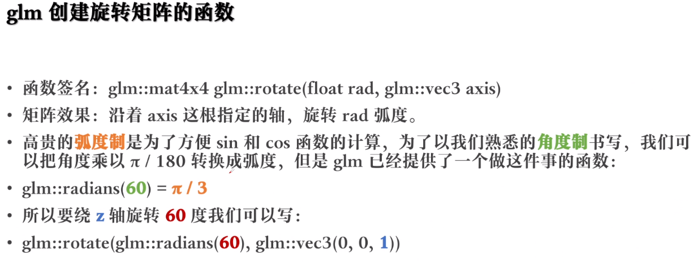
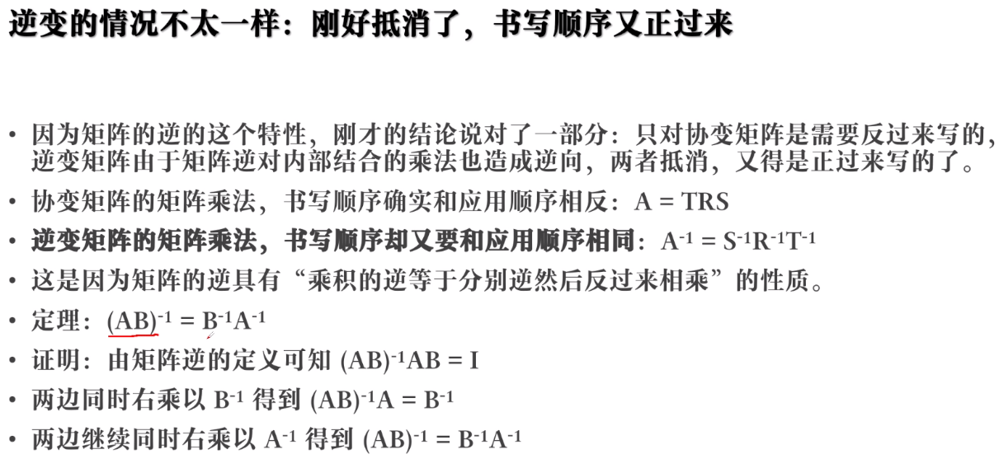
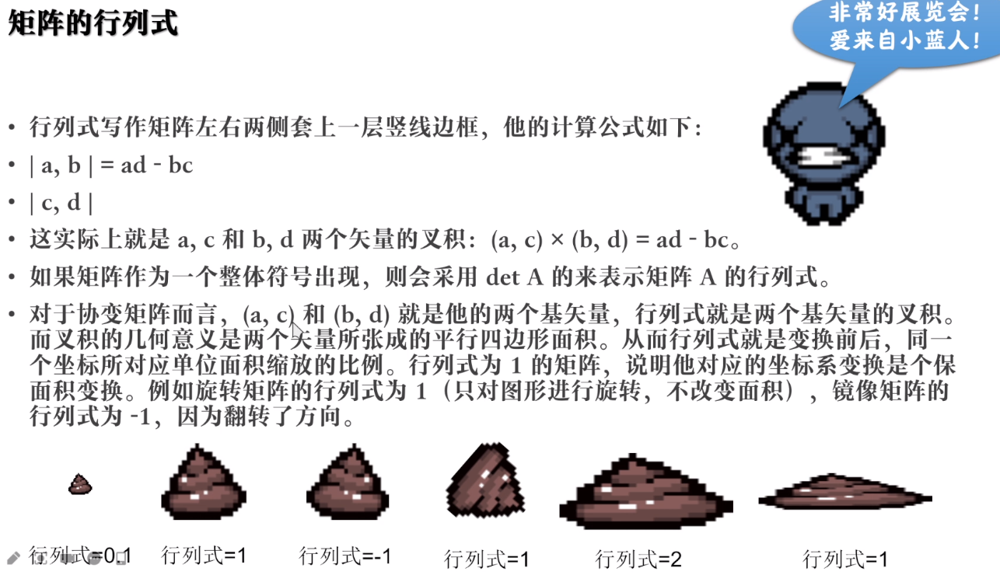

<!--
 * @Author: guanjiajun www.guanjiajun@ewake.com
 * @Date: 2023-07-08 16:50:39
 * @LastEditors: guanjiajun www.guanjiajun@ewake.com
 * @LastEditTime: 2023-07-08 17:36:17
 * @FilePath: \studys\programming\图形学\opengl\现代OpenGL保姆级课程\class2\仿射，齐次.md
 * @Description: 这是默认设置,请设置`customMade`, 打开koroFileHeader查看配置 进行设置: https://github.com/OBKoro1/koro1FileHeader/wiki/%E9%85%8D%E7%BD%AE
-->

这边后几行的2写错位置了

