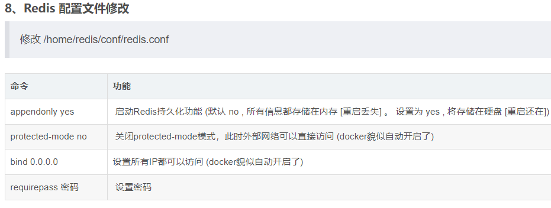
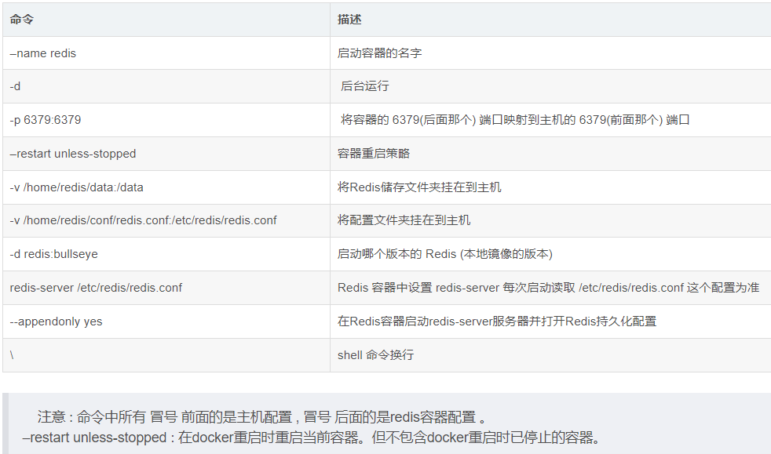

<!--
 * @Author: guanjiajun www.guanjiajun@ewake.com
 * @Date: 2023-04-04 14:11:06
 * @LastEditors: guanjiajun www.guanjiajun@ewake.com
 * @LastEditTime: 2023-04-07 20:11:31
 * @FilePath: \studys\programming\容器技术\docker\redis.md
 * @Description: 这是默认设置,请设置`customMade`, 打开koroFileHeader查看配置 进行设置: https://github.com/OBKoro1/koro1FileHeader/wiki/%E9%85%8D%E7%BD%AE
-->
### 拉取镜像
<https://blog.csdn.net/weixin_45821811/article/details/116211724>\
<https://blog.csdn.net/BThinker/article/details/123374236>
```shell
docker pull redis

docker pull redis:alpine

docker pull redis:7.0.10-alpine3.17
```
### 新建本地挂载目录
<https://blog.csdn.net/sinat_25207295/article/details/117925174>
```shell
mkdir -p /home/redis/conf
mkdir -p /home/redis/data
#官网下载redis.conf放在conf文件夹中
#修改 appendonly yes ,bind * -::*,requirepass 密码

```

### 启动redis容器
```shell
#开放端口用 --add-port
firewall-cmd --permanent --add-port=8080/tcp
#移除端口用 --remove-port
firewall-cmd --permanent --remove-port=8080/tcp
#刷新规则用 --reload
firewall-cmd --reload
#查询端口是否开放用 --query-port
firewall-cmd --query-port=8080/tcp
#建议重启
docker run --name redis62 --restart=always --log-opt max-size=100m --log-opt max-file=2 -p 6379:6379 -v /home/redis/conf/redis.conf:/etc/redis/redis.conf -v /home/redis/data:/data -di redis:alpine redis-server /etc/redis/redis.conf  --appendonly yes  --requirepass ewake666

#--appendonly yes  --requirepass ewake666不修改配置文件 可不加

```
--restart=always 总是开机启动
--log是日志方面的
-p 6379:6379 将6379端口挂载出去
--name 给这个容器取一个名字
-v 数据卷挂载
- /home/redis/myredis/myredis.conf:/etc/redis/redis.conf 这里是将 liunx 路径下的myredis.conf 和redis下的redis.conf 挂载在一起。
- /home/redis/myredis/data:/data 这个同上
-d redis 表示后台启动redis
redis-server /etc/redis/redis.conf 以配置文件启动redis，加载容器内的conf文件，最终找到的是挂载的目录 /etc/redis/redis.conf 也就是liunx下的/home/redis/myredis/myredis.conf
–appendonly yes 开启redis 持久化
–requirepass 000415 设置密码 （如果你是通过docker 容器内部连接的话，就随意，可设可不设。但是如果想向外开放的话，一定要设置，我被搞过，可以看这篇文章“阿里云服务器中毒‘Kirito666’经历”）



### 查看Docker运行中的容器
```shell
docker ps 
docker ps | grep redis
```
### 查看日志
```shell
#此处 --since 30m 是查看此容器30分钟之内的日志情况。
docker logs --since 30m myredis
```

### 进入Redis容器
```shell
### 通过 Docker 命令进入 Redis 容器内部
docker exec -it redis /bin/bash
#alpine
docker exec -it redis sh
### 进入 Redis 控制台
redis-cli
redis-cli -a 密码 -p 端口默认6379
### 添加一个变量为 key 为 name , value 为 bella 的内容
> set name bella
### 查看 key 为 name 的 value 值
> get name
 
 
### 或者也可以直接通过Docker Redis 命令进入Redis控制台 (上面两个命令的结合)
docker exec -it redis redis-cli

## 进入Redis容器
docker exec -it redis /bin/bash
 
## 通过密码进入Redis控制台
redis-cli -h 127.0.0.1 -p 6379 -a 123456
```

