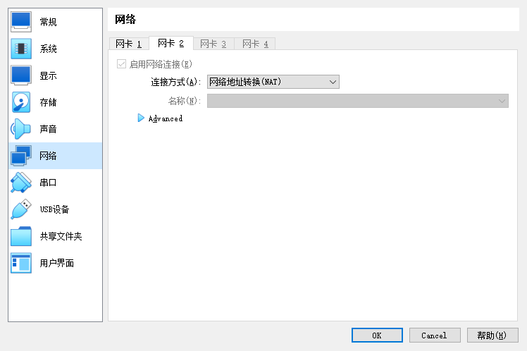
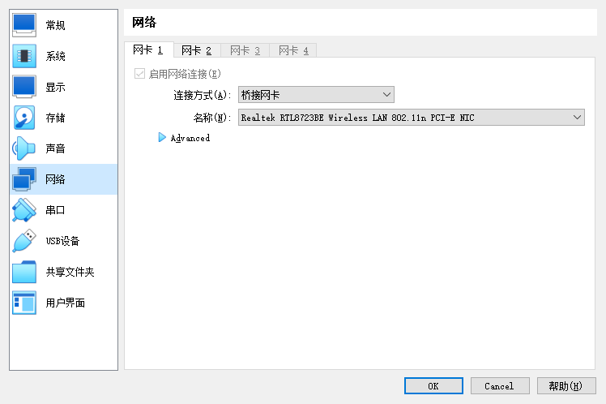
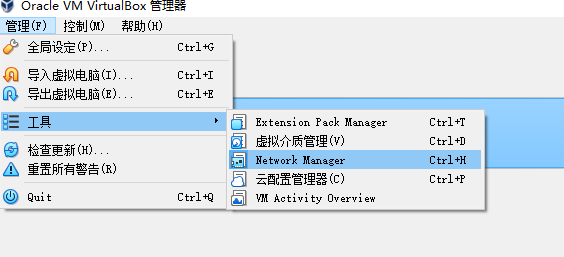
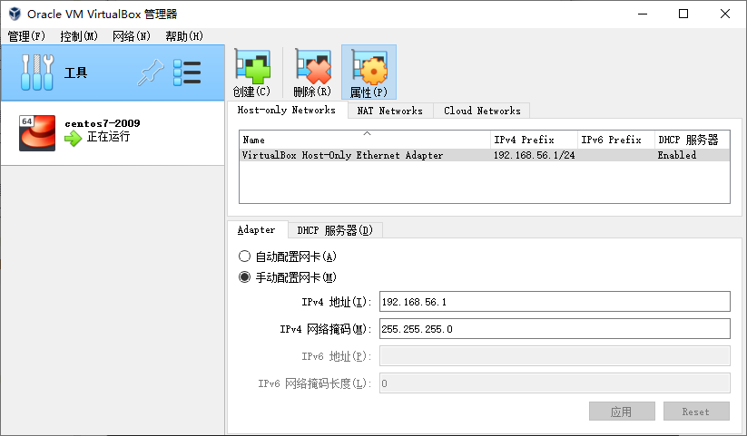

<!--
 * @Author: guanjiajun www.guanjiajun@ewake.com
 * @Date: 2023-05-26 18:48:59
 * @LastEditors: guanjiajun www.guanjiajun@ewake.com
 * @LastEditTime: 2023-05-26 19:04:37
 * @FilePath: \studys\programming\容器技术\virtualbox\网卡配置.md
 * @Description: 这是默认设置,请设置`customMade`, 打开koroFileHeader查看配置 进行设置: https://github.com/OBKoro1/koro1FileHeader/wiki/%E9%85%8D%E7%BD%AE
-->
<https://blog.csdn.net/fengsheng5210/article/details/123548419>




```shell
 vi /etc/sysconfig/network-scripts/ifcfg-enp0s3
```
```config
ifcfg-enp0s3
TYPE="Ethernet"
PROXY_METHOD="none"
BROWSER_ONLY="no"
BOOTPROTO="static"
DEFROUTE="yes"
IPV4_FAILURE_FATAL="no"
IPV6INIT="yes"
IPV6_AUTOCONF="yes"
IPV6_DEFROUTE="yes"
IPV6_FAILURE_FATAL="no"
IPV6_ADDR_GEN_MODE="stable-privacy"
NAME="enp0s3"
UUID="b65ec4e3-4619-8009-1e9a15bfb9b7"
DEVICE="enp0s3"
ONBOOT="yes"
IPADDR="192.168.0.88"
NETMASK="255.255.255.0"
GETEWAY="192.168.0.1"
DNS1="192.168.0.1"
DNS2="114.114.114.114"
```
```config
ifcfg-enp0s8
#可能没用
TYPE="Ethernet"
PROXY_METHOD="none"
BROWSER_ONLY="no"
BOOTPROTO="dhcp"
DEFROUTE="yes"
IPV4_FAILURE_FATAL="no"
IPV6INIT="yes"
IPV6_AUTOCONF="yes"
IPV6_DEFROUTE="yes"
IPV6_FAILURE_FATAL="no"
IPV6_ADDR_GEN_MODE="stable-privacy"
NAME="enp0s8"
UUID="7553504a-6900-45b1-99a1-75fa80dbcf26"
DEVICE="enp0s8"
ONBOOT="yes"
```
```shell
systemctl restart network
# 重启报错查看日志文件
cat /var/log/messages | grep network
# 如果uid冲突,重新生成uid并在ifcfg-enp0s3中配置
uuidgen enp0s3


```