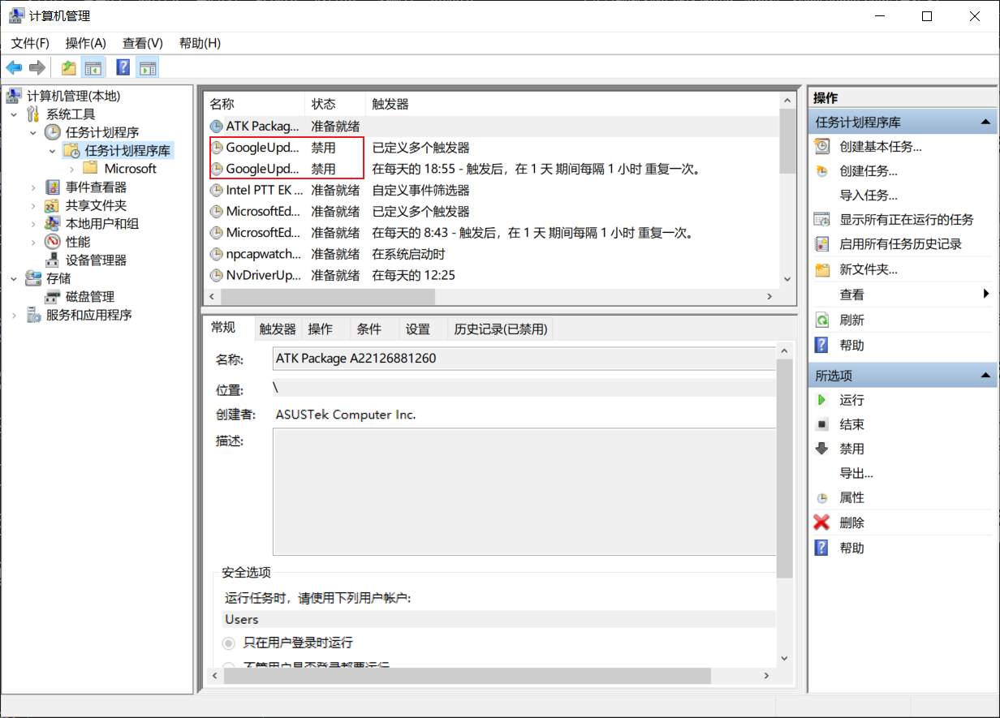
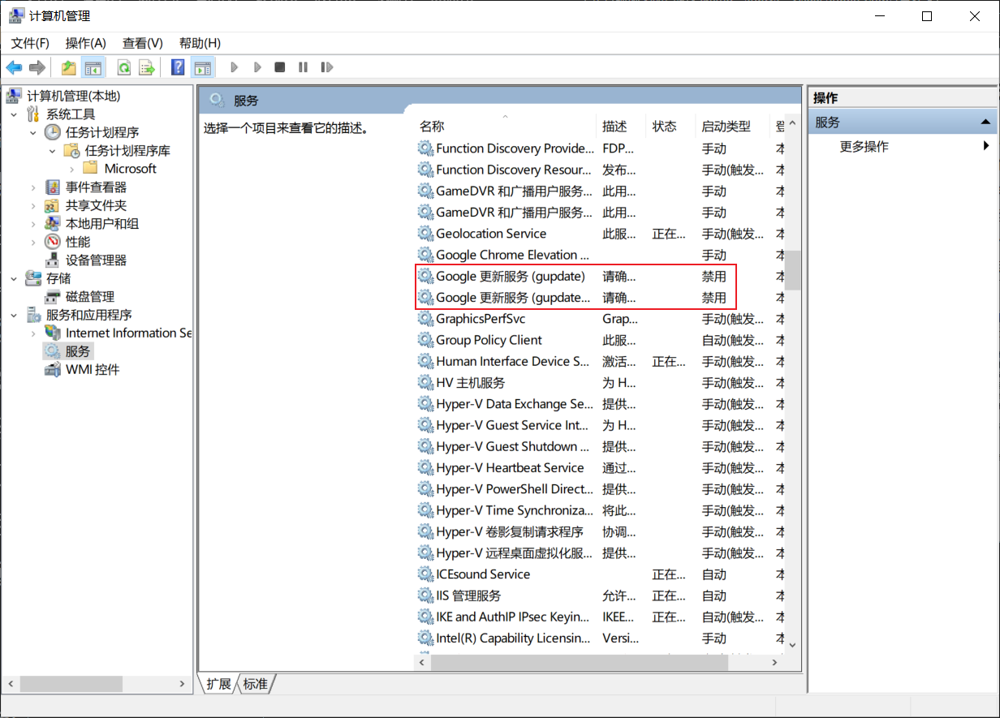
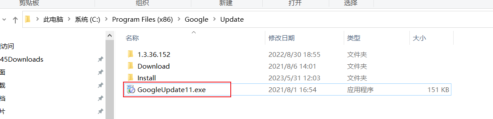

<https://www.kancloud.cn/weixixi/ytk_/3069378>\
### 第一步：禁用任务计划
首先是【鼠标右键计算机->管理】，在【计算机管理(本地)->系统工具->任务计划程序->任务计划程序库】中找到两个和Google自动更新相关的任务计划【GoogleUpdateTaskMachineCore】与【GoogleUpdateTaskMachineUA】，并把它俩禁用掉。印象中介绍这方法的网游的截图里是有三个任务计划的，我这边只有俩，如果有多个的话就发挥自己的聪明才智判断一下是否是和Chrome的自动更新相关的吧~

### 第二步：禁用更新服务
然后在下方的【服务和应用程序->服务】中，找到两个和Google更新相关的服务【Google更新服务(gupdate)】、【Google更新服务(gupdatem)】，并右键，选择属性，把启动类型改为禁用。如果没有找到的可以略过。

### 第三步：重命名更新程序
完成上面两步后理论上就可以停止Chrome的自动更新了，不过有网友说这么做之后，不要在Chrome中点击【帮助->关于Google Chrome】。我是没有作死过，不过既然有人这么说了，那就最好不要点了吧~

但是越说不让点有的小伙伴就是越想点，以往各种方法禁用chrome自动升级不成功，它有各种方法来升级谷歌，但一定是使用update里的升级程序来升级的，你可重命名或删除里面的文件，但是它会直接生成，在来Update文件夹上右键，在属性里的安全页签里点击编辑，设置system完全控制权设置为拒绝，administrator权限也是它赋予的。System是最高权限，设置完了之后google就没有权限动这个文件了。我们切断这一步，只要它没法在里面生成程序，那么它就无法升级了。

另外有看到另外的一个方法更加简单，就是在C盘中把GoogleUpdate.exe文件改个名~这个是Chrome默认的安装位置（应该），如果你用过什么黑科技改过安装位置的话，按照相对路径来找吧，应该大同小异。

我自己的使用的是默认路径，如下图：
