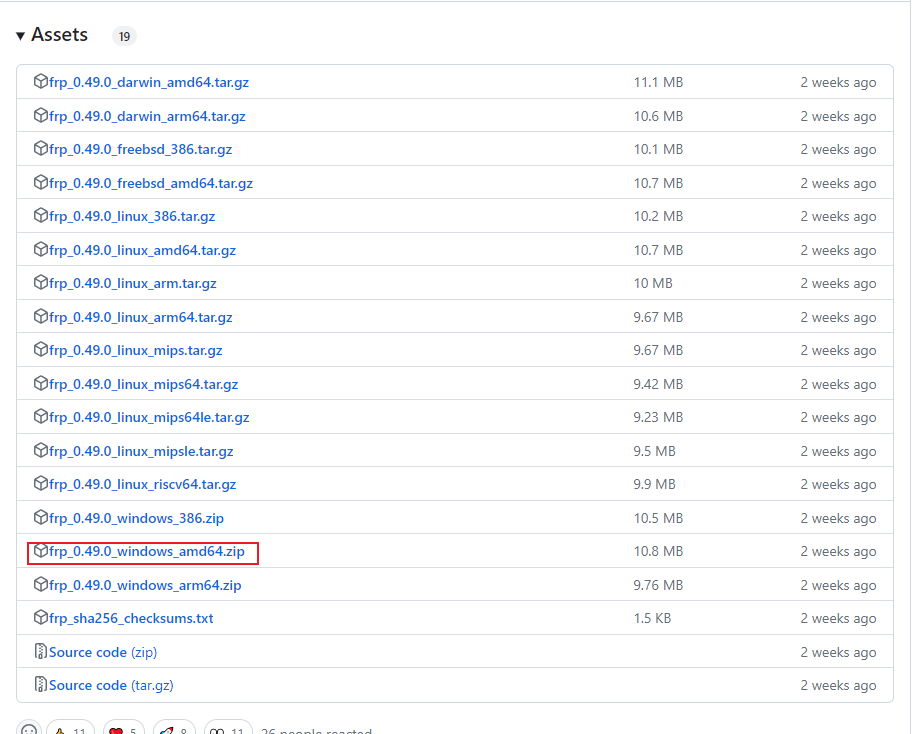
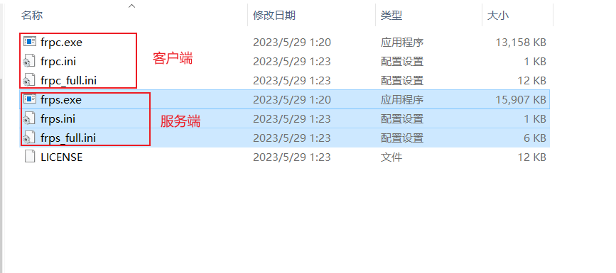

<!--
 * @Author: guanjiajun www.guanjiajun@ewake.com
 * @Date: 2023-06-09 17:35:10
 * @LastEditors: guanjiajun www.guanjiajun@ewake.com
 * @LastEditTime: 2023-06-09 20:38:16
 * @FilePath: \studys\programming\网络\内网穿透.md
 * @Description: 这是默认设置,请设置`customMade`, 打开koroFileHeader查看配置 进行设置: https://github.com/OBKoro1/koro1FileHeader/wiki/%E9%85%8D%E7%BD%AE
-->
### fr
<https://blog.csdn.net/a497785609/article/details/124923959>\
<https://blog.csdn.net/qq1170993239/article/details/124421103>\
<https://github.com/fatedier/frp/releases>\
<https://blog.csdn.net/weixin_43802382/article/details/123994468>\


#### 修改配置
服务端
```ini
[common]
bind_port = 7000 
vhost_http_port = 7003
; bind_port 用来建立frp服务器端与客户端连接的端口。

; vhost_http_port 用来代理http请求的端口
```
运行服务端
```shell
./frps -c ./frps.ini
```
客户端配置\
server_addr = ***.***.***.***（替换为你阿里云主机的外网IP）
server_port = 7000  

这两句是用来建立客户端与服务器端的连接用的，端口需与服务器端一致。

2.配置远程连接

[rdp]
type = tcp
local_ip = 0.0.0.0           
local_port = 3389
remote_port = 7089
将服务器的7089端口，映射到本地主机的3389端口，同样，需要在阿里云控制台添加安全规则。

3.配置web映射(不怎么起作用)
[web01]
type = http
local_ip = 0.0.0.0
local_port = 82  
custom_domains = a.qingshanboke.com

[web]
type = tcp //协议（使用tcp是不使用域名直接IP加端口号便可以访问web）
local_ip = 127.0.0.1 //本地IP地址
local_port = 8080 //本地web端口号
remote_port = 6064 //和服务端相同

添加http端口映射，服务器端的端口是7003，所以映射后的访问地址为：

http://a.qingshanboke.com:7003，一定要记得加上端口号。
```ini
[common]
server_addr = ***.***.***.***
server_port = 7000   
 
[rdp]
type = tcp
local_ip = 0.0.0.0           
local_port = 3389
remote_port = 7089
 
[web01]
type = http
local_ip = 0.0.0.0
local_port = 82  
custom_domains = a.qingshanboke.com
```
命令行运行客户端
```shell
@echo off
:home
frpc -c frpc.ini
goto home
```
