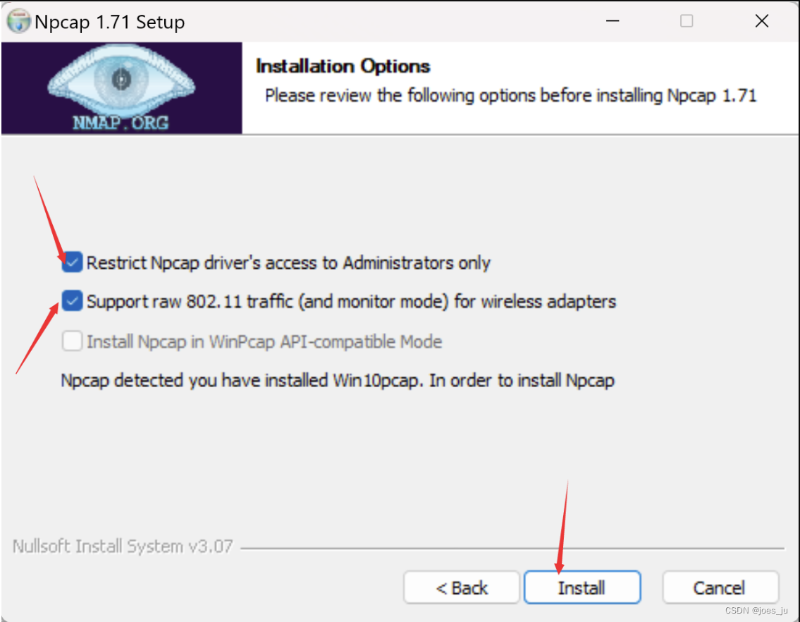
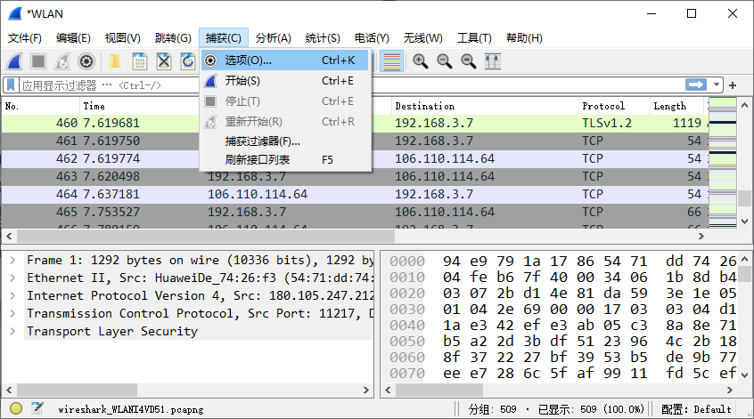
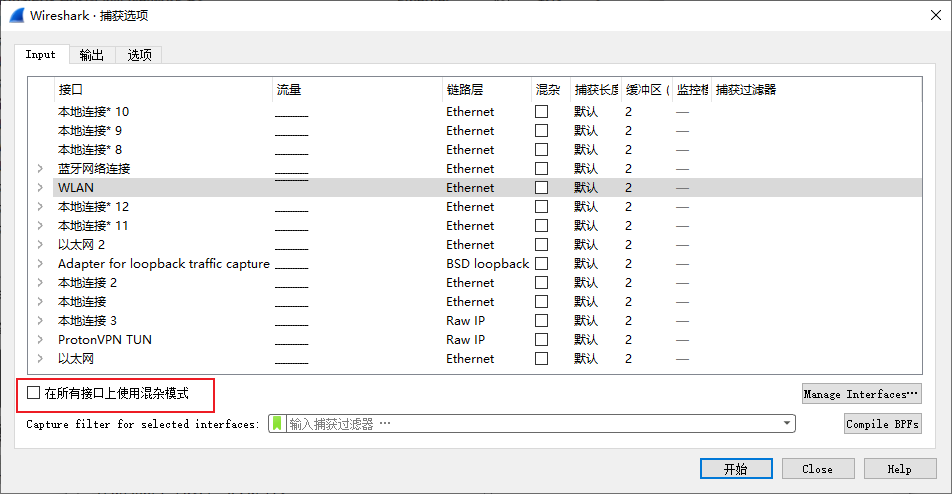

### wireshark安装
<https://blog.csdn.net/weixin_46172366/article/details/128087730>
除下图和选择安装路径，其余next


### 输入
#### 混杂模式
抓取经过网卡的所有数据包，包括发往本网卡和非发往本网卡的。

#### 非混杂模式
只抓取目标地址是本网卡的数据包（包括广播包），对于发往别的主机而经过本网卡的数据包忽略（可能会影响本地代理的网络发送）。


### 协议
oicq,dns,dis基于udp\
tcp可靠（三次握手），udp快
#### ARP
地址解析协议，通过网络地址定位mac地址
```shell
nmap -sn 网关地址#扫描网关
```
命令运行抓取到ARP数据包