<!--\

 * @Author: guanjiajun www.guanjiajun@ewake.com
 * @Date: 2023-07-04 15:26:20
 * @LastEditors: guanjiajun www.guanjiajun@ewake.com
 * @LastEditTime: 2023-07-04 18:45:46
 * @FilePath: \studys\programming\量化，数据分析\matpolotlib\matplotlib基础.md
 * @Description: 这是默认设置,请设置`customMade`, 打开koroFileHeader查看配置 进行设置: https://github.com/OBKoro1/koro1FileHeader/wiki/%E9%85%8D%E7%BD%AE<>
-->
<https://blog.csdn.net/weixin_63009369/article/details/127839386>\
<https://blog.csdn.net/qq_38542085/article/details/78442060>
### 安装
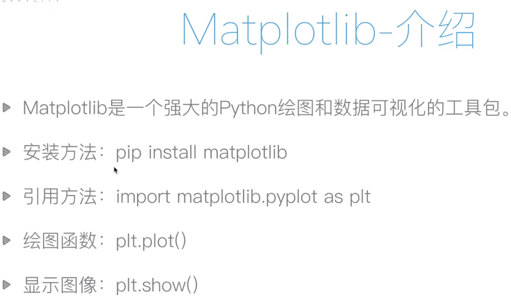
### plot
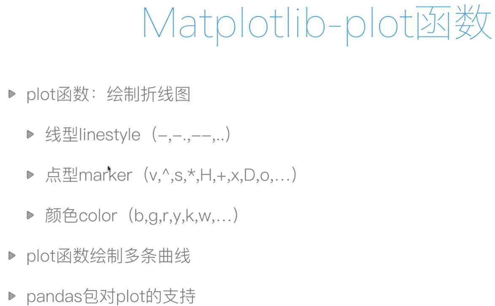

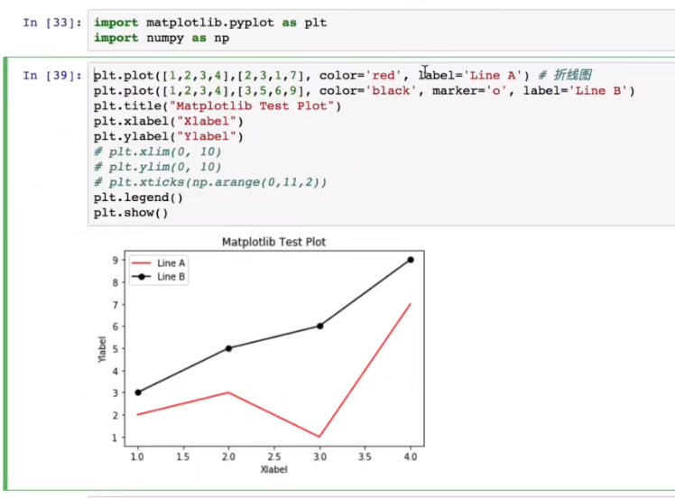
### pandas相关
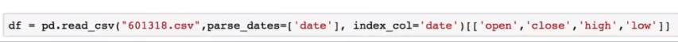
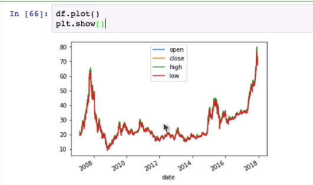
### 函数图像
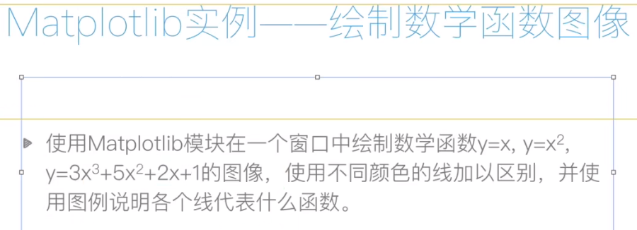
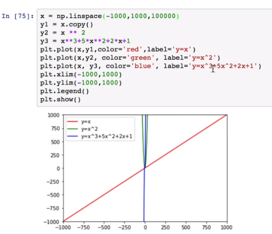
### 画布与子图
subplot 几行 几列 位置
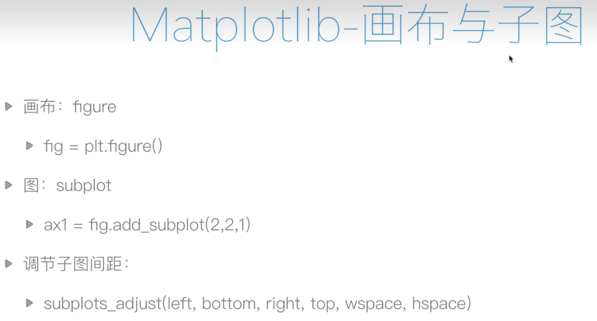
```python
plt.figure()
plt.subplot(2,2,1)#建立一个两行两列的画布，第一个
plt.plot([0,1],[0,1])
plt.subplot(2,2,2)#第二个
plt.plot([0,1],[0,1])
plt.subplot(2,2,3)#第三个
plt.plot([0,1],[0,1])
plt.subplot(2,2,4)#第四个
plt.plot([0,1],[0,1])
plt.show()
```
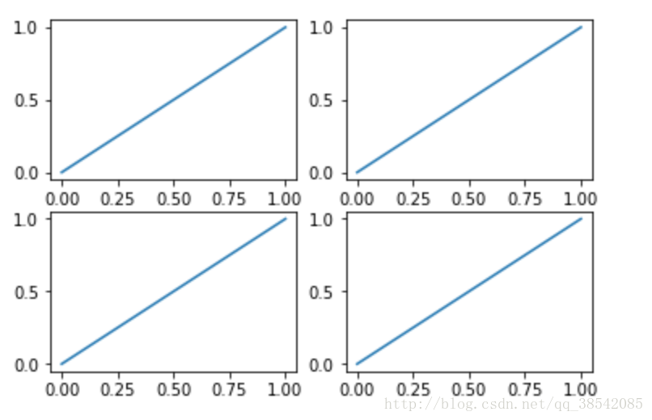
```python
plt.figure()
plt.subplot(2,1,1)#建立一个两行两列的画布，第一个
plt.plot([0,1],[0,1])
plt.subplot(2,3,4)#第二个
plt.plot([0,1],[0,1])
plt.subplot(2,3,5)#第三个
plt.plot([0,1],[0,1])
plt.subplot(2,3,6)#第四个
plt.plot([0,1],[0,1])
plt.show()
```
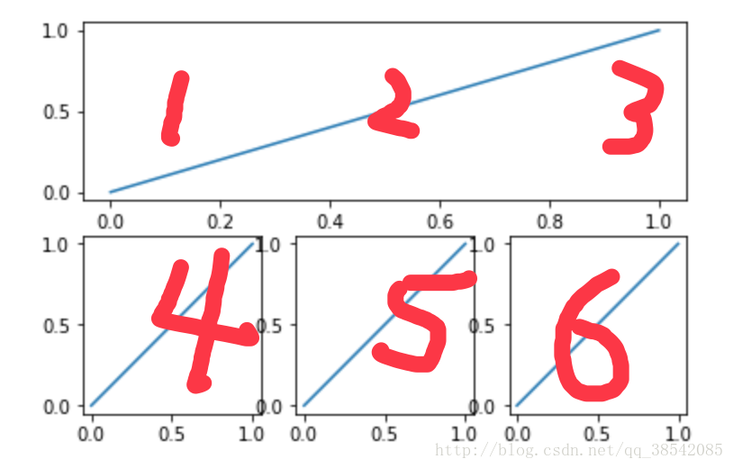
### 常见图类型
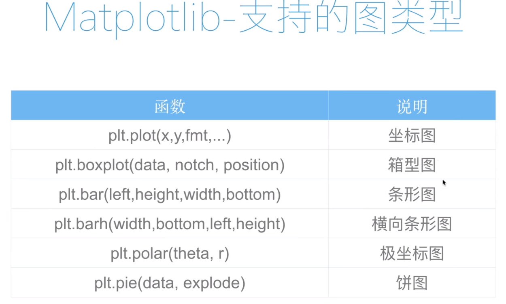
#### 条形图
```python
x = np.arange(10)
y = 2**x + 10
plt.bar(x,y,facecolor='#9999ff',edgecolor='white')#柱颜色，柱边框颜色
for x,y in zip(x,y):#zip指把x，y结合为一个整体，一次可以读取一个x和一个y
    plt.text(x,y,'%.2f' % y,ha='center',va='bottom')#指字体在中间和柱最顶的顶部
plt.show()
```
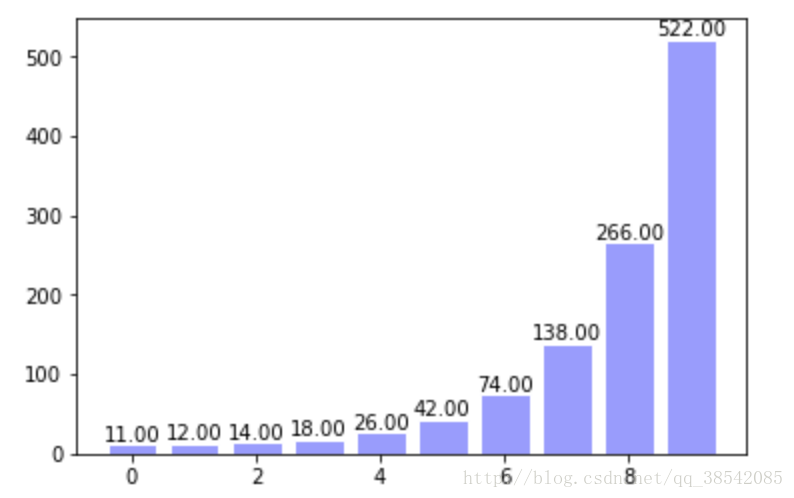
#### 饼图
```python
import matplotlib.pyplot as plt
 
labels = 'sing', 'dance', 'rap', 'basketball'
size = [15, 30, 45, 10]
explode = (0, 0.1, 0, 0)
plt.pie(size, explode=explode, labels=labels, autopct='%1.1f%%',
        shadow=True, startangle=90)
#圆
plt.axis('equal')
plt.show()
```
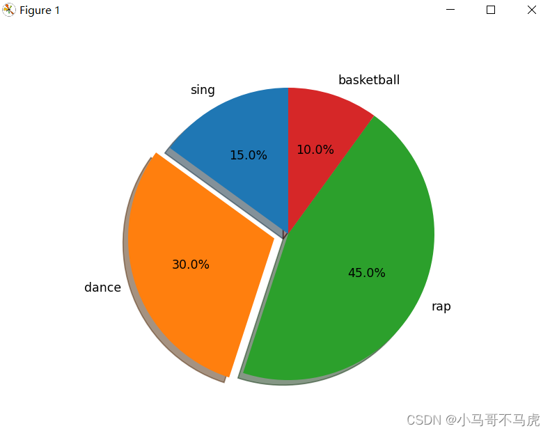
#### 直方图
hist常用参数：

* ·bins：直方图区间的个数
* 
* ·color：柱子颜色
* 
* ·edgecolor：柱子边框颜色
* 
* ·denstiy：参数默认为Flase,表示用每个区间的数值个数来绘图，当去True时，柱子的高度为每个区间的频率
* 
* ·orientation：表示柱子的方向，默认值为vertical，为竖直方向，当取值为horizontal时为水平向
* 
* ·histtpe：指定绘图的类型，参数bar和stepfilled一样，当参数为step时只绘边框的线条
* 
* ·alpha：设置像素
* 
```python
import matplotlib.pyplot as plt
import numpy as np
 
np.random.seed(0)   
mu,sigma=100,20         #均值和标准差
a=np.random.normal(mu,sigma,size=100)
plt.hist(a,20,histtype='stepfilled',facecolor='b',alpha=0.75)
plt.title('Histogram')
plt.show()
```
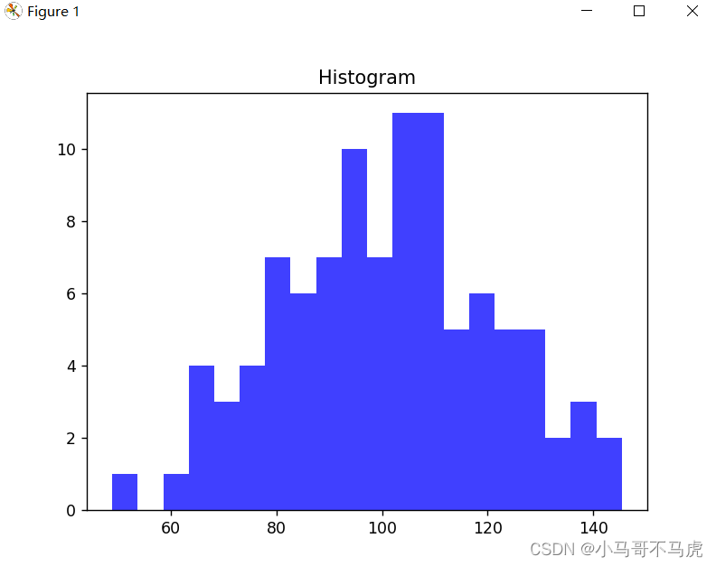

```python
import matplotlib.pyplot as plt
import numpy as np
 
np.random.seed(0)
mu,sigma=100,20         #均值和标准差
a=np.random.normal(mu,sigma,size=100)
plt.hist(a, 20, histtype='bar', facecolor='b', alpha=0.75,
         edgecolor='k',orientation='horizontal')
plt.title('Histogram')
plt.show()
```
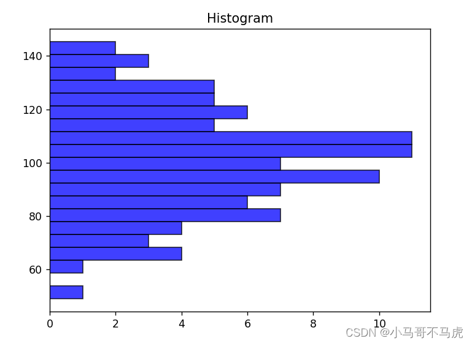
#### 散点图
```python
import matplotlib.pyplot as plt
import numpy as np
 
fig,ax=plt.subplots()
ax.plot(10*np.random.randn(100),10*np.random.randn(100),'o')
ax.set_title('Simple Scatter')
plt.show()
```
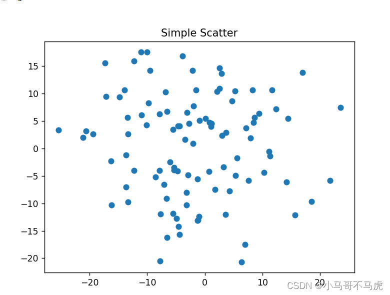
#### 等高图
```python
def f(x,y):
    #用来生成高度
    return (1-x/2+x**5+y**3)*np.exp(-x**2-y**2)

x = np.linspace(-3,3,100)
y = np.linspace(-3,3,100)

X,Y = np.meshgrid(x,y)#将x，y指传入网格中
plt.contourf(X,Y,f(X,Y),8,alpha=0.75,cmap=plt.cm.hot)#8指图中的8+1根线，绘制等温线，其中cmap指颜色

C = plt.contour(X,Y,f(X,Y),8,colors='black',linewidth=.5)#colors指等高线颜色
plt.clabel(C,inline=True,fontsize=10)#inline=True指字体在等高线中

plt.xticks(())
plt.yticks(())
plt.show()
```
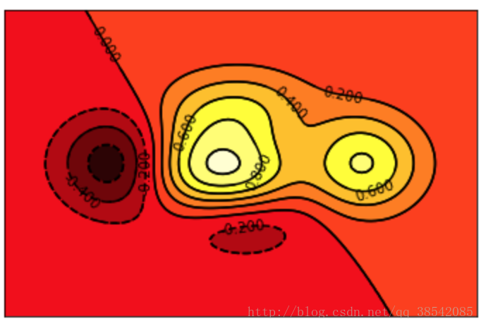
#### 3d
```python
from mpl_toolkits.mplot3d import Axes3D#动态图所需要的包
fig = plt.figure()
ax = Axes3D(fig)

x = np.arange(-4,4,0.25)#0.25指-4至4间隔为0.25
y = np.arange(-4,4,0.25)
X,Y = np.meshgrid(x,y)#x，y放入网格
R = np.sqrt(X**2 + Y**2)
Z = np.sin(R)

ax.plot_surface(X,Y,Z,rstride=1,cstride=1,cmap=plt.get_cmap('rainbow'))#rstride=1指x方向和y方向的色块大小
ax.contourf(X,Y,Z,zdir='z',offset=-2,cmap='rainbow')#zdir指映射到z方向，-2代表映射到了z=-2
ax.set_zlim(-2,-2)

plt.show()
```
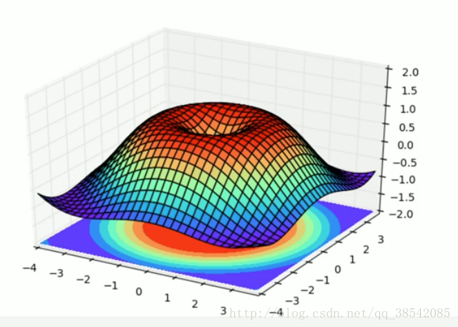
#### 动态图
```python
from matplotlib import animation#动态图所需要的包
fig,ax = plt.subplots()#子图像
x = np.arange(0,2*np.pi,0.01)
line, = ax.plot(x,np.sin(x))

def animate(i):
    line.set_ydata(np.sin(x+i/10))#用来改变的y对应的值
    return line,
def init():
    line.set_ydata(np.sin(x))#动态图初始图像
    return line,

ani = animation.FuncAnimation(fig=fig,func=animate,init_func=init,interval=20)#动态作图的方法，func动态图函数，init_func初始化函数，interval指图像改变的时间间隔
plt.show()
```
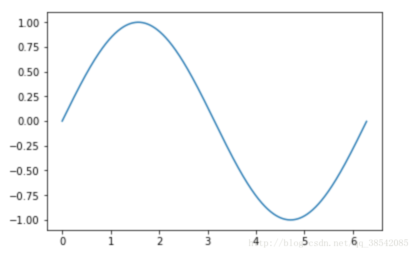
