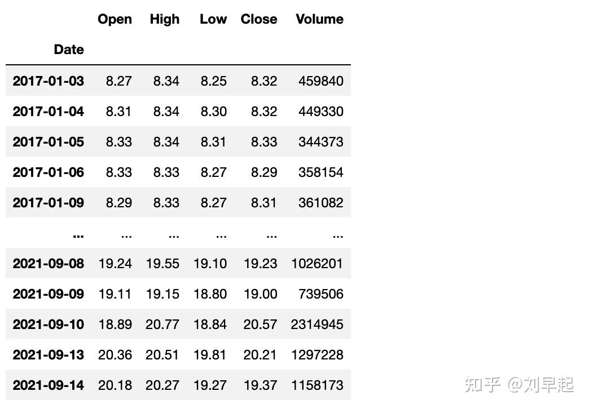

<!--
 * @Author: guanjiajun www.guanjiajun@ewake.com
 * @Date: 2023-07-04 19:43:31
 * @LastEditors: guanjiajun www.guanjiajun@ewake.com
 * @LastEditTime: 2023-07-06 13:51:45
 * @FilePath: \studys\programming\量化，数据分析\matpolotlib\金融相关.md
 * @Description: 这是默认设置,请设置`customMade`, 打开koroFileHeader查看配置 进行设置: https://github.com/OBKoro1/koro1FileHeader/wiki/%E9%85%8D%E7%BD%AE
-->
### 绘制k线图
<https://zhuanlan.zhihu.com/p/412404949>

### 安装与数据准备
上面已经说到，mplfinance 是一个独立的库，所以直接使用 pip 安装即可，没有任何难度
```python
pip install mplfinance
```
至于在数据准备上，根据我的开发经验，越懒人版的绘图库对数据要求则越严格，所以在使用之前，我们需要将数据整理成指定的格式，下面是某股票（平安银行000001.sz）的对应数据

如上图所示，数据必须是Pandas DataFrame格式，且必须按照顺序包含开盘价、最高价、最低价、收盘价以及成交量，同时索引需要是pandas支持的时间类型。

关于如何获得、清洗得到这样的数据将不是本文的分享内容，下面仅介绍如何基于这样的数据进行绘图。


#### 基础使用
首先需要导入
```python
import mplfinance as mpf
```
接下来，在上述数据基础上一行代码即可生成简易价格走势图
```python
mpf.plot(df_new, type='line')
```

#### 添加移动均线
通过设置 mav 参数可以添加对应的移动均线，例如添加5日、10日、30日移动均线
```python
mpf.plot(df_new, type='line',mav=(5,10,30))
```

需要注意的是，这里的x日移动均线并不是通过我们数据的时间索引计算而来，仅是移动x个索引位置而来，由于我们数据时间精度为1天，所以恰好是对应的x天移动均线。

如果索引是分钟级数据，那么设置 mav 得到的就是x分钟均线！
#### 添加成交量
通过设置 volume 参数，可以进一步添加成交量
```python
mpf.plot(df_new, type='line',mav=(5,10,30), volume=True)
```

#### 制作蜡烛图
通过设置 type 参数可以绘制更专业的蜡烛图，由于上面的数据时间维度过长，绘制蜡烛图会导致很难看清细节。

所以下面绘制最后 40 个交易日的蜡烛图，并添加成交量与 3、6、9 日均线
```python
mpf.plot(df_new.tail(40), type='candle',mav=(3,6,9), volume=True)
```

#### 展示非交易时间
上面的图是连续的，但交易日并不是天天都是，每天也有指定时间，通过设置 show_nontrading 参数，可以按照交易时间绘制，将非交易时间添加为空白
```python
mpf.plot(df_new,type='candle',mav = (3),show_nontrading=True, volume=True)
```

至此 mplfinance 的基本使用就介绍完毕，相比来说还是比较容易上手使用的。

#### 彩蛋 - pyecharts
虽然 matplotlib 也可以绘制动态图，详见我的这篇文章，但是由于 matplotlib 的特性，展示起来并不是很方便。

如果需要能交互式操作数据，拖动时间轴等功能，可以尝试使用 pyecharts，但由于不像 mplfinance 封装好开箱即用，代码写起来还是需要相当一定时间的，大家可以自行选择

<https://zhuanlan.zhihu.com/p/411954837>\
最后就是下载方式了，目前有三种方式

1 - 百度网盘

链接: https://pan.baidu.com/s/1NfB82GBpgJgSrG8IMWuDjg 提取码: lgb2

2 - GitHub

Github链接如下

GitHub - liuhuanshuo/Pandas_Advanced_Exercise: Pandas进阶修炼300题

3 - 在线练习

或者在和鲸社区在线练习

工作台 - Heywhale.com