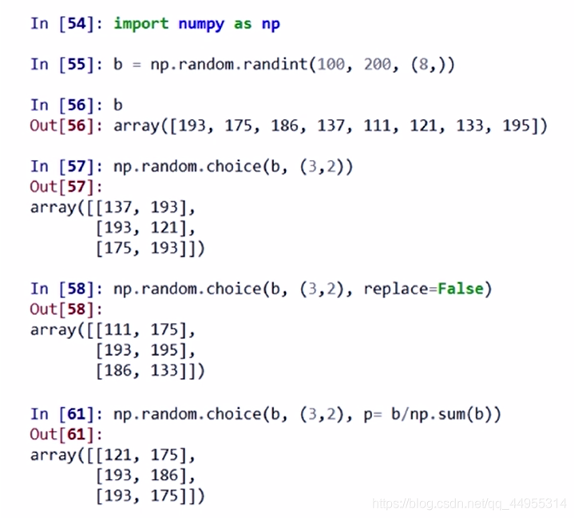
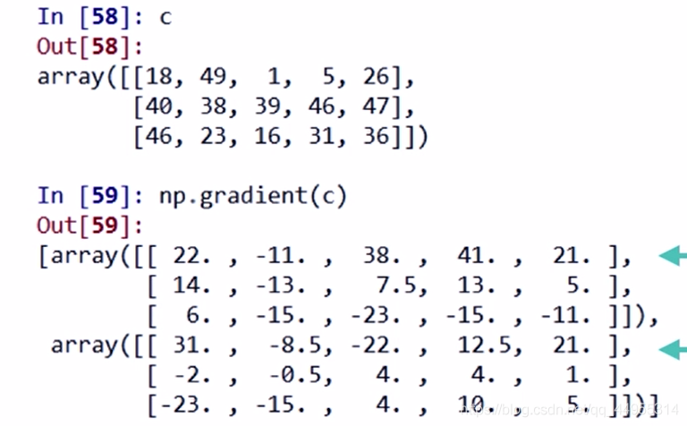
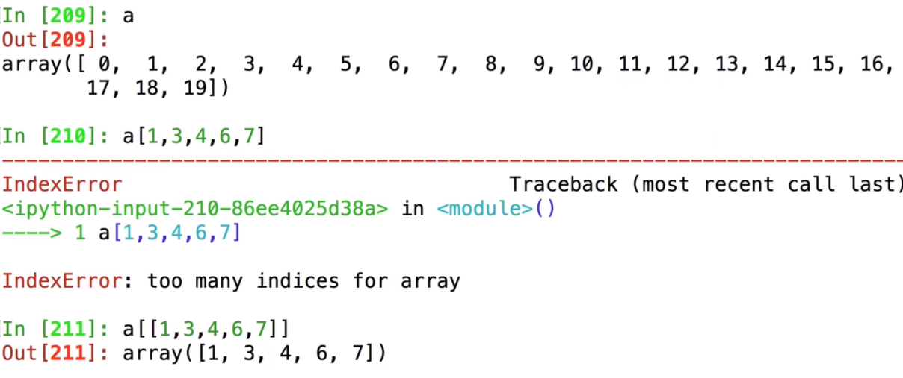
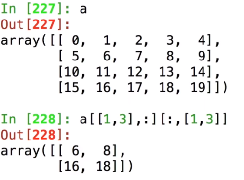
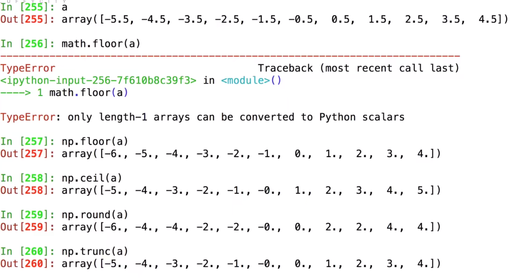
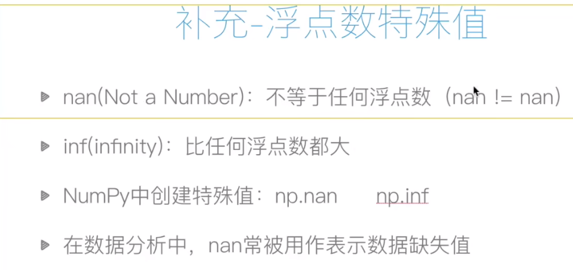
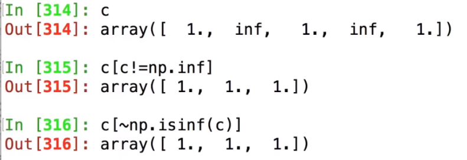

<!--
 * @Author: guanjiajun www.guanjiajun@ewake.com
 * @Date: 2023-07-03 16:38:32
 * @LastEditors: guanjiajun www.guanjiajun@ewake.com
 * @LastEditTime: 2023-07-03 19:50:23
 * @FilePath: \studys\programming\量化，数据分析\numpy\numpy基础函数.md
 * @Description: 这是默认设置,请设置`customMade`, 打开koroFileHeader查看配置 进行设置: https://github.com/OBKoro1/koro1FileHeader/wiki/%E9%85%8D%E7%BD%AE
-->
<https://blog.csdn.net/qq_44955314/article/details/117791453>\
<https://blog.csdn.net/m0_63462829/article/details/124971997>
### 简介
Numpy是科学计算库,是一个强大的N维数组对象ndarray，是广播功能函数。其整合C/C++.fortran代码的工具 ，更是Scipy、Pandas等的基础。

### 函数大全
#### 基本函数
.ndim ：维度
.shape ：各维度的尺度 （2，5）
.size ：元素的个数 10
.dtype ：元素的类型 dtype(‘int32’)
.itemsize ：每个元素的大小，以字节为单位 ，每个元素占4个字节
#### ndarray数组的创建
np.arange(n) ; 元素从0到n-1的ndarray类型
np.ones(shape): 生成全1
np.zeros((shape)， ddtype = np.int32) ： 生成int32型的全0
np.full(shape, val): 生成全为val
np.eye(n) : 生成单位矩阵

np.ones_like(a) : 按数组a的形状生成全1的数组
np.zeros_like(a): 同理
np.full_like (a, val) : 同理

np.linspace（1,10,4）： 根据起止数据等间距地生成数组
np.linspace（1,10,4, endpoint = False）：endpoint 表示10是否作为生成的元素
np.concatenate():

#### 数组的维度变换
.reshape(shape) : 不改变当前数组，依shape生成
.resize(shape) : 改变当前数组，依shape生成
.swapaxes(ax1, ax2) : 将两个维度调换
.flatten() : 对数组进行降维，返回折叠后的一位数组

#### 数组的类型变换
数据类型的转换 ：a.astype(new_type) : eg, a.astype (np.float)
数组向列表的转换： a.tolist()
#### 数组的索引和切片

##### 一维数组切片
a = np.array ([9, 8, 7, 6, 5, ])
a[1:4:2] –> array([8, 6]) ： a[起始编号：终止编号（不含）： 步长]

##### 多维数组索引
a = np.arange(24).reshape((2, 3, 4))
a[1, 2, 3] 表示 3个维度上的编号， 各个维度的编号用逗号分隔

##### 多维数组切片
a[1:2,2:3]此例子中逗号前是行，后是列
a [：，：，：：2 ] 缺省时，表示从第0个元素开始，到最后一个元素
#### 数组的运算
np.abs(a) np.fabs(a) : 取各元素的绝对值
np.sqrt(a) : 计算各元素的平方根
np.square(a): 计算各元素的平方
np.log(a) np.log10(a) np.log2(a) : 计算各元素的自然对数、10、2为底的对数
np.ceil(a) np.floor(a) : 计算各元素的ceiling 值， floor值（ceiling向上取整，floor向下取整）
np.rint(a) : 各元素 四舍五入
np.modf(a) : 将数组各元素的小数和整数部分以两个独立数组形式返回
np.exp(a) : 计算各元素的指数值
np.sign(a) : 计算各元素的符号值 1（+），0，-1（-）
.
np.maximum(a, b) np.fmax() : 比较（或者计算）元素级的最大值
np.minimum(a, b) np.fmin() : 取最小值
np.mod(a, b) : 元素级的模运算
np.copysign(a, b) : 将b中各元素的符号赋值给数组a的对应元素

#### 数据的CSV文件存取
CSV (Comma-Separated Value,逗号分隔值) 只能存储一维和二维数组

np.savetxt(frame, array, fmt=’% .18e’, delimiter = None): frame是文件、字符串等，可以是.gz .bz2的压缩文件； array 表示存入的数组； fmt 表示元素的格式 eg： %d % .2f % .18e ; delimiter： 分割字符串，默认是空格
eg： np.savetxt(‘a.csv’, a, fmt=%d, delimiter = ‘,’ )

np.loadtxt(frame, dtype=np.float, delimiter = None, unpack = False) : frame是文件、字符串等，可以是.gz .bz2的压缩文件； dtype：数据类型，读取的数据以此类型存储； delimiter: 分割字符串，默认是空格; unpack: 如果为True， 读入属性将分别写入不同变量。

#### 多维数据的存取
a.tofile(frame, sep=’’, format=’%s’ ) : frame: 文件、字符串； sep: 数据分割字符串，如果是空串，写入文件为二进制 ； format:： 写入数据的格式
eg: a = np.arange(100).reshape(5, 10, 2)
a.tofile(“b.dat”, sep=”,”, format=’%d’)

np.fromfile(frame, dtype = float, count=-1, sep=’’)： frame： 文件、字符串 ； dtype： 读取的数据以此类型存储； count：读入元素个数， -1表示读入整个文件； sep: 数据分割字符串，如果是空串，写入文件为二进制

PS: a.tofile() 和np.fromfile（）要配合使用，要知道数据的类型和维度。

np.save(frame, array) : frame: 文件名，以.npy为扩展名，压缩扩展名为.npz ； array为数组变量
np.load(fname) : frame: 文件名，以.npy为扩展名，压缩扩展名为

np.save() 和np.load() 使用时，不用自己考虑数据类型和维度。

#### numpy随机数函数
##### numpy 的random子库
<https://blog.csdn.net/Tan_jianchi/article/details/120625678>\
rand(d0, d1, …,dn) : 各元素是[0, 1）的浮点数，服从均匀分布
randn(d0, d1, …,dn)：标准正态分布
randint(low， high,（ shape）): 依shape创建随机整数或整数数组，范围是[ low, high）
seed(s) ： 随机数种子
shuffle(a) : 根据数组a的第一轴进行随机排列，改变数组a
permutation(a) : 根据数组a的第一轴进行随机排列， 但是不改变原数组，将生成新数组
choice(a[, size, replace, p]) : 从一维数组a中以概率p抽取元素， 形成size形状新数组，replace表示是否可以重用元素，默认为False。
eg.

replace = False时，选取过的元素将不会再选取

uniform(low, high, size) : 产生均匀分布的数组，起始值为low，high为结束值，size为形状
normal(loc, scale, size) : 产生正态分布的数组， loc为均值，scale为标准差，size为形状
poisson(lam, size) : 产生泊松分布的数组， lam随机事件发生概率，size为形状
eg: a = np.random.uniform(0, 10, (3, 4)) a = np.random.normal(10, 5, (3, 4))

#### numpy的统计函数
sum(a, axis = None) : 依给定轴axis计算数组a相关元素之和，axis为整数或者元组
mean(a, axis = None) : 同理，计算平均值
average(a, axis =None, weights=None) : 依给定轴axis计算数组a相关元素的加权平均值
std（a, axis = None） ：同理，计算标准差
var（a, axis = None）: 计算方差
eg： np.mean(a, axis =1) ： 对数组a的第二维度的数据进行求平均
a = np.arange(15).reshape(3, 5)
np.average(a, axis =0, weights =[10, 5, 1]) : 对a第一各维度加权求平均，weights中为权重，注意要和a的第一维匹配

min(a) max(a) : 计算数组a的最小值和最大值
argmin(a) argmax(a) : 计算数组a的最小、最大值的下标（注：是一维的下标）
unravel_index(index, shape) : 根据shape将一维下标index转成多维下标
ptp(a) : 计算数组a最大值和最小值的差
median(a) : 计算数组a中元素的中位数（中值）
eg：a = [[15, 14, 13],
[12, 11, 10] ]
np.argmax(a) –> 0
np.unravel_index( np.argmax(a), a.shape) –> (0,0)
```python
# 注意：不指定axis时最后的结果是按照数组一维后的求取结果

np.sum(arr,axis=None)       # 求矩阵沿指定轴的元素之和
arr.sum(axis=None)
np.mean(arr,axis=None)      # 求矩阵沿指定轴的均值
arr.mean(axis=None)
np.min(arr,axis=None)       # 求矩阵沿指定轴的最小值
arr.min(axis=None)
np.max(arr,axis=None)       # 求矩阵沿指定轴的最大值
arr.max(axis=None)
np.argmax(arr,axis=None)    # 求矩阵沿指定轴的最大值的索引
arr.argmax(axis=None)
np.argmin(arr,axis=None)    # 求矩阵沿指定轴的最小值的索引
arr.argmin(axis=None)
np.median(arr,axis=None)    # 求矩阵沿指定轴的中值
np.sqrt(arr)            	# 矩阵各元素开方
np.square(arr)				# 矩阵各元素平方
np.clip(arr,a,b)        	# 矩阵各元素小于a时变为a,大于b时变为b,其他不变
```

#### numpy的梯度函数
np.gradient(a) ： 计算数组a中元素的梯度，f为多维时，返回每个维度的梯度
离散梯度： xy坐标轴连续三个x轴坐标对应的y轴值：a, b, c 其中b的梯度是（c-a）/2
而c的梯度是： (c-b)/1

当为二维数组时，np.gradient(a) 得出两个数组，第一个数组对应最外层维度的梯度，第二个数组对应第二层维度的梯度。


#### 图像的表示和变换
```python
#PIL， python image library 库
from PIL import Image
#Image是PIL库中代表一个图像的类（对象）

im = np.array(Image.open(“.jpg”))

im = Image.fromarray(b.astype(‘uint8’)) # 生成
im.save(“路径.jpg”) # 保存
```
im = np.array(Image.open(“.jpg”).convert(‘L’)) # convert(‘L’)表示转为灰度图

### tips
#### 筛选(bool型索引)
```python
a=[random.randint(0,10) for i in range(20)]
a=np.array(a)
#传统list(filter(lambda x:x>5, a))
a[a>5] #筛选出大于5的数据
a>5 #元素大于5为true 否则为false

```

#### 花式索引
```python

```



#### 通用函数
##### 取整

##### 整数小数分离

##### 浮点特殊值


###### 去除nan


###### inf


#### 矩阵
##### 逆矩阵与转置
```python
arr.T 或	np.transpose(arr)	# 返回一个arr的转置矩阵
arr.I						 # 返回一个arr的逆矩阵
np.linalg.det(arr) != 0.0    # 判断arr是不是可逆矩阵,返回True或False
```
##### 矩阵合并
```python
np.vstack((arr1,arr2,arr3)))            # 垂直合并,列数相同
np.hstack((arr1,arr2)))                 # 水平合并,行数相同
np.concatenate((arr1,arr2,arr3))        # 垂直合并,列数相同
np.concatenate((arr1,arr2,arr3),axis=0) # 垂直合并,列数相同
np.concatenate((arr1,arr2,arr3),axis=1) # 水平合并,行数相同

```
##### 矩阵分割
```python
np.split(arr,n,axis=0)                  # 垂直等份切割为n个矩阵,不等份报错
np.split(arr,n,axis=1)                  # 水平等份切割为n个矩阵,不等份报错
np.vsplit(arr,n)                        # 垂直等份切割为n个,不等份报错
np.hsplit(arr,n)                        # 水平等份切割为n个,不等份报错
np.array_split(arr,n,axis=0)            # 垂直不等分切割为n个,前边分的元素多
np.array_split(arr,n,axis=1)            # 水平不等分切割为n个,前边分的元素多

```
##### 矩阵的深拷贝与浅拷贝
```python
arr2 = arr1         					# 赋值操作为浅拷贝,指向内存同一对象地址
arr2 = arr1.copy()  					# 深拷贝,内存地址不一样

```
