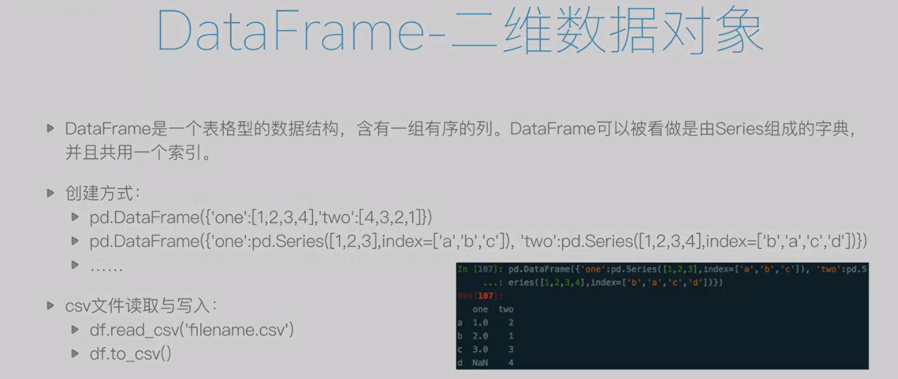
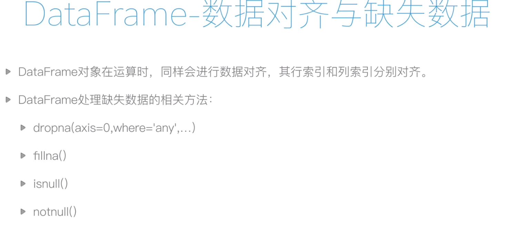
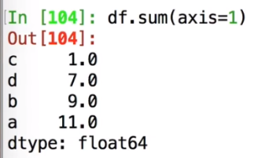

<!--
 * @Author: guanjiajun www.guanjiajun@ewake.com
 * @Date: 2023-07-04 11:10:22
 * @LastEditors: guanjiajun www.guanjiajun@ewake.com
 * @LastEditTime: 2023-07-06 14:25:38
 * @FilePath: \studys\programming\量化，数据分析\pandas\tips.md
 * @Description: 这是默认设置,请设置`customMade`, 打开koroFileHeader查看配置 进行设置: https://github.com/OBKoro1/koro1FileHeader/wiki/%E9%85%8D%E7%BD%AE##
-->
### series

loc[索引名字/标签] iloc[索引]

#### 去除nan

#### nan值填充

### dataframe

#### 常用属性

#### 索引和切片

#### 数据对齐

#### 常用函数
##### axis=1按行

##### nan不参与排序，排最后

### 时间

#### resample类似分组

### 文件

#### 此时时间不是时间对象

#### 某列改为时间对象 

#### 修改列名

#### 指定nan字符串

#### 写入
