<!--
 * @Author: guanjiajun www.guanjiajun@ewake.com
 * @Date: 2023-09-13 17:02:27
 * @LastEditors: guanjiajun www.guanjiajun@ewake.com
 * @LastEditTime: 2023-09-28 17:22:09
 * @FilePath: \studys\programming\量化，数据分析\量化应用\交易守则\交易守则.md
 * @Description: 这是默认设置,请设置`customMade`, 打开koroFileHeader查看配置 进行设置: https://github.com/OBKoro1/koro1FileHeader/wiki/%E9%85%8D%E7%BD%AE
-->
### 1.总纲
#### 1.前十分钟不要做交易，前十五分钟少做（看行情，震荡小），休市前5分钟不要买入；
#### 2.后半小时原则上不开仓（看行情，震荡小），提前设置好阻力位预警线，毛刺多放大时间级别进行交易，5和10日均线可作为开仓平仓参考，
#### 3.成交量小的突破大概率为假突破，真突破后可能会有短暂回撤，可以等短暂回撤在看机会入场（3分钟没机会，重新考虑突破入场或根据成交量5，10日均线入场，突破阻力位两到三个点，真突破剩余20秒就不要追，看下一个趋势是否延续3个点），临界突破时，成交量已经明显高（最好是近15分钟的最高成交量），可考虑提前入场，尽量多做突破行情（根据阻力支撑位，近15分钟最高成交量，其余参考顺势），
#### 4.顺势行情少做（根据成交量（三根及以上成交量较高），5，10日均线入场，还有15分钟k线，前面提及指标主要看一分钟级别；成交量高于前15分钟（可考虑排除前两根的成交量），且下一分钟趋势延续（顺势方向三个点，且是顺势状态），如果下一分钟是十字线，以下下分钟为准；连续四个顺势k线（第三或第四可以是短的反向线），且顺15分钟线，毛刺少，开盘价向上2到3个点入）；
#### 5.成交量大考虑突破和顺势（1分钟），前半小时没有明显行情，根据15分钟线和最近最大成交量做顺势（15分钟级别，前面的最高成交量大多数最好也是顺势）
#### 6.突破放量的线得饱满（线很长要另外考虑，尤其在自己回缩或第二个反向的情况下，说明势头变弱），才能视为后面有同方向机会（顺15分钟势最好，具体问题具体分析），7分钟内有机会可以考虑做（最好5分钟内，7分钟可能会属于震荡突破，此时考虑震荡突破可能更好，），考虑点：放量线边界，机会线与前一根线边界的关系，毛刺多要慎重，期间出现反向成交放量，重新考虑，放量均匀可考虑继续持有，有较大反向放量止盈，追势在前一个k线很饱满的情况下才建议追（最好成交量短时间能高于前一根，且如果第二根与第一根对接处无毛刺最好），最好情况：以空为例，5分钟以内有机会，放量线不是特别大，机会线最高价低于前一根最高价，机会线达到放量线最低或收盘价附近（放量线毛刺小，收盘价最低价较为接近），期间毛刺小且未达到放量线最高价或开盘价（放量线毛刺小且不是特别长），则考虑入场
#### 7.入场不仅要看短期成交量的多少（交易量偏低避免交易），还要看相同趋势的线多不多（前六根里面最好有三根），最好对应趋势成交量逐步一点点增加（递增相同趋势三根及以上，增加过大要谨慎，容易力竭，如果相反趋势成交量递减则更好），成交量均匀下降趋势保持，表明前面经过大升或大降，用户在出货，如下图
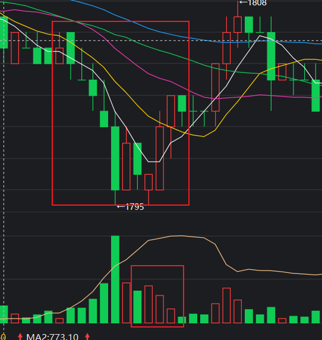
#### 8.横盘震荡期间。覆盖不掉的一方是主力，可顺势，直到出现大量反势放量
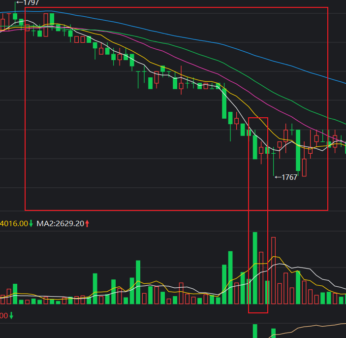
#### 9.连续5个k线都没有覆盖前一根k线的最高价或最低价（排除震荡，成交量不能呈现明显递减），可尝试顺势开仓，开仓止损：前一根最高或最低价一个价位止损，止盈：出现大的反向放量或连续出现两次覆盖，
### 2.突破点入场（5分钟）
#### 考虑因素
##### 1.是否为震荡行情，前两根k线如果毛刺大（第一个饱满，第二根十字也要谨慎），不入场
##### 2.阻力位
###### 昨日最高，最低价
###### 开盘价
###### 震荡区间最高最低（暂定为一分钟）

##### 3.突破点定位（注意大趋势的阻力位，可能有大行情，配合成交量）
1.震荡不剧烈情况下，大阴或大阳线后连续反向（线条饱满为宜），如果第二次反向突破前一次反向最低或最高点（突破三个点为宜），可视为可能突破点，但此种如果前两次收盘价相近，第三个突破后，后续可能反转
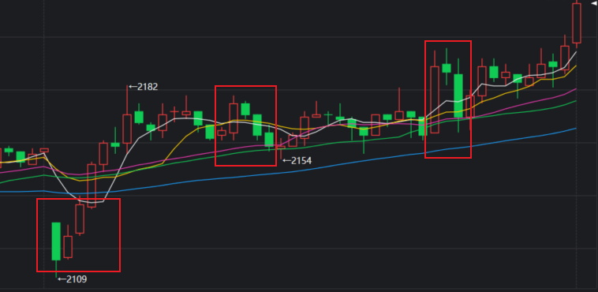
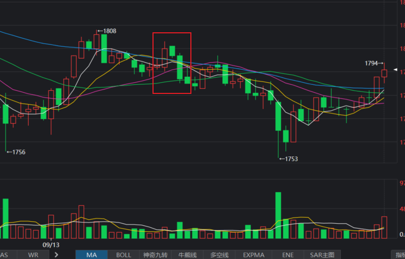
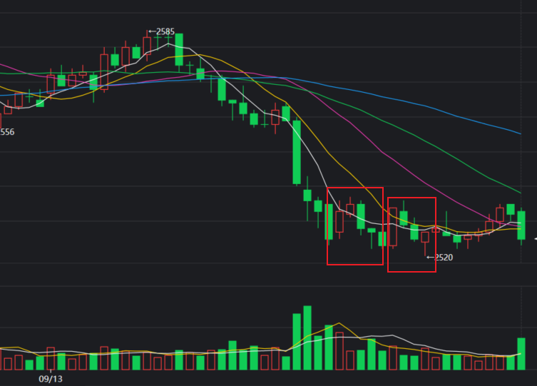
2.震荡不剧烈情况下，阳线（长一点）收盘价在前两根k线所有最高点之（突破三个点为宜），第二根的收盘价如果在第一个收盘价附近或低于第一个收盘价谨慎入（高于三个点为宜，前两根为小线时比较适用，前两根有大线，要酌情考虑），可视为可能突破点，阴线反之（如果势头强劲可考虑提前入场）
###### 可入
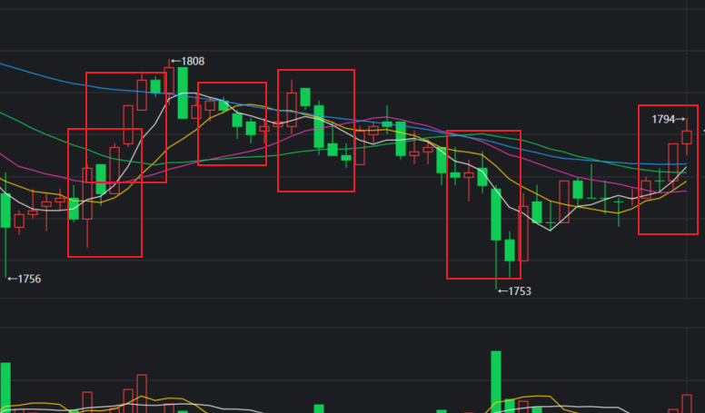
###### 谨慎
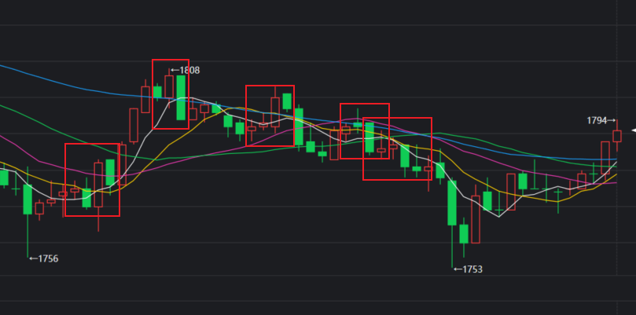
###### 酌情考虑
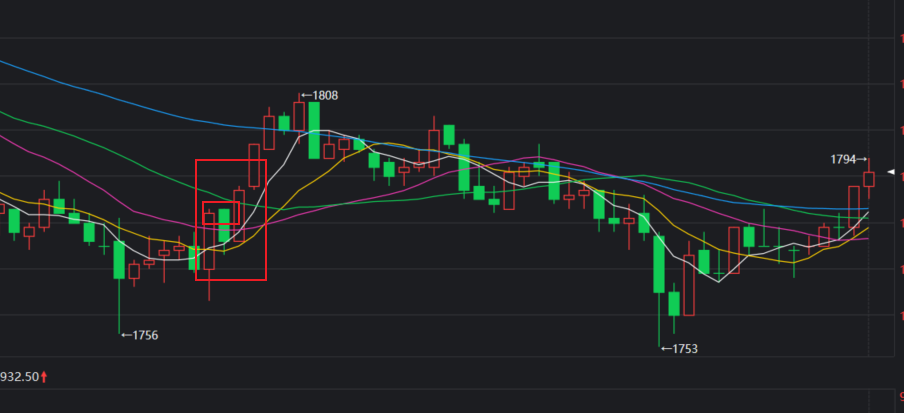
3.锤子线没有顺势突破，有概率反转（要完全不突破锤子，最多一个点），但反转大不大不好说，谨慎少做
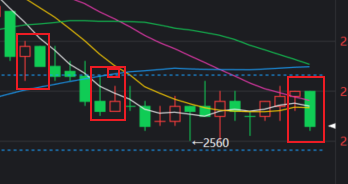
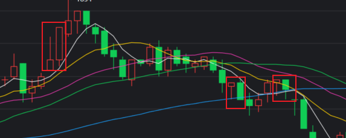
4.大趋势中失败一次就停手，尽量只操作一个品种
5.尽量一个品种做完再做另一个
6.第三根阳线突破第一根的最高点和第二根的成交价（同方向，且第一根是大阳线且毛刺以几乎没有为宜），阴线反之，谨慎使用，这个不一定，这个一般持续两个周期
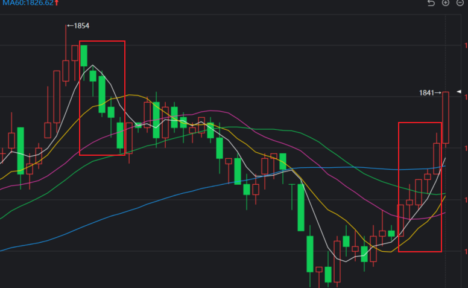
7.大阴线过后三四根均匀阳线后有突破机会，如果混杂阴线，阴线在第三第四则还有机会，不过都要慎重
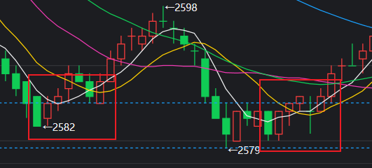

### 3.止盈
#### 15分钟级别
顺势突破成功，回撤4或3个点或1分钟最低价，或出现连续反势线；
盈利200以内，回撤两个点及以上；200以上，回撤到200以内或回撤4个点，还可参考均线及成交量；
#### 1分钟级别
盈利200以内，回撤两个点及以上；200以上，回撤到200以内或回撤4个点，，还可参考均线及成交量；
突破的话，突破成功情况下，利润小，回撤两个点，利润大，3个点；顺势同理
### 4.止损
#### 15分钟级别
顺势突破失败，参考一分钟级别
#### 一分钟级
顺势回撤要低于四个点（最好3个点，最低价为四个点时，以最低价止损）
突破的话，突破失败，一分钟内突破为两个点止损（一分钟外以最低价，开仓距离最低点超过六，以四个点止损），止损后，等下一分钟再进，两次失败，寻找其他机会入场
### 5.涨势暂停信号
参考5，10日均线及成交量
#### 1分钟级别
1.后一根阳线开盘价与前一个阳线开盘价接近且低于其收盘价（主要特征是前一根阳线窄，毛刺多长），要谨慎（这是一分钟级别的，一分钟过后涨势可能回来）
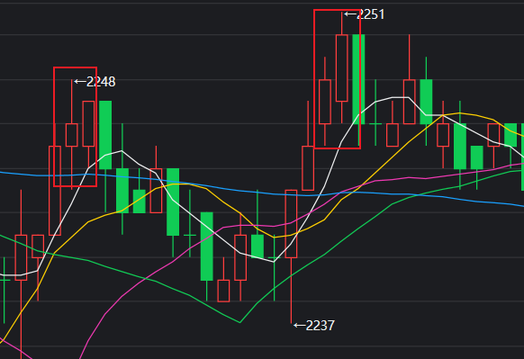