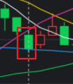

<!--
 * @Author: guanjiajun www.guanjiajun@ewake.com
 * @Date: 2023-09-14 17:09:52
 * @LastEditors: guanjiajun www.guanjiajun@ewake.com
 * @LastEditTime: 2023-09-14 17:39:42
 * @FilePath: \studys\programming\量化，数据分析\量化应用\交易日记\2023-9-14.md
 * @Description: 这是默认设置,请设置`customMade`, 打开koroFileHeader查看配置 进行设置: https://github.com/OBKoro1/koro1FileHeader/wiki/%E9%85%8D%E7%BD%AE
-->
#### 突破失败，可做

#### 突破失败，前毛刺微多，可做谨慎

#### 突破失败，前毛刺微多

#### 突破失败，可做

#### 突破失败，前毛刺微多

#### 后半小时开仓，就行情而言，可做

