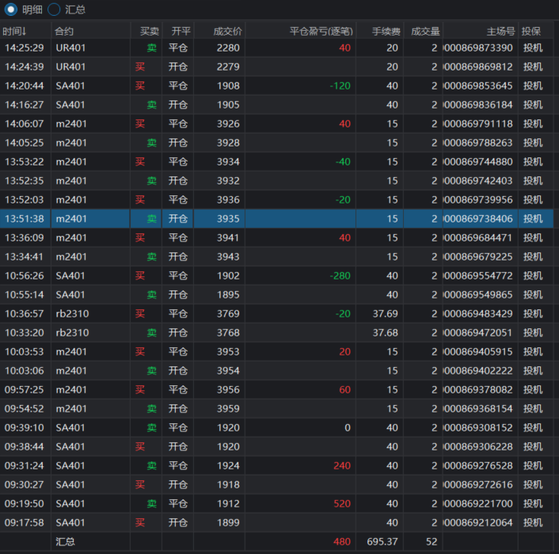

<!--
 * @Author: guanjiajun www.guanjiajun@ewake.com
 * @Date: 2023-09-18 19:01:55
 * @LastEditors: guanjiajun www.guanjiajun@ewake.com
 * @LastEditTime: 2023-09-19 17:34:12
 * @FilePath: \studys\programming\量化，数据分析\量化应用\交易日记\2023-9-19.md
 * @Description: 这是默认设置,请设置`customMade`, 打开koroFileHeader查看配置 进行设置: https://github.com/OBKoro1/koro1FileHeader/wiki/%E9%85%8D%E7%BD%AE
-->
### 关键开仓点位分析

### 关键止损点位分析

### 关键止盈点位分析

### 小结
