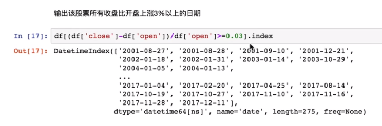
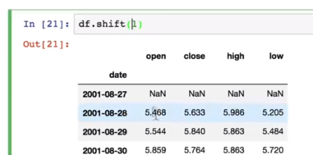
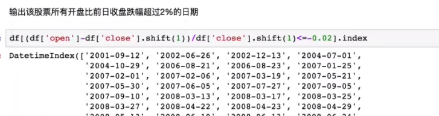

<!--
 * @Author: guanjiajun www.guanjiajun@ewake.com
 * @Date: 2023-07-06 14:13:08
 * @LastEditors: guanjiajun www.guanjiajun@ewake.com
 * @LastEditTime: 2023-07-06 14:52:35
 * @FilePath: \studys\programming\量化，数据分析\量化应用\分析例子.md
 * @Description: 这是默认设置,请设置`customMade`, 打开koroFileHeader查看配置 进行设置: https://github.com/OBKoro1/koro1FileHeader/wiki/%E9%85%8D%E7%BD%AE
-->

```python
df,shift(1) #数据下移1
```




