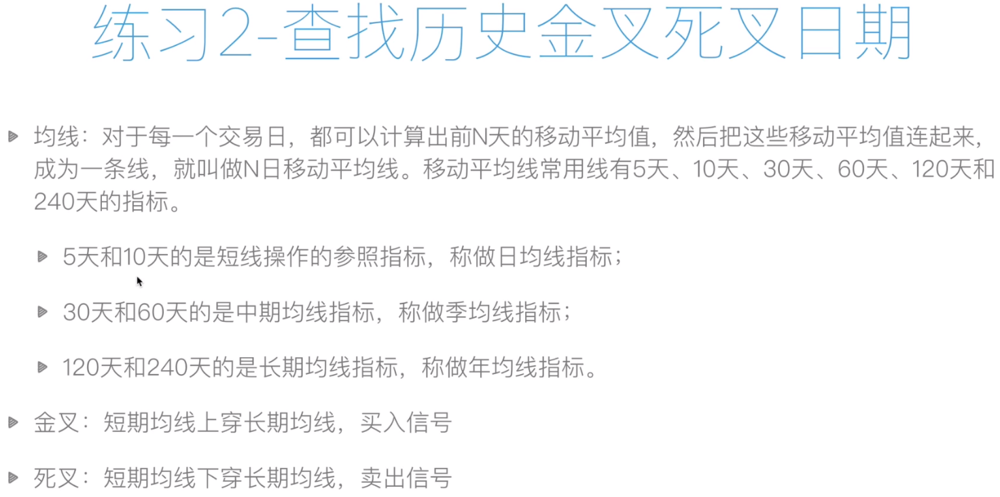
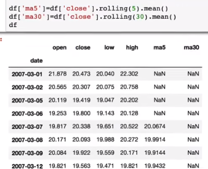
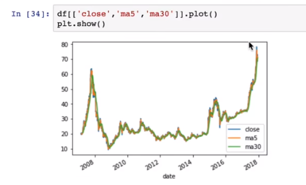
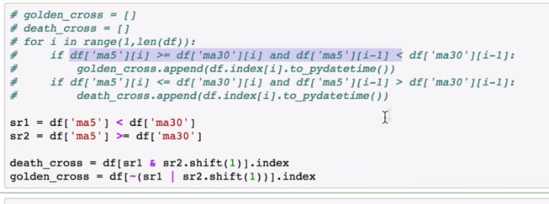
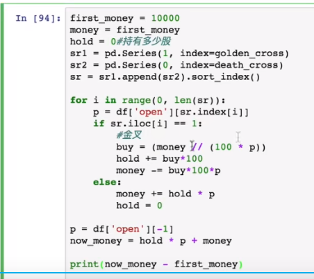

<!--
 * @Author: guanjiajun www.guanjiajun@ewake.com
 * @Date: 2023-07-06 14:57:25
 * @LastEditors: guanjiajun www.guanjiajun@ewake.com
 * @LastEditTime: 2023-07-06 16:46:27
 * @FilePath: \studys\programming\量化，数据分析\量化应用\双均线.md
 * @Description: 这是默认设置,请设置`customMade`, 打开koroFileHeader查看配置 进行设置: https://github.com/OBKoro1/koro1FileHeader/wiki/%E9%85%8D%E7%BD%AE
-->

#### 算均线可以用矩阵相乘or rolling

#### 金叉，死叉 需测试，可能有问题

