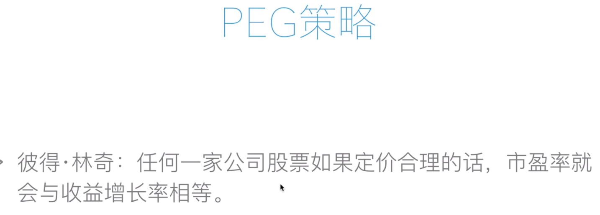

<!--
 * @Author: guanjiajun www.guanjiajun@ewake.com
 * @Date: 2023-07-07 12:37:07
 * @LastEditors: guanjiajun www.guanjiajun@ewake.com
 * @LastEditTime: 2023-07-07 12:46:18
 * @FilePath: \studys\programming\量化，数据分析\量化应用\策略\PEG.md
 * @Description: 这是默认设置,请设置`customMade`, 打开koroFileHeader查看配置 进行设置: https://github.com/OBKoro1/koro1FileHeader/wiki/%E9%85%8D%E7%BD%AE
-->

